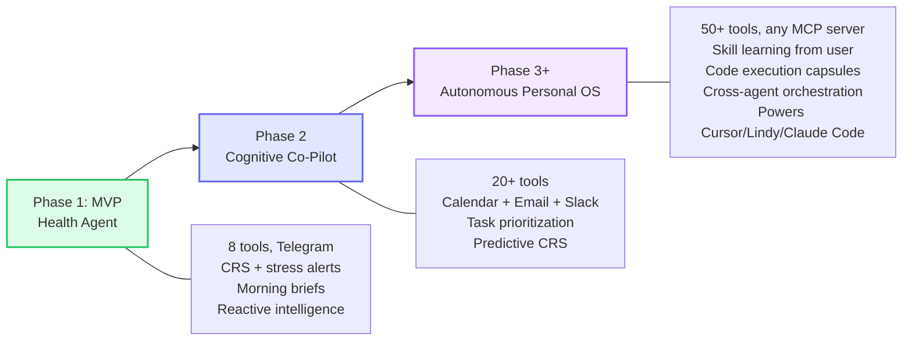
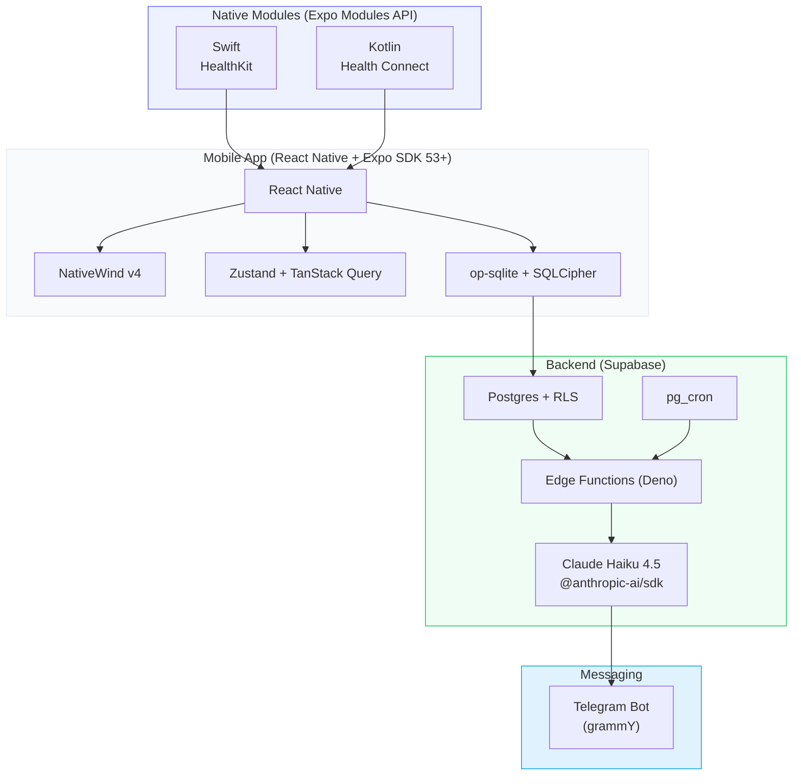

# OneSync Overview

> **Status:** Pre-code. Planning finalized. Ready to build. (March 2026)

## What is OneSync?

OneSync is a **personal cognitive operating system** — an AI agent that reads your body signals from wearables, manages your tasks based on your cognitive state, and evolves into a full autonomous OS that can handle virtually any task in your life.

**Three pillars, built in sequence:**

| Pillar | Phase | What It Does |
|--------|-------|-------------|
| **Body Intelligence** | MVP | Reads HRV, HR, sleep, activity from any wearable. Computes CRS. Detects stress. Proactively messages you via Telegram before you crash. |
| **Task Intelligence** | Phase 2 | Connects to calendar, email, Slack, task manager. Prioritizes work based on your cognitive state. Reschedules, blocks time, manages your day. |
| **Autonomous Personal OS** | Phase 3+ | Learns new skills from you. Delegates to specialist sub-agents. Executes arbitrary tasks via code capsules. Connects to any service via MCP. Powers other agents (Cursor, Lindy, Claude Code) with your biological state. |

```mermaid
graph LR
    W["Wearable<br/>(Apple Watch / Android)"] -->|HR, HRV, Sleep, Steps| P["Phone App<br/>(React Native)"]
    P -->|Encrypted local DB| CRS["CRS Engine<br/>(On-Phone, Offline)"]
    CRS -->|Score + Trigger| S["Supabase<br/>(Edge Functions)"]
    S -->|Rules Pre-Filter| AI["Claude Haiku 4.5<br/>(tool_use)"]
    AI -->|Personalized Message| T["Telegram Bot<br/>(grammY)"]
    T -->|Feedback| AI

    style W fill:#e0e7ff,stroke:#6366f1
    style CRS fill:#dcfce7,stroke:#22c55e
    style AI fill:#fef3c7,stroke:#f59e0b
    style T fill:#e0f2fe,stroke:#0ea5e9
```

## The Full Vision

**The endgame:** OneSync becomes the **biological intelligence substrate** that every other AI agent consults before acting. Not competing with Lindy, Manus, or Claude Code — **powering them** with the one signal they don't have: your cognitive state.

## The Empty Quadrant

No competitor combines all of these:

| | Body Awareness | Proactive Messaging | External Channel | Multi-Device | Cross-Platform | Price |
|---|:---:|:---:|:---:|:---:|:---:|---|
| **OneSync** | Deep (HRV, CRS) | Telegram | Yes | Any HC/HK | Android + iOS | Free / $4.34/mo |
| WHOOP Coach | Deep | In-app only | No | WHOOP only | Both | $17-30/mo |
| Oura Advisor | Deep | No | No | Oura only | Both | $6/mo |
| Nori (YC) | Aggregated | Limited | No | Multi | iOS only | TBD |
| Lindy | None | Yes | Yes | N/A | Web | $50/mo |

## Tech Stack

## Build Phases

```mermaid
gantt
    title OneSync Build Phases (No Timelines — Gate-Based)
    dateFormat X
    axisFormat %s

    section Data Layer
    Phase A - Pre-Code + WoO          :a, 0, 1
    Phase B1 - HealthKit (iOS)         :b1, 1, 2
    Phase B2 - Health Connect (Android) :b2, 2, 3

    section App Layer
    Phase C - Dashboard                :c, 3, 4

    section Agent Layer
    Phase D - Agent Core + Telegram    :d, 4, 5
    Phase E - Proactive Delivery       :e, 5, 6

    section Polish + Validate
    Phase F - Onboarding               :f, 6, 7
    Phase G - Self-Test (14 days)      :g, 7, 8
    Phase H - Beta (5-7 users)         :h, 8, 9

    section Beyond MVP
    Phase 2 - Workspace + Tasks        :p2, 9, 10
    Phase 3 - Autonomous OS            :p3, 10, 11
```

**Build order:** Data quality is the foundation. Get the health pipeline right (B1/B2) before intelligence (D/E), before workspace (Phase 2), before autonomy (Phase 3+).

## The Agent OS — Architecture from 13 Systems

The Agent OS is distilled from 13 production-grade agent systems:

| System | What We Took |
|--------|-------------|
| **Production Agent Platform** (enterprise, internal) | Brain → Orchestrator → Execution three-layer separation. Workspace files as config. Learning flywheel. Async tool dispatch. |
| **OpenFang** (Rust, 137K LOC) | 25-field prompt builder. Autonomous Hands. Loop guard. Triple-layer memory. |
| **Paperclip** (AI company OS) | Heartbeat execution. PARA memory with decay. Goal ancestry. Adapter pattern. |
| **OpenViking** (ByteDance) | L0/L1/L2 context tiers (83% token reduction). Intent-driven retrieval. |
| **CoPaw** (Alibaba) | Pre-reasoning hooks. Proactive recording. Skills with progressive loading. |
| **Pi Mono** | Layered architecture. Auto-compaction. Prompt caching at scale. |
| **Agency-Agents** | Personality Spectrum. Behavioral Nudge Engine. Quality gates. |
| **+ 6 more** | PicoClaw, OpenClaw, Swarms, Agent-Skills-for-CE, context-hub, HumanLayer |

## All 13 Source Systems — Complete Reference

Every architecture pattern in OneSync traces back to a production-grade open-source agent system. Here's the full lineage:

| # | System | What It Is | What We Took for OneSync |
|---|--------|-----------|-------------------------|
| 1 | **Production Agent Platform** (enterprise, internal) | Production-grade agent OS with Brain + Orchestrator + Execution layers. Runs on Pi Mono. | Three-layer architecture (Brain → Orchestrator → Execution). Workspace files as config. Learning flywheel. Async tool dispatch. Context engine with distillation loop. Immutable decision records. |
| 2 | **OpenFang** (Rust, 137K LOC, 14 crates) | Agent Operating System with Hands, triple-layer memory, 16 security systems. | 25-field prompt builder. Autonomous Hands pattern with multi-phase playbooks. Loop guard (SHA256). Triple-layer memory. Taint tracking. Prompt caching separation (system vs user message). |
| 3 | **Paperclip** (AI company orchestrator) | Orchestration platform for AI-agent-run companies. Heartbeat execution model. | Heartbeat-based execution (wake, act, sleep). PARA memory with hot/warm/cold decay. Goal ancestry (trace recommendations to goals). Adapter pattern. Wakeup coalescing. Session persistence across runs. |
| 4 | **OpenViking** (ByteDance/Volcengine) | Context Database for AI agents. Filesystem-paradigm memory. | L0/L1/L2 tiered context loading (83% token reduction, 49% task completion improvement). Intent-driven retrieval (0-5 typed queries per turn). Session compression. Health data summary generation. |
| 5 | **CoPaw** (Alibaba AgentScope) | Personal agent workstation. Two-tier memory, hook system, skills. | Pre-reasoning hooks (5 hooks before each Claude call). Proactive recording ("record first, answer second"). Bootstrap onboarding. Skills system with progressive loading (L1 metadata → L2 body → L3 references). |
| 6 | **Pi Mono** (TypeScript, by badlogic) | Modular coding agent toolkit. Layered architecture. | Layered module design (LLM → agent-core → app). Auto-compaction on conversation overflow. Steering + follow-up queues. Extension system. Message history sanitization. |
| 7 | **Agency-Agents** (100+ agent personas) | Curated library of specialized AI agent personality definitions. NEXUS orchestration. | Personality Spectrum model (5 CRS-adaptive zones). Behavioral Nudge Engine (4-phase). Quality gates (5 gates before every message). Healthcare language compliance. Dev-QA loop pattern. |
| 8 | **Agent-Skills-for-Context-Engineering** | Context engineering patterns for AI agents. Digital Brain example. | Token budget enforcement. Temporal validity on memory entries. U-shaped attention optimization. Append-only pattern log. Four-bucket context management (write/select/compress/isolate). BDI mental states. |
| 9 | **context-hub** (Andrew Ng / @aisuite) | Curated documentation delivery system for AI agents. | Progressive disclosure (load minimum, request more). Data confidence tiers (high/moderate/low/degraded). Annotation-style learning. BM25 relevance for memory recall. |
| 10 | **OpenClaw** (TypeScript, 22+ channels) | Multi-channel AI assistant gateway. Context engine + plugin SDK. | Multi-channel routing pattern (Telegram → WhatsApp → push → in-app). Session compaction. Plugin architecture for tool extensions. |
| 11 | **PicoClaw** (Go, <10MB RAM) | Ultra-lightweight agent. File-based memory, provider failover. | File-based MEMORY.md pattern (adapted to Postgres). Provider failover chains with error classification (429/529/500/timeout). Hot-reloadable workspace files. |
| 12 | **Swarms** (Python, enterprise orchestration) | Multi-agent orchestration framework. MixtureOfAgents, SwarmRouter. | MixtureOfAgents for Phase 2 morning brief (3 specialist Haiku + 1 synthesis = 88% cheaper than Opus). SwarmRouter for trigger-to-strategy routing. HierarchicalSwarm validates Hands architecture. |
| 13 | **Context Engineering** (HumanLayer/YC talk) | Y Combinator talk on context engineering for agents. | FIC framework (focus on what matters). 40-60% context utilization rule. Compaction as first-class pattern. Human leverage pyramid. |
| 14 | **NemoClaw** (NVIDIA) | Enterprise agent governance framework from NVIDIA GTC 2026. | Versioned blueprints with plan-apply-rollback. Declarative per-hand policies (least privilege). Operator-in-the-loop escalation. Multi-model routing middleware. Config runs (plan → apply → observe). A/B testing infrastructure. All deferred to Phase 2. |

## Five Source-of-Truth Documents

| Doc | What It Contains | When to Read |
|-----|-----------------|-------------|
| **[Master Build Reference](master-reference.md)** | Complete schema, tools, algorithms, phases A-H, cost model | Building anything |
| **[North Star](north-star.md)** | Vision, positioning, the "why" — from health agent to autonomous OS | Need motivation or framing |
| **[One-Pager](one-pager.md)** | Pitch, ICP, competitive landscape, business model | Talking to investors/users |
| **[Research & Algorithms](research-algorithms.md)** | CRS science, stress detection, validation plan | Working on algorithms |
| **[Agent OS Intelligence](agent-intelligence.md)** | The full Agent OS: prompt builder, hooks, memory, personality, nudge, quality gates, task intelligence, autonomous OS vision | Building Phase D-E and beyond |

## Proactive Intelligence Levels

| Level | Phase | What the Agent Does |
|-------|-------|-------------------|
| **1: Reactive** | MVP | "Your HRV dropped 22% in the last 30 min" |
| **2: Pattern-Aware** | Phase G+ | "It's Monday 1:30pm — your HRV typically drops now. Break?" |
| **3: Predictive** | Phase 2 | "Sleep debt + 4 meetings → CRS will crash by 2pm. I've moved your hardest task to 10am." |
| **4: Autonomous OS** | Phase 3+ | Learns skills from you. Delegates to specialists. Executes code. Powers other agents with your biology. |
