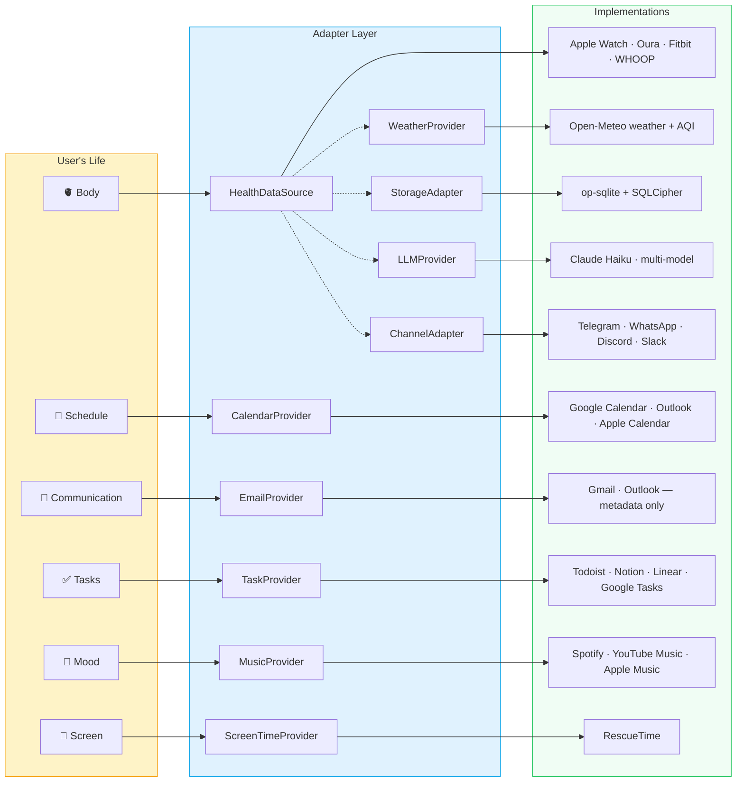
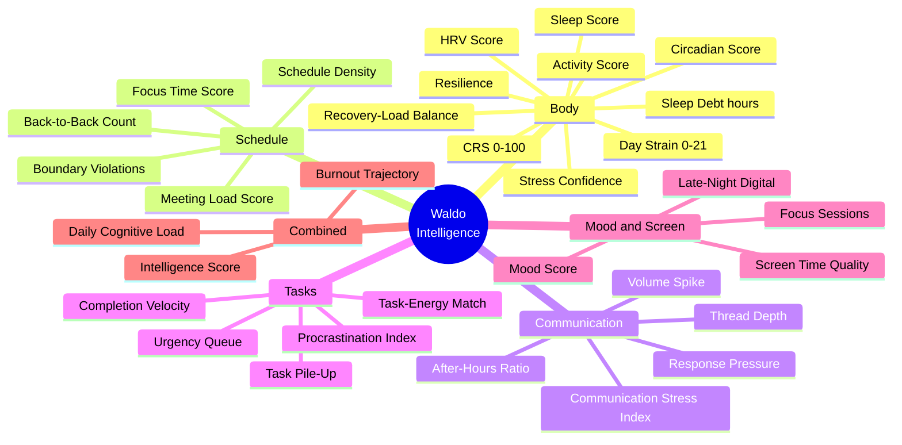
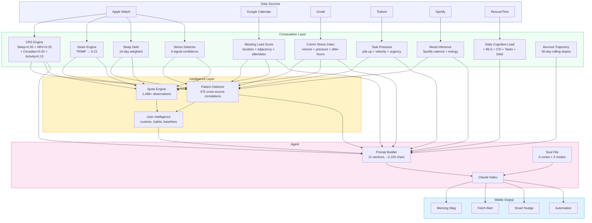
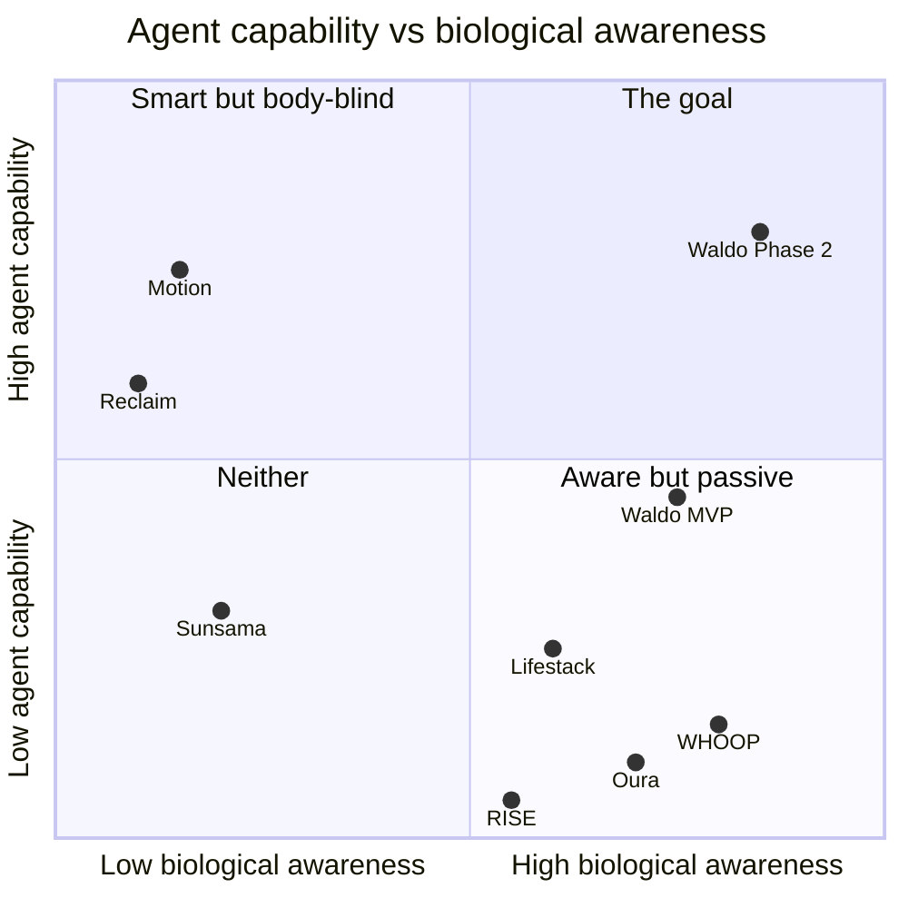

# Adapter ecosystem

Waldo uses **10 adapter interfaces** across **6 dimensions** of a person's life. Every external integration goes through an adapter — agent logic never references a specific provider. Adding a new integration = implement the interface. No changes to CRS, prompt builder, or agent reasoning.

## The 10 adapters



## 32 metrics across 6 dimensions



## How metrics flow into the agent



## Key formulas

### CRS (Cognitive Readiness Score)
```
CRS = (Sleep × 0.35) + (HRV × 0.25) + (Circadian × 0.25) + (Activity × 0.15)
Range: 0-100. Zones: Peak (80+), Moderate (50-79), Low (<50)
```

### Day Strain (cardiovascular load)
```
TRIMP = Σ (zone_minutes × zone_weight)
Weights: [1.0, 1.5, 2.5, 4.0, 8.0] for zones 1-5
Strain = min(21, log10(TRIMP + 1) × 7)
```

### Stress Confidence
```
Confidence = 0.35×(HRV drop) + 0.25×(HR elevation) + 0.20×(duration) + 0.20×(sedentary)
Threshold: ≥0.60 fires Fetch Alert. 2h cooldown. Max 3/day.
```

### Meeting Load Score
```
Per meeting: (duration/30min) × adjacency × attendees × time_factor
adjacency: 1.0 (>15min gap), 1.4 (5-15min), 1.8 (back-to-back)
Daily MLS = Σ all meetings
```

### Daily Cognitive Load
```
DCL = normalize(MLS)×0.25 + normalize(CSI)×0.25 + normalize(TaskPileUp)×0.20 + normalize(SleepDebt)×0.30
```

### Burnout Trajectory (30-day)
```
BTS = HRV_slope×0.35 + sleep_debt_trend×0.25 + after_hours_trend×0.20 + MLS_trend×0.20
> 0.6 = burnout trajectory
```

## Cross-source correlation math

```
10 data sources
C(10,2) = 45 two-source pairs
C(10,3) = 120 three-source triples
C(10,4) = 210 four-source combos
Total: 375 unique correlations

Each produces: Spot, Pattern, Nudge, or Automation
Theoretical: 375 × 4 = 1,500 unique agent behaviors
Practical: ~80-100 meaningful behaviors
```

Every new data source multiplies intelligence exponentially, not linearly.

## 23 agent capabilities

### Proactive (11)
| # | Capability | Data sources needed |
|---|-----------|-------------------|
| 1 | Enhanced Morning Wag | Health + Calendar + Tasks |
| 2 | Pre-meeting energy prep | Health + Calendar |
| 3 | Back-to-back circuit breaker | Health + Calendar |
| 4 | Focus block protection | Calendar + Health |
| 5 | Sleep debt alarm | Health |
| 6 | Communication overwhelm | Email/Slack + Health |
| 7 | Weekly pattern breaker | Health + Calendar (pattern) |
| 8 | Burnout trajectory warning | Health + Calendar + Email (30-day) |
| 9 | Post-exercise cognitive boost | Health + Tasks |
| 10 | Evening review | All sources |
| 11 | Weekend recovery forecast | Health + Calendar |

### Task intelligence (8) — adapts HOW, never blocks WHAT
> Waldo never says "don't do this task." Deadlines are real. Waldo helps get it done.

| # | Capability | What Waldo does |
|---|-----------|----------------|
| 12 | Deadline-aware prioritization | Ranks by urgency×0.4 + importance×0.3 + energy_fit×0.3. Due-today always surfaces. |
| 13 | Smart sequencing | Hardest first during peak, admin during trough, momentum starter when depleted |
| 14 | Break-it-down | Low CRS + deadline → "25-min chunks with 5-min breaks. Start with the section you know." |
| 15 | Overdue triage | >10 overdue → "Pick 3 that matter. Defer, delegate, or delete the rest." |
| 16 | Recurring surfacing | Day-of-week match → "It's Monday. Workout: Legs. CRS 71. Good to go?" |
| 17 | Deferral intelligence | Due tomorrow + low today + predicted recovery → "Push through now or hit it fresh?" |
| 18 | Implicit capture | Detects follow-ups from calendar events, stale email threads, patterns |
| 19 | Completion tracking | Learns which energy states are productive for this user over time |

### Automation (5)
| # | Capability | What Waldo does |
|---|-----------|----------------|
| 20 | Meeting rescheduling | "Push 8am to 10am — predicted CRS jumps 52 → 68" |
| 21 | Auto-DND | Sets Slack status during focus/low-CRS |
| 22 | Recovery day enforcement | Marks light-calendar + low-CRS days |
| 23 | Communication batching | Suggests email blocks, not continuous |
| 24 | Sleep optimization | Screen time nudge based on data |

### Task nudge examples

| Situation | CRS | What Waldo says |
|-----------|-----|----------------|
| Deadline today, good energy | 82 | "82 and the deadline is today. Knock it out before noon." |
| Deadline today, low energy | 45 | "45 but this is due today. Three 25-min chunks. Start with what you know. Good enough beats perfect." |
| Deadline tomorrow, depleted | 38 | "Due tomorrow. You're at 38 today, predicted 68 tomorrow morning. Push through or hit it fresh?" |
| 13 tasks overdue | 65 | "13 overdue. That number is the problem. Pick 3 that matter. Defer the rest." |
| No momentum, low energy | 35 | "Start with one thing. Reply to one message. Then see how you feel." |
| Peak + task completed | 82 | "You cleared that during your peak window. That's the pattern — hard stuff before noon." |
| Recurring task detected | 71 | "It's Monday. Your list says 'Workout: Legs'. CRS 71. Good to go?" |

### Learning (6)
| # | Pattern | Cross-source insight |
|---|---------|---------------------|
| 25 | Meeting → stress | "Monday 2pm sync drops your HRV 25%" |
| 26 | Music → mood → CRS | "Low-energy playlists after 3pm → CRS <60 next day" |
| 27 | Coding time vs state | "You commit at 10pm but CRS says that's decline" |
| 28 | Email → sleep | "Emails after 10pm → sleep efficiency drops 8%" |
| 29 | Screen → recovery | "<2h recreational screen → CRS 9 points higher" |
| 30 | Task timing | "72% of completions during CRS 70+" |

## Competitive position


