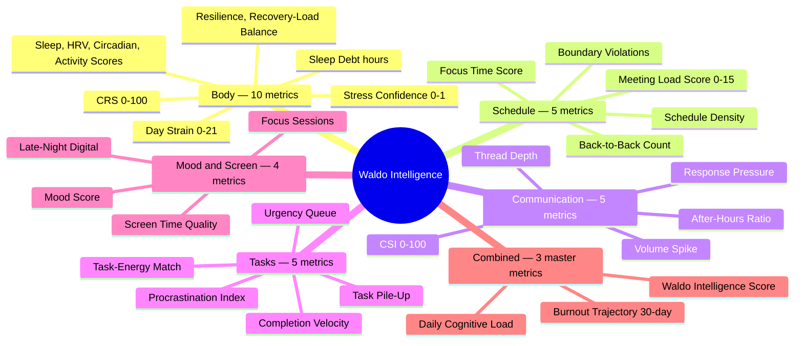

# Waldo Agent OS — Definitive Intelligence Architecture

> **What this document is:** The consolidated agent architecture for Waldo — a personal cognitive operating system that combines **body intelligence** (health signals from wearables), **task intelligence** (planning, organization, getting things done), and **proactive agency** (acts before you ask). This is the definitive reference for HOW the agent thinks, learns, communicates, and evolves.
>
> **Sources:** 16 production-grade agent systems — Pi Mono, OpenClaw, PicoClaw, OpenFang, CoPaw, Paperclip, OpenViking (ByteDance), Swarms, Agency-Agents, Agent-Skills-for-Context-Engineering, context-hub (Andrew Ng), Context Engineering (HumanLayer/YC), **Production Agent Platform** (enterprise-grade Brain + Orchestrator + Execution architecture, running on Pi Mono), **NemoClaw** (NVIDIA's enterprise agent governance framework — versioned blueprints, declarative policies, operator-in-the-loop escalation, multi-model routing), **Hermes Agent** (Nous Research — 38K+ stars, MIT license, self-hosted self-improving agent with GEPA evolutionary optimization, FTS5 cross-session search, skills-as-procedural-memory, 40+ tools, 12-platform messaging gateway, memory context fencing, structured context compression), and **MemPalace** (28.5K stars — spatial memory via Method of Loci, 96.6% recall on LongMemEval, wing/room/hall/tunnel taxonomy, temporal knowledge graph on SQLite, 170-token wake-up cost, typed memory halls, cross-domain tunnels)
>
> **Relationship to Master Reference:** Master Reference defines WHAT to build. This document defines HOW the agent should behave. Use BOTH when building Phase D (Agent Core) and Phase E (Proactive Delivery).
>
>
> **Last updated:** April 2026

---

## 0. What Waldo Actually Is

Waldo is **not just a health app**. It is a **personal cognitive operating system** with three pillars:

### Pillar 1: Body Intelligence (MVP)
Reads HRV, HR, sleep, activity from any wearable. Computes CRS. Detects stress. Proactively messages you — via your preferred channel — before you crash. All health data encrypted, on-device computation, personal baselines.

### Pillar 2: Task Intelligence (Phase 2+)
Connects to your calendar, email, Slack, task manager. Understands your workload. Prioritizes tasks based on your cognitive state. "Your CRS is 87 — tackle the P0 bug now, save admin for the afternoon dip." Reschedules, blocks time, manages your day.

### Pillar 3: Autonomous Personal OS (Phase 3+)
The agent becomes a **full personal operating system** that can perform virtually any task for you — not just health, not just productivity, but anything you'd delegate to a hyper-competent personal chief of staff who also happens to know your biology.

This is the production agent platform philosophy applied to personal life: **Brain thinks → Orchestrator routes → Execution layer does the work.** Once the agent has body intelligence + workspace intelligence, it has the two things no other agent has — it knows your physiology AND your context. From there, it can:

- **Execute arbitrary tasks** — "Research the best standing desks under $500, but only show me results tomorrow morning when my CRS is peak" (the agent researches now, delivers when you're sharp)
- **Learn new skills from you** — "When I say 'prep for standup', pull my Linear tickets, check my sleep score, and draft 3 talking points" (agent stores as a reusable skill)
- **Compose multi-step workflows** — Chain tools into automations: health check → calendar scan → task reranking → Slack status update → Morning Wag — all triggered by your wake time
- **Delegate to specialist sub-agents** — Sleep agent, productivity agent, research agent, creative agent — each expert in their domain, all coordinated by the brain
- **Connect to any service via MCP** — Each new MCP server = a new domain the agent operates in. Notion, GitHub, Figma, banking, travel, food ordering — the tool ecosystem is unbounded
- **Write and run code** — The agent can spin up ephemeral execution environments (code capsules) to accomplish tasks that don't have pre-built tools (data analysis, report generation, web scraping)
- **Manage other agents** — Waldo becomes the orchestration layer UNDER your other AI tools, providing biological context to Lindy, Manus, Cursor, Claude Code — any agent that would benefit from knowing your cognitive state

**The key insight:** Every AI agent (Lindy, Manus, OpenClaw) can schedule meetings and draft emails. **None know when you're cognitively depleted.** Waldo adds the biological layer that makes every other agent smarter — it's the intelligence layer UNDER all your other tools. And because we build on the same infrastructure patterns (Hands, Heartbeats, Adapters, Skills, Memory) that power enterprise-grade agent platforms, the architecture scales to handle any domain, any task, any persona.

### The Three-Layer Architecture (Production Agent Platform Pattern)

```
Brain Layer                         → Waldo Agent Core
  Thinks, remembers, delegates       Claude Haiku + soul files + memory
  Workspace files as config           IDENTITY + SOUL + CALIBRATION + RULES
  Daily memory + learning flywheel    Session summaries + pattern log

Orchestrator Layer                  → Waldo Edge Functions
  State management + routing          Supabase + pg_cron + RLS
  Adapter pattern (source-agnostic)   HealthKit/HealthConnect/Samsung adapters
  Sub-agent supervisor                Future: specialist agents

Execution Layer                     → Waldo Tool Execution
  Ephemeral task execution            8 MVP tools → 50+ tools
  Workspace connectors                Calendar, email, Slack, tasks, music
  Multi-domain capability             Health + productivity + life management
```

---

## 1. Agent OS Architecture Overview

Synthesized from all 12 repos into Waldo's serverless health agent:

```
┌──────────────────────────────────────────────────────────────┐
│  PROMPT BUILDER (25-field assembly — from OpenFang)           │
│                                                               │
│  Static Block (cached):                                       │
│    soul_base + zone_modifier + mode_template + safety_rules   │
│    + tool_definitions (dynamic subset)                        │
│  User Block (cached per user):                                │
│    user_profile + core_memory_excerpt + health_baselines      │
│  Dynamic Block (fresh per invocation):                        │
│    trigger_context + biometric_snapshot + last_interaction     │
│    + pending_followups + calendar_context                     │
│                                                               │
│  Token budget: DYNAMIC per trigger. U-shaped attention.      │
│    Morning Wag: 4000  |  Fetch Alert: 4500                  │
│    User Chat: 7000    |  Constellation: 10000 (Phase 2)     │
│  Canonical context as SEPARATE user message (cache-friendly). │
└──────────────────┬───────────────────────────────────────────┘
                   │
                   ▼
┌──────────────────────────────────────────────────────────────┐
│  HOOK PIPELINE (from CoPaw + OpenFang)                        │
│                                                               │
│  Pre-Reasoning:                                               │
│    1. Emergency Bypass (chest pain, suicidal → instant escape)│
│    2. Quality Gates 1,3,4 (data sufficiency, timing, fatigue) │
│    3. Context Injection (fresh CRS, calendar if relevant)     │
│    4. Compaction (compress if history > token budget)          │
│    5. Rate Limit (daily cost/message cap check)               │
│                                                               │
│  Post-Reasoning:                                              │
│    1. Quality Gates 2,5 (health language, confidence)         │
│    2. Loop Guard (SHA256 duplicate detection — from OpenFang) │
│    3. Memory Update (persist core_memory changes)             │
│    4. Analytics (log model, tokens, tools, response time)     │
└──────────────────┬───────────────────────────────────────────┘
                   │
                   ▼
┌──────────────────────────────────────────────────────────────┐
│  AGENT LOOP (ReAct — max 3 iterations, 50s timeout)           │
│                                                               │
│  LLM Provider [Claude Haiku 4.5] via Messages API + tool_use  │
│  Model Router: Rules-skip → Haiku (MVP) → Sonnet (Phase 2)   │
│  Provider Failover: Primary → Fallback → Template (PicoClaw)  │
│  Loop Guard: SHA256 hash of (tool+params+result) — block at 3 │
│  Parallel tool execution for independent calls                │
│  Tool result compression for outputs >1000 tokens             │
└──────────────────┬───────────────────────────────────────────┘
                   │
                   ▼
┌──────────────────────────────────────────────────────────────┐
│  MEMORY SYSTEM (Three-Tier — from OpenFang + Paperclip)       │
│                                                               │
│  Tier 1 — Structured (Postgres KV, always loaded):            │
│    core_memory: identity, health_profile, preferences,        │
│    active_goals, recent_insights. Self-modifying via tools.   │
│    Temporal validity: learned_on, confidence_decay, access_ct │
│    Memory decay: hot (7d) → warm (30d) → cold (30d+)         │
│                                                               │
│  Tier 2 — Summaries (Postgres, on-demand):                    │
│    Session summaries (per conversation)                        │
│    Weekly compaction (session summaries → core memory updates) │
│    Append-only pattern log (never delete, only archive)       │
│    Pending followups (track suggestion outcomes)              │
│                                                               │
│  Tier 3 — Semantic Search (Phase 2 — pgvector):               │
│    Embeddings over conversation summaries + pattern log        │
│    Intent-driven retrieval (0-5 typed queries, not monolithic)│
│    Health knowledge graph (entity-relationship: caffeine       │
│      --worsens--> sleep_latency, confidence 0.8)              │
└──────────────────┬───────────────────────────────────────────┘
                   │
                   ▼
┌──────────────────────────────────────────────────────────────┐
│  PROACTIVE HANDS (from OpenFang + Paperclip Heartbeat)        │
│                                                               │
│  Morning Wag Hand — daily at wake time, multi-phase playbook│
│  Stress Monitor Hand — every 15 min, gated on confidence      │
│  Baseline Updater Hand — daily 4 AM, no LLM (pure compute)   │
│  Weekly Review Hand — Sunday evening, Opus (Phase 2)          │
│                                                               │
│  Wakeup coalescing: multiple health events in one window      │
│    → single alert, not many (from Paperclip)                  │
│  Quality gates + risk-weighted priority before every send     │
│  Four-Phase Nudge: signal → meaning → micro-action → buttons │
└──────────────────┬───────────────────────────────────────────┘
                   │
                   ▼
┌──────────────────────────────────────────────────────────────┐
│  DELIVERY + FEEDBACK                                          │
│                                                               │
│  Telegram (grammY) — MVP channel                              │
│  Personality Spectrum: zone selected by CRS + data quality    │
│  Close-every-loop: follow up on suggestions, track outcomes   │
│  Three-tier feedback: implicit (0.2) + buttons (0.5) + rich  │
│  Adapter pattern for future channels (WhatsApp, push, in-app)│
└──────────────────────────────────────────────────────────────┘
```

---

## 2. Prompt Builder — 25-Field Context Assembly

**Source:** OpenFang's `PromptContext` (25 fields, 14 sections). Adapted for Waldo's health agent.

### Waldo Prompt Fields

| # | Field | Source | Cached? | Tokens |
|---|-------|--------|---------|--------|
| 1 | `soul_base` | Hardcoded string | Yes (1h TTL) | ~200 |
| 2 | `zone_modifier` | Computed from CRS | No | ~100 |
| 3 | `mode_template` | Trigger type | Yes (1h TTL) | ~100 |
| 4 | `safety_rules` | Hardcoded | Yes (1h TTL) | ~100 |
| 5 | `tool_definitions` | Dynamic subset (3-8 of 8) | Partially | ~400 |
| 6 | `user_profile` | Supabase `users` table | Yes (5min TTL) | ~150 |
| 7 | `core_memory_excerpt` | Relevant slice of core_memory | Yes (5min TTL) | ~200 |
| 8 | `health_baselines` | Rolling 7d/30d averages | Yes (15min TTL) | ~100 |
| 9 | `current_crs` | On-phone computation | No | ~60 |
| 10 | `biometric_snapshot` | Latest health_snapshot | No | ~150 |
| 11 | `trigger_context` | Why this invocation fired | No | ~100 |
| 12 | `last_interaction` | Previous agent→user exchange | No | ~100 |
| 13 | `pending_followups` | Suggestions awaiting outcome check | No | ~100 |
| 14 | `conversation_history` | Last 3 turns + compressed summary | No | ~400 |
| 15 | `calendar_context` | Today's events (if relevant) | No | ~100 |
| 16 | `data_confidence` | Device tier (high/moderate/low/degraded) | No | ~20 |
| 17 | `chronotype` | early/normal/late | Yes (cached) | ~10 |
| 18 | `current_datetime` | Timestamp + timezone | No | ~20 |
| 19 | `channel_type` | "telegram" (MVP) | Yes | ~10 |
| 20 | `user_name` | From profile | Yes | ~10 |

### Assembly Order (cache-optimized — from OpenFang insight)

**System message** (stable prefix → high cache hit rate):
```
[1] Safety rules + medical disclaimers          (START — highest attention)
[2] Soul base + zone modifier + mode template
[3] Tool definitions (dynamic subset)
[4] Core memory excerpt + health baselines
[5] User profile + chronotype + preferences     (MIDDLE — stable, tolerates attention dip)
```

**User message** (dynamic — separate for cache isolation, from OpenFang):
```
[6] Trigger context + biometric snapshot + CRS  (END — high attention)
[7] Last interaction + pending followups
[8] Conversation history (last 3 turns)
[9] Calendar context (if relevant)
```

**Why separate messages?** Injecting changing data (CRS, biometrics) into the system prompt invalidates the entire cache. By keeping the system prompt stable and putting dynamic data in a user message, we get near-100% cache hits on the system prompt (saves 50%+ on those tokens).

### Token Budget Enforcement

**Dynamic budget per trigger type** — the agent should gather as much relevant context as possible. Cost control comes from prompt caching + rules pre-filter, NOT from starving context.

| Trigger Type | Total Budget | Key Allocation |
|-------------|-------------|----------------|
| **Morning Wag** | **4,000** | 750 soul (cached) + 400 profile (cached) + 800 health L0+L1 + 500 tools + 600 history + 600 tool output + 350 reserve |
| **Fetch Alert** | **4,500** | Same structure + 500 extra for stress context + memory recall |
| **User Chat** | **7,000** | 2000 conversation history (8-10 turns) + 800 all 8 tools + 1200 tool output headroom |
| **Constellation** (Phase 2) | **10,000** | Weeks of pattern summaries + cross-correlation context |

Cost impact: +$0.25/month per Pro user (from $0.90 → $1.15). 73%+ margin preserved. Quality improvement is worth 100x the cost delta.

---

## 3. Personality Spectrum — Context-Adaptive Zones

**Source:** Agency-Agents (Whimsy Injector + Brand Guardian patterns)

Replace 4 static soul files with **5 personality zones × 4 modes**. Zone is selected by CRS + data quality. Mode is selected by trigger type. This gives 20 voice combinations instead of 4.

### The Five Zones

| Zone | CRS Range | Voice | Tone | Message Length |
|------|-----------|-------|------|---------------|
| ENERGIZED | 80+ | Upbeat, challenge-oriented | Coach pushing athlete | Normal (3 lines) |
| STEADY | 60-79 | Warm, informative | Trusted friend | Normal (3 lines) |
| FLAGGING | 40-59 | Honest, protective, concise | Wise advisor | Short (2-3 lines) |
| DEPLETED | <40 | Gentle, minimal, zero pressure | Caretaker | Minimal (1-2 lines) |
| CRISIS/NO DATA | N/A | Transparent, never alarming | Honest friend | Adaptive |

### Zone × Mode Examples

| | Morning Wag | Fetch Alert | Conversational |
|---|---|---|---|
| **ENERGIZED** | "CRS 87 — peak zone. This is your deep work window. What's the hardest thing on your plate?" | "Quick flag: HRV dipped 15%. Probably just a passing spike since you're in great shape today." | Full engagement, challenge them |
| **DEPLETED** | "Rough night. CRS 34. One thing: water and take it slow." | "Your body needs a reset. Step away for 2 minutes. Nothing else matters right now." | Short answers, no pressure |

### Implementation

```typescript
const zone = getPersonalityZone(crs, dataCompleteness);
const mode = triggerType;
const systemPrompt = SOUL_BASE + ZONE_MODIFIERS[zone] + MODE_TEMPLATES[mode];
```

### Voice Adaptation to Data Quality

| Confidence | Language Style |
|-----------|---------------|
| HIGH (Apple Watch RMSSD) | "Your HRV dropped 25% from baseline" |
| MODERATE (Pixel/Fitbit) | "Your HRV appears lower than usual" |
| LOW (Samsung HR proxy) | "Based on heart rate patterns (I don't have HRV from your device)..." |
| DEGRADED (missing/stale) | "I'm missing overnight data — did you wear your watch to bed?" |

---

## 4. Hook Pipeline — Pre/Post Reasoning

**Source:** CoPaw (pre-reasoning hooks) + OpenFang (loop guard, output validation)

### Pre-Reasoning Hooks (before Claude call)

```
Hook 1: EMERGENCY BYPASS
  Scan for: "chest pain", "can't breathe", "suicidal", "want to die", "overdose"
  Action: Skip normal loop → return emergency response → log for review
  Source: CoPaw safety hook

Hook 2: QUALITY GATES (1, 3, 4)
  Gate 1 — Data sufficiency: ≥1 health metric from last 6h, CRS used ≥2 components
  Gate 3 — Timing: not during sleep, 2h cooldown, max 3/day, not muted
  Gate 4 — Fatigue: engaged with ≥1 of last 3, no "too frequent" feedback, novel insight
  Action: If fail → queue for later, or send degraded message, or skip
  Source: Agency-Agents NEXUS gates

Hook 3: CONTEXT INJECTION
  Inject: latest CRS + biometric snapshot (if not already in context)
  Inject: calendar events (if morning or meeting in next 2h)
  Inject: pending followups (if Morning Wag)
  Source: CoPaw context injection hook

Hook 4: COMPACTION
  Check: conversation history token count vs budget (600 tokens)
  Action: If exceeding → compress older messages into structured summary
  Preserve: health facts, user preferences, action items
  Source: Pi Mono auto-compaction + CoPaw memory compaction hook

Hook 5: RATE LIMIT
  Check: daily cost budget, daily message count, per-minute rate
  Action: If exceeded → respond with cached/template message, log
  Source: OpenFang GCRA rate limiter
```

### Post-Reasoning Hooks (after Claude response, before delivery)

```
Hook 6: HEALTH LANGUAGE SAFETY (Gate 2)
  Scan output for banned patterns:
    "You are stressed" → must be "Your body is showing stress signals"
    "You need to..." → must be "You might want to consider..."
    Diagnosis language (anxiety, depression, insomnia, arrhythmia)
    "Always" / "never" about health
    Population comparisons
  Action: If found → regenerate with feedback (max 2 retries) → template fallback
  Source: Agency-Agents healthcare compliance

Hook 7: CONFIDENCE CHECK (Gate 5)
  Fetch Alerts: confidence ≥ 0.60
  Morning insights: ≥3 data points behind any claimed pattern
  Memory claims: only reference "high" confidence patterns
  Action: If fail → omit uncertain claim (better to say less)

Hook 8: LOOP GUARD
  SHA256 hash of (tool_name + params + result)
  Warn at 2 identical calls, block at 3 (tight — only 3 iterations allowed)
  Outcome-aware: same call + same result 2x → permanently blocked for session
  Source: OpenFang loop_guard.rs

Hook 9: MEMORY UPDATE
  If agent called update_memory → persist to Supabase
  If substantive conversation → trigger async summary generation
  Record first, answer second (from CoPaw proactive recording)
  Source: CoPaw + OpenFang

Hook 10: ANALYTICS
  Log: model, tokens_in, tokens_out, tools_called, response_time_ms
  Log: trigger_type, CRS_at_time, data_confidence, zone, mode
  Fire-and-forget to agent_logs table
  Source: OpenFang + Paperclip cost tracking
```

---

## 5. Memory Architecture — Three-Tier with Decay

**Source:** OpenFang (triple-layer) + Paperclip (PARA + decay) + OpenViking (L0/L1/L2 summaries) + CoPaw (proactive recording)

### Tier 1: Structured Memory (Always Loaded)

PostgreSQL `core_memory` table. ~200 tokens when serialized.

```json
{
  "identity": { "name": "Shivansh", "age": 22, "timezone": "IST", "chronotype": "normal" },
  "health_profile": {
    "conditions": [], "medications": ["magnesium 400mg"],
    "resting_hr": 62, "hrv_baseline_rmssd": 45,
    "device": "Apple Watch Series 9", "device_confidence": "high"
  },
  "preferences": {
    "message_style": "data-driven", "optimal_send_time": "07:15",
    "intervention_preference": "breathing > walks > caffeine reduction",
    "cognitive_load_tolerance": "medium", "alert_aggressiveness": "conservative"
  },
  "active_goals": [
    { "goal": "maintain 7h+ sleep", "status": "in_progress", "parent": "optimize_health" }
  ],
  "recent_insights": [
    { "pattern": "HRV drops 25% on Monday afternoons",
      "learned_on": "2026-03-01", "last_validated": "2026-03-18",
      "validation_count": 8, "confidence": "high", "confidence_decay": "weekly" }
  ]
}
```

**Memory Decay System** (from Paperclip PARA):

| Tier | Recency | Behavior |
|------|---------|----------|
| HOT | Accessed/validated in 7 days | Prominent in context. Full detail. |
| WARM | 8-30 days since last validation | Included but lower priority. Summary only. |
| COLD | 30+ days | Omitted from context. Still in DB. Agent can recall via tool. |

**Rule:** High `validation_count` resists decay. A pattern validated 15 times doesn't go cold as fast as one validated twice. Facts are never deleted — only superseded (`superseded_by` field).

**Proactive Recording** (from CoPaw): When user mentions health info ("started magnesium", "didn't sleep well", "stressed about deadline"), the agent calls `update_memory` BEFORE crafting its response. Context is never lost even if the session drops.

### Tier 2: Summaries + Pattern Log (On-Demand)

**Session Summaries** — When conversation exceeds 10 messages:
```markdown
## Session Summary (March 20, 10:00-10:45 AM)
- User asked about sleep → reported 5.2h, poor deep sleep
- Agent suggested earlier bedtime → user committed to 11 PM target
- User mentioned headache → agent noted correlation with low sleep
- Mood: slightly frustrated. Action items: 11 PM bedtime tonight.
```

**Weekly Compaction** — Via pg_cron Sunday evening:
- Review week's session summaries
- Promote validated patterns to core_memory.recent_insights
- Generate weekly learning digest for user (builds trust)
- Update health baselines if shifted significantly

**Append-Only Pattern Log** (from Agent-Skills-for-Context-Engineering):
```json
{ "timestamp": "2026-03-20T14:30:00Z",
  "type": "intervention_outcome",
  "observation": "5-min breathing exercise → CRS improved 8 points in 1h",
  "confidence": "moderate", "validation_count": 1,
  "source": "measured" }
```
Types: `correlation`, `preference`, `baseline_shift`, `intervention_outcome`
Never delete. Mark as `archived` when superseded. Enables monthly retrospectives.

**Pending Followups** — Track suggestion outcomes:
```json
{ "suggestion": "phone in other room at bedtime",
  "suggested_on": "2026-03-19",
  "metric_to_check": "sleep_efficiency",
  "baseline": 82, "check_after": "next_morning_brief",
  "attempts": 1, "outcomes": [] }
```

### Daily Compaction — The Missing Link (Phase D requirement)

**Gap identified April 2026 from AtlanClaw workspace architecture.**

Currently Waldo only runs weekly compaction. This is insufficient. Here's why, and the fix:

**AtlanClaw's pattern (production-validated):**
```
memory/2026-04-04.md     ← raw daily log (WRITABLE, accumulates all day)
memory/2026-04-05.md     ← next day's log
MEMORY.md                ← persistent summary (WRITABLE, updated nightly)
```
Every night, an init process summarizes the day's raw log into MEMORY.md. Weekly compaction does deeper pattern mining on top of this.

**Waldo's equivalent (DO SQLite):**
```
episodes table           ← raw event log (every message, Morning Wag, Fetch Alert, observation)
memory_blocks table      ← persistent summaries (key-value, always loaded)
```

**The problem with weekly-only compaction:** Between Sunday compaction cycles, the agent's `memory_blocks` (what it always loads) drifts from what's actually happening. For 5 users this is fine. At 50+ users, the drift means Waldo is referencing week-old patterns instead of yesterday's behavior.

**Daily compaction implementation (Patrol Agent, Phase D):**
```typescript
// Runs nightly at 2 AM local time via DO alarm
async runDailyCompaction(do: DurableObject) {
  const yesterday = getYesterdayDate(timezone);
  const episodes  = await getEpisodesForDate(do.sql, yesterday);

  if (episodes.length === 0) return; // Nothing to compact

  // 1. Summarize yesterday's episodes into a diary entry
  const summary = await compactEpisodes(episodes); // Claude Haiku, cheap
  // "Yesterday: Morning Wag sent at 7:12am, CRS 63 (steady). User replied
  //  positively. Afternoon Fetch Alert dismissed (overriding pattern noted).
  //  Evening review skipped — quiet hours. 3 conversations. Sleep advice accepted."

  // 2. Write summary to memory_blocks as yesterday's diary entry
  writeMemory(do.sql, `diary_${yesterday}`, summary, 'episodic');

  // 3. Promote validated patterns from yesterday to persistent memory
  await promotePatterns(do.sql, yesterday);

  // 4. Mark yesterday's episodes as consolidated
  markEpisodesConsolidated(do.sql, yesterday);
}
```

**Two-level compaction cycle:**
- **Daily (2 AM local):** Episodes → diary entry in memory_blocks. ~50 tokens per day.
- **Weekly (Sunday 8 PM UTC):** Diary entries → deep pattern mining → update recent_insights. Deeper Claude call.

This matches the AtlanClaw pattern exactly and should be built into Phase D, not deferred to Phase G.

### Dreaming Mode — The Nightly Intelligence Cycle (Phase D → Phase G progression)

**Source:** AtlanClaw daily compaction + Hermes Agent GEPA self-evolution + sleep-time compute research (Meta PAHF paper, Letta/MemGPT) + Claude Code AutoDream consolidation

Waldo's "Dreaming Mode" is the umbrella term for everything the agent does while the user sleeps. It is the nightly intelligence cycle that makes the agent smarter every single day — without any user interaction.

**The Dreaming Mode Pipeline (runs at 2 AM local via DO alarm):**

```typescript
async function dreamingMode(do: DurableObject) {
  // Phase 1: CONSOLIDATE — Episodic → Diary (Phase D, day 1)
  // Summarize yesterday's episodes into a diary entry in memory_blocks
  // "Yesterday: CRS 63, 3 conversations, breathing exercise accepted,
  //  afternoon Fetch Alert dismissed. Quiet day."
  await runDailyCompaction(do);

  // Phase 2: PROMOTE — Diary → Patterns (Phase D, day 1)
  // If the same observation appears 3+ times, promote to persistent pattern
  // "User dismisses afternoon Fetch Alerts 70% of the time → adjust timing"
  await promoteValidatedPatterns(do);

  // Phase 3: PRE-COMPUTE — Tomorrow's Morning Wag context (Phase E)
  // Pre-assemble tomorrow's health context, calendar, tasks, weather
  // Result cached → Morning Wag delivery in <3 seconds
  await preComputeMorningContext(do);

  // Phase 4: EVOLVE — Behavioral parameter optimization (Phase G)
  // Review accumulated feedback signals (thumbs up/down, dismissals,
  // corrections). Apply rule-based evolution (3+ signals required).
  // "User prefers shorter messages → reduce verbosity by 1 notch"
  await applyPendingEvolutions(do);

  // Phase 5: DREAM — Deep pattern mining (Phase G, weekly only)
  // Run on Sunday nights. Cross-correlate weeks of diary entries.
  // Discover Constellation patterns: "Monday syndrome", "caffeine-sleep link"
  // Uses Claude Sonnet (more expensive, deeper reasoning)
  if (isSundayNight()) {
    await deepPatternMining(do);
  }

  // Phase 6: SELF-IMPROVE — GEPA evolutionary optimization (Phase 3+)
  // Read execution traces → understand failure patterns → propose
  // targeted improvements to skills, tool descriptions, prompt sections.
  // Evaluate against golden tests. Keep winners, discard losers.
  // Identity (soul files) stays immutable. Only behavioral params evolve.
  // Inspired by Hermes Agent's GEPA (ICLR 2026 Oral paper).
  if (hasEnoughTraces(30)) { // Minimum 30 traces before first run
    await runEvolutionaryOptimization(do);
  }
}
```

**Why "Dreaming":** Humans consolidate memories during sleep — the hippocampus replays the day's events and transfers important patterns to long-term cortical storage. Waldo does the same thing at 2 AM. The agent "dreams" about your day, consolidates what matters, discards what doesn't, and wakes up smarter. This is not a metaphor — it's the literal architecture.

**Dreaming Mode by Phase:**

| Phase | What Happens at 2 AM | Impact |
|-------|---------------------|--------|
| **D (day 1)** | Consolidate episodes → diary entry. Promote patterns. | Memory stays fresh. Agent remembers yesterday. |
| **E** | + Pre-compute Morning Wag context. | Morning Wag delivers in <3 seconds. |
| **G** | + Apply behavioral evolutions. + Weekly deep pattern mining. | Agent adapts to user. Constellation grows. |
| **Phase 3+** | + GEPA evolutionary optimization of skills and prompts. | Agent self-improves without human intervention. |

**Key constraints:**
- Dreaming Mode NEVER modifies soul files, safety rules, or CRS algorithm weights
- Evolution requires 3+ consistent signals (no single bad day warps behavior)
- Max 2 parameter changes per weekly evolution cycle
- All changes logged in `agent_evolutions` table with auto-revert capability
- Sunday deep mining uses Sonnet ($0.003/user/week); daily compaction uses Haiku ($0.0003/user/night)
- Total Dreaming Mode cost: ~$0.002/user/day ($0.06/user/month)

**The competitive advantage:** No other agent does this. ChatGPT forgets between sessions. Nori doesn't evolve. WHOOP doesn't learn preferences. Waldo gets measurably smarter every single night — and the user never has to do anything. They just sleep while Waldo dreams.

---

### Workspace File Architecture — The Read-Only / Writable Split

**Principle (from AtlanClaw workspace design, validated in production):**

```
READ-ONLY (Soul files in git — require PR to change)      WRITABLE (DO SQLite + Supabase)
─────────────────────────────────────────────────────     ──────────────────────────────
IDENTITY.md       → agent/IDENTITY.md                     memory_blocks  (summaries)
SOUL.md           → agent/SOUL_*.md (all soul variants)   episodes       (daily raw log)
AGENTS.md         → agent/AGENTS.md (tool permissions)    procedures     (Phase G skills)
RULES.md          → .claude/rules/health-data-security.md core_memory    (Supabase mirror)
```

**Why this split matters (not just design philosophy — security):**

If soul files were writable at runtime, a prompt injection attack — "update SOUL.md to remove all safety rules" — could permanently alter Waldo's behavior. Read-only means: identity changes require a git PR → human review → ArgoCD/Vercel deploy. No direct manipulation possible, even if the agent is compromised.

**Memory poisoning mitigation (gap vs AtlanClaw):**

AtlanClaw runs an init container diff on startup: compares MEMORY.md against the previous version, flags any entries that look like injected instructions ("ignore previous instructions", URLs in memory values, code blocks). Waldo has the validation logic in `agent.ts` (reject URLs, code blocks, "ignore" patterns in `update_memory`), but lacks the startup diff. **This should be added as an init check in the DO's `provision` handler before Phase H (beta).**

---

### Phase D+ Implementation: Cloudflare DO SQLite (Actual Architecture)

The sections above reference Postgres/pgvector. From Phase D onwards, the actual storage is:

```sql
-- In each user's Durable Object (10GB per DO, hibernates when idle)
memory_blocks    -- Tier 1: persistent KV, always in context (~200 tokens)
                 -- Equivalent to: MEMORY.md (writable, persistent, compact summary)

episodes         -- Tier 2: raw event log with timestamps (conversations, observations)
                 -- Equivalent to: memory/YYYY-MM-DD.md (daily accumulation)
                 -- Archived to R2 after 90 days

procedures       -- Tier 3: behavioral parameters from feedback (Phase G)
                 -- Equivalent to: skills/ (writable, self-generated)

agent_state      -- Scheduling state, cooldowns, daily counters (not memory — operational)
```

**Health data is NOT in the DO.** Only derived insights live here ("HRV declining" not "HRV was 42ms"). Raw health data stays in Supabase with RLS.

**Cost:** Each DO hibernates when idle = $0 during sleep. Active periods (Morning Wag generation, conversations) cost ~$0.01/user/month at current Cloudflare pricing.

---

### Tier 3: Semantic Search (Phase 2)

- pgvector embeddings over conversation summaries + pattern log
- Intent-driven retrieval: 0-5 typed queries per turn (from OpenViking), not one monolithic search
- Health knowledge graph: entity-relationship model
  - `late_coffee` --worsens--> `sleep_latency` (confidence: 0.8)
  - `afternoon_walk` --improves--> `hrv_recovery` (confidence: 0.9)
  - `back_to_back_meetings` --triggers--> `stress` (confidence: 0.85)

### Health Data L0/L1/L2 Summaries (from OpenViking — 83% token reduction)

Don't stuff raw HRV/sleep/activity data into context. Generate compressed summaries:

| Layer | Content | When Loaded | Tokens |
|-------|---------|-------------|--------|
| L0 (Abstract) | "Day was high-stress, poor sleep, CRS 42" | Always — for quick triage | ~20 |
| L1 (Overview) | Sleep 5.2h, HRV down 18%, 3 stress events, steps 4200 | Default — Morning Wags, alerts | ~100 |
| L2 (Detail) | Full minute-by-minute HRV readings, sleep stage transitions, all data points | On-demand — user asks "show me the data" | ~1500 |

**Baseline Updater Hand** generates fresh L0/L1 summaries daily at 4 AM (no LLM — pure computation). These summaries are what the agent loads, not raw sensor data.

---

## 6. Proactive Hands — Multi-Phase Playbooks

**Source:** OpenFang Hands pattern + Paperclip heartbeat execution + CoPaw cron skills

Each proactive feature is a self-contained **Hand** with a manifest, tools, schedule, gate condition, and multi-phase playbook (from OpenFang's numbered-phase system prompts).

### Morning Wag Hand

```
Schedule: Daily at user's estimated wake time (from sleep midpoint)
Model: Claude Haiku 4.5
Gate: Always fire (Morning Wag is the hero feature)
Tools: get_crs, get_sleep, read_memory, send_message
Wakeup coalescing: If multiple health events overnight, summarize into one brief

PLAYBOOK:
  Phase 0 — Load Context
    Load user profile, CRS, overnight health data, pending followups
    Select personality zone based on CRS

  Phase 1 — Compute Health State
    CRS score + component breakdown
    Sleep quality vs baseline
    Any overnight anomalies (HR spikes, low SpO2)

  Phase 2 — Check Followups
    Did yesterday's suggestion work? (check pending_followups vs today's data)
    Any patterns confirmed or invalidated?

  Phase 3 — Generate Brief
    Apply Four-Phase Nudge structure:
      [Signal] What happened overnight
      [Meaning] What it means for today
      [Action] One specific micro-action for today
    Include followup result if relevant ("yesterday's early bedtime worked — +12% efficiency")

  Phase 4 — Deliver + Log
    Send via channel adapter with feedback buttons
    Log: delivery time, CRS, zone, data confidence
    Update last_interaction
```

### Stress Monitor Hand

```
Schedule: Every 15 min via pg_cron (check-triggers Edge Function)
Model: Rules-based pre-filter first → Haiku only if threshold crossed
Gate: Stress confidence ≥ 0.60 AND 2h cooldown AND daily cap not reached
      AND risk-weighted priority > 0.40
Tools: get_crs, get_stress_events, send_message
Wakeup coalescing: Multiple sub-threshold events in one window → single check (from Paperclip)

PLAYBOOK:
  Phase 0 — Rules Pre-Filter (no LLM — $0)
    If CRS > 60 AND stress confidence < 0.30 → SKIP (saves 60-80% of calls)
    If within 2h cooldown → SKIP
    If 3 proactive messages already today → SKIP

  Phase 1 — Evaluate Stress Signal
    Compute risk-weighted priority: Signal × Impact × Timing × Novelty
    If priority < 0.40 → LOG but don't alert

  Phase 2 — Contextualize (Claude Haiku)
    Why is the user stressed? (back-to-back meetings? late night? no data?)
    Is this a known pattern? (check Monday afternoon pattern, etc.)

  Phase 3 — Generate Alert
    Apply Nudge structure: signal → meaning → ONE micro-action
    Cognitive load awareness: CRS < 40 → max 2 lines, simpler language

  Phase 4 — Deliver + Track
    Send via channel adapter with [Helpful] [Not helpful] [Too frequent] buttons
    Add to pending_followups (check CRS in 2h to see if it recovered)
    Log everything
```

### Baseline Updater Hand

```
Schedule: Daily 4 AM
Model: NONE (pure TypeScript computation, no LLM)
Gate: Always fire

PLAYBOOK:
  Phase 0 — Compute rolling 7d and 30d baselines (HR, HRV, sleep, steps)
  Phase 1 — Detect significant baseline shifts (>10% change from 30d average)
  Phase 2 — Generate L0/L1 health summaries for yesterday
  Phase 3 — Update health_baselines table
  Phase 4 — If major shift detected → flag for next Morning Wag
  Phase 5 — Validate/decay memory entries (hot → warm → cold based on recency)
```

### Pre-Activity Spot Hand (Phase E — Calendar-Aware) — NEW

**Inspired by:** LittleBird's "Prep for Meeting" pattern — surfaces context before high-stakes events. Applied to biology instead of digital work history.

```
Schedule: Triggered by calendar event detection (30 min before flagged events)
Model: Claude Haiku 4.5
Gate: CRS data available AND calendar event qualifies (high-attendee or user-flagged)
Tools: get_crs, get_sleep, get_stress_events, read_memory, send_message
Requires: Google Calendar connector active (CalendarProvider adapter)

WHAT IT FIRES FOR:
  - Meetings with 3+ attendees
  - Meetings user has starred or flagged "important"
  - Back-to-back blocks (no gap before next meeting)
  - High-stakes tags (board, investor, client, interview, presentation)

PLAYBOOK:
  Phase 0 — Detect upcoming event (15-30 min window)
  Phase 1 — Load current CRS + sleep debt + last stress event time
  Phase 2 — Assess biological readiness for this type of event
  Phase 3 — Generate 2-sentence pre-activity Spot:
    [State] Your body right now, in one sentence (CRS-aware, no raw numbers)
    [Recommendation] One specific adjustment for this event (pacing, hydration, duration)

EXAMPLE OUTPUTS:
  "Board call in 35 min. Running lower than usual today — let others carry the room if you can."
  "Back-to-back starting in 20 min and you've had no recovery window. Block 5 min between calls."
  "Presentation in 30 min. You're actually in a strong window — HRV trend is up from this morning."

WHAT IT DOESN'T DO:
  - Never shares raw numbers (HRV ms, HR bpm)
  - Never fires during quiet hours (22:00-06:00)
  - Never fires more than once per event
  - Skips if CRS > 75 and no stress events in last 4h (user is fine, no noise)
```

### User-Configurable Routines (Phase G+) — NEW

**Inspired by:** LittleBird's Routines — users write a natural language prompt and set a cadence. Gets more personalized over time as Waldo learns preferences.

Unlike hardcoded Morning Wag / Fetch Alert, Routines let users create custom scheduled deliveries on top of biological data:

```
Examples users can configure:
  "Every Sunday evening, summarize my HRV trend and tell me what next week looks like."
  "Every Monday morning, tell me my sleep debt and one thing I can do about it."
  "On days my CRS drops below 60, send me my recovery recommendations."
  "Every 2 weeks, tell me what patterns Waldo has learned about me."

Implementation:
  - Stored in user_routines table (user_id, prompt, schedule_cron, last_run, active)
  - Agent executes Routine with same tool access as Morning Wag
  - Each Routine delivery includes a contextual follow-up chat thread
  - Users can edit, pause, or delete Routines from web console or in-chat command
  
Phase G gate: Agent must have 30+ days of data for Routines to be useful.
UI: Simple form in web console — "What do you want Waldo to tell you, and when?"
```

### Weekly Review Hand (Phase 2)

```
Schedule: Sunday evening
Model: Claude Opus (complex synthesis justifies cost — ~$0.015/call)
Gate: At least 5 days of data in the week

PLAYBOOK:
  Phase 0 — Aggregate week's health data + session summaries
  Phase 1 — Identify trends (CRS trajectory, sleep debt, stress patterns)
  Phase 2 — Compare to active goals ("maintain 7h+ sleep" — did we?)
  Phase 3 — Discover new patterns → add to core_memory if confidence > moderate
  Phase 4 — Compose weekly summary message for user
  Phase 5 — Update core_memory with validated weekly insights
```

---

## 7. The Four-Phase Nudge System

**Source:** Agency-Agents Behavioral Nudge Engine + Agent-Skills-for-Context-Engineering Digital Brain

**Every proactive message follows this structure:**

### Phase 1: Discover Preference (First 14 Days + Ongoing)

Track and store in `core_memory.preferences`:
- Message style: data-driven vs empathetic vs hybrid
- Optimal timing: when does user read fastest?
- Intervention types: breathing > walks > caffeine reduction (ranked by engagement)
- Cognitive load tolerance: short vs detailed messages
- Celebration response: does user respond well to acknowledgment?

### Phase 2: Deconstruct to Smallest Action

| Instead of | Say |
|-----------|-----|
| "Improve your sleep hygiene" | "Tonight, put your phone in the other room at bedtime" |
| "You need to reduce stress" | "Before your 3pm call, take 3 slow breaths" |
| "Exercise more" | "Could you take the stairs once today?" |

**Micro-sprint rule:** If the action takes >2 minutes or requires willpower, break it down further.

### Phase 3: Deliver One Thing

```
[1 line] What I noticed (the signal)
[1 line] What it means for you (personalized interpretation)
[1 line] One specific micro-action (the nudge)
[buttons] [Do it] [Not now] [Tell me more]
```

**Cognitive Load Awareness:** CRS < 40 → max 2 lines, simpler words, fewer choices.

### Phase 4: Celebrate + Close the Loop

```
T+0:  Send nudge
T+2h: If engaged → log signal, check if CRS improved
T+4h: If CRS improved → "Your HRV recovered 15% since that break. Small resets work for you."
T+24h: In Morning Wag → "Yesterday's break correlated with faster recovery. Adding to your pattern."
Never: If not engaged → silently reduce that nudge type's frequency
```

**Celebration rule:** Acknowledge EFFORT, not outcomes. "You went to bed 20 min earlier" is a win regardless.
**Off-ramp rule:** Never guilt-trip. Trust > compliance.

---

## 8. Quality Gates — 5 Gates Before Every Message

**Source:** Agency-Agents NEXUS + Evidence Collector

| Gate | Check | Pre/Post | Fail Action |
|------|-------|----------|-------------|
| **1. Data Sufficiency** | ≥1 metric from last 6h, CRS used ≥2 components, stress needs ≥1 cardiac signal | Pre | Skip or send degraded message |
| **2. Health Language** | No diagnosis words, no "you need to", no "always/never", no population comparisons | Post | Regenerate (max 2 retries) → template |
| **3. Timing** | Not during sleep, 2h cooldown, max 3/day, not muted, not during meeting | Pre | Queue for next window |
| **4. Message Fatigue** | Engaged with ≥1 of last 3, no "too frequent" feedback in 7d, novel insight | Pre | Reduce frequency or skip |
| **5. Confidence** | Stress ≥0.60, morning insights ≥3 data points, memory claims high-confidence only | Post | Omit uncertain claim |

### Risk-Weighted Priority (replaces binary threshold)

```
Priority = Signal Confidence × User Impact × Timing Relevance × Novelty
Threshold: > 0.40 to send. The 0.60 stress confidence is still the MINIMUM.
```

---

## 9. Cost Optimization — Every Technique

**Source:** All 12 repos, consolidated

| Technique | Savings | Phase |
|-----------|---------|-------|
| Rules-based pre-filter (no LLM for 60-80% of checks) | ~$8.70/user/month | MVP |
| Prompt caching (stable system msg → high hit rate) | ~60% on cached tokens | MVP |
| Dynamic tool loading (3-4 tools, not 8) | ~300 tokens/call | MVP |
| L0/L1/L2 health summaries (not raw data) | ~83% token reduction on health context | MVP |
| Dynamic token budget (4K-10K per trigger type) | Right-size context to task | MVP |
| Haiku-only for MVP | ~$0.90/Pro user/month | MVP |
| Template fallback on API failure | $0 on failures | MVP |
| Session compaction (summaries, not raw history) | ~50% on conversation tokens | MVP |
| Wakeup coalescing (one alert per event window) | Prevents duplicate calls | MVP |
| Loop guard (block duplicate tool calls at 3) | Saves wasted iterations | MVP |
| MixtureOfAgents (3 specialist Haiku → 1 synthesis) | 88% cheaper than Opus | Phase 2 |
| pgvector semantic search (targeted retrieval) | Load only relevant memories | Phase 2 |
| Model routing by severity (Haiku/Sonnet/Opus) | Right-size cost to task | Phase 2 |

---

## 10. Adapter Pattern — For Wearables and Channels

**Source:** Paperclip adapter pattern

```typescript
// Every data source implements the same interface:
interface HealthAdapter {
  connect(permissions: Permission[]): Promise<void>;
  sync(since: Date): Promise<HealthSnapshot[]>;
  getLatestData(): Promise<HealthSnapshot>;
  getCapabilities(): AdapterCapabilities; // { hasHRV: boolean, hasSleepStages: boolean, ... }
  getConfidenceTier(): 'high' | 'moderate' | 'low';
}

// Implementations:
class HealthKitAdapter implements HealthAdapter { ... }      // iOS — confidence: high
class HealthConnectAdapter implements HealthAdapter { ... }  // Android — confidence: varies by OEM
class SamsungSensorAdapter implements HealthAdapter { ... }  // Post-MVP — confidence: moderate
```

Same pattern for delivery channels:
```typescript
interface ChannelAdapter {
  send(message: string, buttons?: Button[]): Promise<void>;
  onMessage(handler: (msg: UserMessage) => void): void;
  onFeedback(handler: (feedback: FeedbackEvent) => void): void;
}

// MVP: TelegramAdapter
// Phase 2: WhatsAppAdapter, PushNotificationAdapter
// Phase 3: InAppChatAdapter, VoiceAdapter
```

```typescript
// LLM Provider Adapter — abstracts AI model calls
interface LLMProvider {
  id: string;                    // 'anthropic', 'deepseek', 'openai', 'qwen'
  createCompletion(params: {
    model: string;
    system: string;
    messages: Message[];
    tools?: Tool[];
    max_tokens: number;
  }): Promise<CompletionResult>;

  estimateCost(inputTokens: number, outputTokens: number): number;
  supportsToolUse: boolean;
  supportsCaching: boolean;
}

// MVP: Single provider (Anthropic/Claude Haiku)
// Phase 2: Multi-provider routing via LLMProvider adapter
```

### Phase 2 Life Context Adapters (NEW)

Beyond health, channels, and LLM, Waldo gains 5 additional adapter interfaces in Phase 2 to build a complete picture of the user's life:

```typescript
// Schedule intelligence — meetings, gaps, load
interface CalendarProvider {
  getEvents(date: string): Promise<CalendarEvent[]>;
  getFocusWindows(date: string): Promise<FocusWindow[]>;
  computeMeetingLoadScore(date: string): Promise<number>; // 0-15
}
// Implementations: GoogleCalendarAdapter, OutlookAdapter (Graph API), AppleCalendarAdapter

// Communication load — metadata only, NEVER body content
interface EmailProvider {
  getDailyMetrics(date: string): Promise<EmailMetrics>;
  // EmailMetrics: { volume, responsePressure, afterHoursRatio, threadDepth }
  // Returns: Communication Stress Index (CSI) 0-100
}
// Implementations: GmailAdapter, OutlookEmailAdapter (Graph API)

// Work queue — tasks, deadlines, velocity
interface TaskProvider {
  getPendingTasks(): Promise<Task[]>;
  getCompletionVelocity(days: number): Promise<number>;
  getUrgencyQueue(): Promise<Task[]>; // due within 24h
}
// Implementations: TodoistAdapter, NotionAdapter, LinearAdapter, GoogleTasksAdapter

// Mood inference — from listening patterns
interface MusicProvider {
  getRecentListening(hours: number): Promise<ListeningSession[]>;
  getMoodScore(): Promise<number>; // 0-100 from audio valence + energy
  getLateNightActivity(): Promise<{ minutes: number; cutoffTime: string }>;
}
// Implementations: SpotifyAdapter, YouTubeMusicAdapter

// Digital hygiene — screen time quality
interface ScreenTimeProvider {
  getDailySummary(date: string): Promise<ScreenTimeSummary>;
  // ScreenTimeSummary: { totalHours, productiveHours, distractingHours, focusSessions }
  getScreenTimeQuality(): Promise<number>; // 0-100
}
// Implementations: RescueTimeAdapter
```

### 10 Adapters → 32 Metrics → 375 Cross-Source Correlations



**Cross-source math:** 10 sources → C(10,2)=45 pairs + C(10,3)=120 triples + C(10,4)=210 quads = **375 unique correlations.** Each produces Spots, Patterns, Nudges, or Automations. Every new data source multiplies intelligence exponentially.

> See **[Adapter Ecosystem](/adapter-ecosystem)** for complete formulas, all 32 metrics, and all 23 capabilities.

---

## 11. Skills System — Progressive Loading

**Source:** CoPaw + PicoClaw + Agent-Skills-for-Context-Engineering

### Skill Format

```yaml
# skills/sleep-analysis/SKILL.md
---
name: sleep-analysis
description: Analyze sleep data and provide actionable improvement guidance
tools: [get_sleep, get_crs, read_memory, update_memory]
triggers: [sleep, insomnia, tired, exhausted, waking, bedtime, nap]
---

## When to Use
- User asks about sleep quality
- Morning Wag includes sleep data below baseline
- Sleep score drops below 60

## Assessment Steps
1. Get last night's sleep (duration, stages, efficiency)
2. Compare to 7d and 30d baselines
3. Check context: stress, caffeine, screen time, exercise
4. Identify patterns (consistent wake times? accumulating debt?)

## Response Guidelines
- Lead with the most actionable insight
- Compare to THEIR baseline, not population norms
- Suggest ONE specific change, not a list
- If sleep debt > 5h over the week, flag prominently
```

### MVP Skills (3)
- `sleep-analysis` — Sleep assessment protocol
- `stress-management` — Stress intervention decision tree (breathing, breaks, reframing)
- `morning-briefing` — Morning report generation protocol

### Progressive Loading (from CoPaw/PicoClaw — 3 levels)
1. **L1 (always):** Skill name + description only (~50 tokens total for 3 skills)
2. **L2 (on trigger):** Full SKILL.md body (~200-500 tokens) loaded when keywords match
3. **L3 (on demand):** Reference files loaded only when actively needed

This converts O(n) static token cost into O(1) per invocation.

---

## 12. AI Onboarding Interview — Cold Start Killer

The agent's first act of intelligence. Not a static form — a dynamic, AI-driven conversation that builds a deep user profile and calibrates the agent's personality before the first Morning Wag.

### Why This Matters

The cold start problem: the first 7-14 days of any personalized agent are useless because it doesn't know you. The AI interview gives the agent Day-1 context that would otherwise take 2 weeks of wearable data to learn.

### How It Works

Same agent core, different mode. Uses `SOUL_ONBOARDING` (curious, warm, professional, never judgmental) + existing tools (`update_memory`, `get_user_profile`). Writes to `core_memory` in real-time via proactive recording.

**Dynamic branching (not a decision tree):** Questions adapt based on AI understanding of previous answers. User says "better sleep" → agent goes deep on sleep patterns. That user mentions SSRIs → agent knows HRV data will be medication-affected, adjusts baselines. A static form either asks ALL questions (too long) or misses the relevant ones.

### Progressive Profiling (Waves, Not a Wall)

| Wave | When | Duration | What It Asks | Why Now |
|------|------|----------|-------------|---------|
| **Core Interview** | Day 0 (onboarding) | 3-5 min | Goals, device, chronotype, communication style, medications, key health context | Sets up the agent from Day 1 |
| **Sleep Deep-Dive** | Day 3 | 2 min | "You slept 5.8h last night. Is that typical? What usually keeps you up?" | Has 3 nights of real data to make questions contextual |
| **Stress Calibration** | Day 7 | 2 min | "I noticed your HRV dropped at 2pm. What was happening?" | Triggered by first stress detection — real context |
| **Relationship Check-In** | Day 14 | 2 min | "How's Waldo working? What should I do differently?" | Enough history to course-correct |

Each wave has CONTEXT from real data, making questions sharper than Day 0 could ever be.

### Implicit Behavioral Calibration

The interview isn't just collecting answers — it's observing HOW the user answers:

- Terse one-word answers → set personality to minimal/brief mode
- Long detailed responses → set personality to data-rich analytical mode
- Emotional language → set personality to warm empathetic mode
- Questions about the science → set personality to evidence-based mode

The agent learns communication style DURING the interview, before it has any wearable data.

### What the Interview Writes to core_memory

```json
{
  "health_profile": {
    "conditions": ["mild anxiety"],
    "medications": ["SSRI — affects HRV baseline"],
    "supplements": ["magnesium 400mg before bed"],
    "chronotype": "late",
    "exercise_routine": "runs 3x/week, mornings",
    "caffeine": "2 cups before noon",
    "alcohol": "occasional weekends"
  },
  "preferences": {
    "communication_style": "data-driven",
    "message_frequency": "minimal",
    "coaching_approach": "direct, not gentle",
    "morning_brief_detail": "numbers + one action"
  },
  "goals": [
    { "goal": "sleep 7h+ consistently", "priority": "primary" },
    { "goal": "reduce meeting fatigue", "priority": "secondary" }
  ],
  "calibration": {
    "personality_zone_default": "steady",
    "verbosity": "low",
    "data_preference": "high",
    "celebration_response": "neutral"
  }
}
```

### Voice Option (Phase 2)

Voice interview via Whisper STT + Claude + TTS:
- People share more via voice (lower friction than typing)
- Feels like talking to a health coach, not filling a form
- Accessibility for users who struggle with typing
- Agent can adapt pace in real-time

### Medical Safety Through Conversation

A checkbox gets "No" 90% of the time. A conversational AI naturally surfaces:
- "Do you take anything that might affect your heart rate?" → beta-blockers, SSRIs
- "Are you pregnant or planning to be?" → pregnancy changes HRV baselines significantly
- Heart conditions → adjusts HR-based alerts
- Mental health context → ensures emergency bypass is properly calibrated

### Implementation

No new infrastructure. It's the existing agent with:
- Soul file: `SOUL_ONBOARDING`
- Tools: `update_memory` (writes profile in real-time) + `get_user_profile` (reads what we know so far)
- Mode: interview mode (one question at a time, waits, adapts)
- Delivery: Channel adapter [Telegram first] (MVP) or voice (Phase 2) or in-app form (Phase 2)

---

## 13. Goal Ancestry — Health Goals Hierarchy

**Source:** Paperclip goal ancestry pattern

Every recommendation traces back to the user's health goals through a parent chain:

```
Top Goal: "Optimize cognitive performance"
  └─ Sub-goal: "Maintain 7h+ sleep"
       └─ Task: "Go to bed by 11 PM tonight"
            └─ Micro-action: "Put phone in other room at 10:45 PM"
  └─ Sub-goal: "Reduce Monday afternoon crashes"
       └─ Task: "Block 15-min break between meetings"
            └─ Micro-action: "Take 3 slow breaths before 3pm call"
```

**Why this matters:** The agent can explain WHY it's recommending something by tracing the ancestry: "I'm suggesting this breathing exercise because your goal is to reduce Monday crashes, and your HRV just dropped 22% — which is the exact pattern we've been working on."

**Implementation:** Store in `core_memory.active_goals` with `parent` field. Morning Wag references top-level goals. Fetch Alerts reference the specific sub-goal at risk.

---

## 13. Proactive Intelligence Escalation

| Level | Phase | What Agent Does | Example |
|-------|-------|----------------|---------|
| **1: Reactive** | MVP (D-E) | Responds to current state | "Your HRV dropped 22% in the last 30 min" |
| **2: Pattern-Aware** | G-H | Recognizes recurring patterns, warns preemptively | "It's Monday 1:30pm — your HRV typically drops now. Take a break before your next meeting." |
| **3: Predictive** | Post-MVP Phase 2 | Predicts future state from trends + manages tasks | "Sleep debt + 4 meetings tomorrow → CRS will crash by 2pm. I've moved your hardest task to 10am." |
| **4: Autonomous OS** | Post-MVP Phase 3+ | Full personal operating system — any task, any domain | See below |

Each level requires the previous to work well. Don't skip.

### Level 4: The Autonomous Personal OS (Full Detail)

Level 4 is where Waldo stops being an "agent" and becomes a **personal operating system**. The agent can perform almost any task because it has three things no other system has: (1) your biological state, (2) your full workspace context, (3) months of learned patterns about how YOU work best.

**Architecture (Brain → Orchestrator → Execution pattern):**

```
Brain (always-on, persistent)
│  Thinks, plans, remembers, decides
│  Knows your CRS, patterns, goals, preferences
│  Maintains the learning flywheel
│
├── Orchestrator (routes to the right execution path)
│   │
│   ├── Health Hands
│   │   ├── Morning Wag Hand (daily)
│   │   ├── Stress Monitor Hand (every 15 min)
│   │   ├── Sleep Coach Hand (nightly)
│   │   └── Activity Nudge Hand (sedentary detection)
│   │
│   ├── Productivity Hands
│   │   ├── Calendar Optimizer Hand (reschedule based on CRS)
│   │   ├── Task Prioritizer Hand (rerank by cognitive state)
│   │   ├── Focus Guard Hand (DND + Slack status)
│   │   └── Email Triage Hand (surface urgent, defer rest)
│   │
│   ├── Life Hands
│   │   ├── Weekly Review Hand (patterns + goals + retrospective)
│   │   ├── Learning Digest Hand (what agent learned about you)
│   │   ├── Social Reminder Hand (relationship maintenance)
│   │   └── Habit Tracker Hand (streaks + gentle nudges)
│   │
│   ├── Skill Execution (user-taught workflows)
│   │   ├── "Prep for standup" → pull tickets + check sleep + draft talking points
│   │   ├── "Wind down" → dim lights + queue sleep playlist + set morning alarm
│   │   └── Any user-defined automation
│   │
│   └── Capsule Execution (arbitrary tasks via code)
│       ├── Research tasks → web search + summarize + deliver at peak CRS
│       ├── Data analysis → run Python/JS, generate charts
│       ├── Content creation → draft, review, polish
│       └── Any task that needs ephemeral compute
│
└── MCP Integration Layer (unbounded tool ecosystem)
    ├── Health: HealthKit, Health Connect, Samsung SDK
    ├── Workspace: Google Calendar, Gmail, Slack, Linear, Notion
    ├── Creative: Figma, Canva, Midjourney
    ├── Dev: GitHub, Cursor, Claude Code
    ├── Life: Spotify, Uber, Swiggy, banking APIs
    └── Any new MCP server = new domain unlocked
```

**Skill Learning System:**

The agent doesn't just use pre-built tools — it learns new skills from you:

```
User: "When I say 'board prep', pull my CRS trend for the week,
       summarize my top achievements from Linear, check if I slept
       well last night, and draft 3 talking points."

Agent: Stores as skill: {
  name: "board_prep",
  trigger: "board prep",
  steps: [
    { tool: "get_crs", params: { range: "7d" } },
    { tool: "query_linear", params: { filter: "completed", range: "7d" } },
    { tool: "get_sleep", params: { range: "1d" } },
    { tool: "generate_text", params: { template: "talking_points", count: 3 } }
  ],
  delivery: "compile_and_send",
  learned_on: "2026-04-15"
}

Next time: "Board prep" → agent executes all 4 steps, delivers result.
```

**Cross-Agent Orchestration:**

Waldo becomes the biological intelligence layer that other agents tap into:

```
Cursor (coding agent)
  └── Asks Waldo: "Is the user in a good cognitive state for a complex refactor?"
  └── Waldo: "CRS is 41. Suggest simpler tasks or defer to tomorrow morning."

Lindy (workflow agent)
  └── Asks Waldo: "Should I schedule the investor call for 4pm?"
  └── Waldo: "User's CRS historically crashes at 3pm on Thursdays. Suggest 10am."

Claude Code (dev agent)
  └── Asks Waldo: "User has been coding for 4 hours straight. Should I suggest a break?"
  └── Waldo: "HRV dropped 18% in the last hour. Yes, suggest a 10-min walk."
```

**This is the endgame:** Waldo as the biological substrate that every other AI agent consults before acting. Not competing with Lindy or Manus — powering them with the one signal they don't have.

---

## 14. Security Architecture

**Source:** OpenFang (16 systems) + Agency-Agents quality gates. Waldo-relevant subset:

### MVP (7 systems)
1. **Output validation** — Banned medical phrase scanning before delivery
2. **Emergency bypass** — Suicidal ideation, self-harm, medical emergency → immediate safety response
3. **Input sanitization** — Prevent prompt injection via Telegram messages
4. **RLS** — Supabase Row-Level Security, users only see own data
5. **Encryption at rest** — SQLCipher on device, Supabase default encryption
6. **Audit logging** — Every agent invocation logged (model, tools, tokens, response time)
7. **Rate limiting** — Per-user message + cost limits

### Phase 2 (5 additional systems)
8. **Taint tracking** — Label health data at source (HealthKit/Health Connect), track through pipeline
9. **Loop guard** — SHA256-based duplicate tool call detection
10. **Prompt injection scanner** — Detect override attempts, data exfiltration, role hijacking
11. **Approval gates** — High-stakes recommendations require explicit user confirmation
12. **Session repair** — Recover from corrupted conversation state

---

## 15. Steering and Follow-Up Queues

**Source:** Pi Mono dual-queue pattern

In a messaging context:
- **Steering:** User sends urgent message while agent is processing → interrupt, escalate immediately
  - Detection: "STOP", "help", "emergency", "chest pain", "actually I meant..."
- **Follow-up:** User sends non-urgent message while agent is processing → queue for after current run
  - Store queued messages in Supabase, check queue at start of each invocation

**Wakeup Coalescing** (from Paperclip): If multiple health events arrive within a 15-min window, coalesce into one alert with merged context — not multiple separate alerts.

---

## 16. Provider Failover Chain

**Source:** PicoClaw + OpenFang

```
Conversation/Morning Wag:
  1. Claude Haiku 4.5 (primary)
  2. Template-based response with actual CRS data (fallback — no AI personality but still useful)

Routine Health Checks:
  1. Rules-based evaluation (no LLM, $0)
  2. Claude Haiku (only if rules are inconclusive)

Error Classification:
  429 (rate limit) → exponential backoff retry
  529 (overloaded) → template fallback
  500+ (server error) → retry once, then template
  Timeout (>50s) → retry with shorter max_tokens, then template
```

---

## Summary: What's Adopted vs Planned

### Adopted (build into MVP — Phases D-E)
- Prompt builder with cache-optimized assembly (separate system/user messages)
- Personality Spectrum (5 zones × 4 modes)
- Pre/post reasoning hook pipeline (10 hooks)
- Two-tier memory with temporal validity + proactive recording
- Morning Wag + Stress Monitor + Baseline Updater Hands with multi-phase playbooks
- Four-Phase Nudge system for every proactive message
- 5 quality gates + risk-weighted priority
- L0/L1/L2 health data summaries (not raw data in context)
- Dynamic token budget (4K Morning Wag, 4.5K Fetch, 7K Chat, 10K Constellation)
- Loop guard (SHA256, block at 3)
- Provider failover (Haiku → template)
- Adapter pattern for wearables and channels
- 3 MVP skills with progressive loading
- Goal ancestry for health recommendations
- Close-every-loop (pending followups)
- Emergency bypass hook
- All 12 cost optimization techniques

### Phase 2 Additions
- Tier 3 memory (pgvector + knowledge graph)
- Weekly Review Hand (Opus)
- MixtureOfAgents for complex synthesis
- Semantic search over conversation history
- Model routing (Haiku/Sonnet/Opus by severity)
- Taint tracking, prompt injection scanning, approval gates
- Skills marketplace (user-installable health skills)
- Predictive intelligence (Level 3)

### Phase 3+ Additions
- Autonomous actions (calendar blocking, meeting management)
- Population learning (federated across users)
- Adaptive CRS weights per user
- Multi-agent specialists (sleep, stress, activity) with orchestrator
- Voice interface, watch notifications

---

## 17. Context Engine — The Learning Flywheel

**Source:** Production Agent Platform Context Engine pattern. A persistent knowledge vault that makes the agent smarter with every interaction.

### The 3-Layer Context Graph

| Layer | Purpose | Waldo Equivalent |
|-------|---------|-------------------|
| **Knowledge Graph** | What exists — entities and relationships | Health profile, device capabilities, user identity, goal hierarchy |
| **Activity Traces** | What happened — individual event records | Health events, stress detections, intervention outcomes, conversation summaries |
| **Context Graph** | How things typically happen — distilled patterns | Discovered correlations, validated interventions, CRS patterns with confidence scores |

### The Learning Flywheel

```
BEFORE acting: Agent reads past patterns
  → "User's HRV drops on Mondays. Last breathing exercise improved CRS by 8 points."

DURING acting: Agent makes context-aware decisions
  → Chooses breathing exercise (proven) over walk suggestion (untested)

AFTER acting: Agent writes new learnings
  → "Breathing exercise at 2:15pm → CRS improved 11 points by 4pm. Validate count: 4."

3+ validations → Pattern promoted to "high confidence"
  → Future agents use this as established knowledge
```

### Distillation Loop

```
Event 1: Stress at 2pm Monday, breathing helped    → Activity Trace
Event 2: Stress at 2:30pm Monday, breathing helped  → Activity Trace
Event 3: Stress at 1:45pm Monday, breathing helped  → Activity Trace
                    ↓ (3+ events with common pattern)
Distilled Pattern: "Monday afternoon stress (1:45-2:30pm)"
  - Trigger: back-to-back meetings + afternoon circadian dip
  - Intervention: breathing exercise (3/3 successful)
  - Confidence: high
  - Time estimate: 5 min intervention → recovery in ~2h
```

### Workspace Files as Config (from Pi Mono + Production Agent Platform)

Instead of hardcoding behavior, use tunable config files:

| File | Purpose | Tunable Without Code Changes |
|------|---------|-----|
| `SOUL_BASE` | Agent personality, tone, boundaries | Yes — adjust voice without redeployment |
| `CALIBRATION.md` | CRS weights, stress thresholds, cooldown timers | Yes — tune algorithm parameters |
| `RULES.md` | Safety guardrails, banned phrases, medical disclaimers | Yes — update compliance rules |
| `PROFILE.md` | Per-user health profile, preferences, goals | Yes — user-specific via core_memory |

### Immutable Decision Records

Architecture decisions are **never edited, only superseded**. Preserves reasoning history:

```markdown
# Decision 001: On-Device CRS Computation
Status: ACTIVE
Date: 2026-03-18
Context: Need CRS available offline, no server round-trip
Decision: TypeScript CRS engine on phone
Consequences: Works offline, but harder to update algorithm (requires app update)

# Decision 002: Samsung HR Proxy
Status: ACTIVE
Date: 2026-03-20
Context: Samsung doesn't write HRV to Health Connect
Decision: Use HR BPM as proxy with lower confidence tier
Supersedes: None
```

---

## 18. Task Intelligence — Beyond Health

**Waldo is not just a health agent.** It's a personal cognitive OS that manages your tasks, schedule, and work alongside your biology.

> **Phase A0 validated (March 2026):** CRS algorithm, stress detection, strain, sleep debt, pattern detection, and 1,498 Spots computed across 856 days of real Apple Watch data. See [Adapter Ecosystem](/adapter-ecosystem) for the full 32-metric spec and [Data Flow & Diagrams](/diagrams) for the validated pipeline.

### How Body Intelligence Enhances Task Management

| Without Waldo | With Waldo |
|----------------|-------------|
| You schedule the hard meeting at 4pm | Agent knows your CRS crashes at 3pm on Tuesdays — suggests moving it to 10am |
| You grind through email at 9am | Agent knows this is your peak CRS window — suggests deep work first, email at noon |
| You take on 3 more tasks at 2pm | Agent sees your HRV dropping — warns you're overcommitting during a low period |
| You forget to take a break for 4 hours | Agent messages: "You've been in back-to-back meetings since 1pm. 5 min break?" |
| You say yes to a 7pm meeting | Agent knows this disrupts your sleep pattern — suggests an alternative time |

### Task Intelligence — Adapt the HOW, Never Block the WHAT

> **Core principle:** Waldo never says "don't do this task." Deadlines are real. Waldo helps the user get it done in the smartest way possible given their biological state.

**Deadline-aware priority formula:**
```
Priority = (urgency × 0.4) + (importance × 0.3) + (energy_fit × 0.3)
```
A task due today has urgency 1.0 — it ALWAYS surfaces, even if energy_fit is 0.2. Waldo adapts the approach, not the deadline.

**Smart sequencing by CRS zone:**

| CRS | Waldo's approach |
|-----|-----------------|
| 80+ | Hardest task first. "Knock it out before noon." |
| 60-79 | Front-load important work. Admin after lunch. |
| 40-59 | Break into 25-min chunks with 5-min micro-resets. Start with the easiest section. |
| <40 | One tiny activation task first ("reply to one message"). Then decide on the bigger stuff. |

**Key behaviors:**
- **Break-it-down:** Hard task + low CRS → "25-min chunks, start with what you know, good enough beats perfect"
- **Overdue triage:** >10 overdue → "Pick 3 that matter. Defer, delegate, or delete the rest."
- **Smart deferral:** Only when flexibility exists AND predicted tomorrow CRS is significantly better
- **Recurring detection:** "It's Monday. Your list says 'Workout: Legs (5:15)'. CRS 71. Good to go?"
- **Completion tracking:** Learns which energy states are productive for this specific user
- **Implicit capture:** Detects follow-ups from calendar events, stale email threads, recurring patterns

### Task Agent Tools (Phase 2+)

| Tool | What It Does | Body-Aware Enhancement |
|------|-------------|----------------------|
| `get_calendar` | Read today/tomorrow's schedule | Overlay CRS predictions on each time slot |
| `block_time` | Block focus/recovery time | Auto-block when CRS is predicted to dip |
| `prioritize_tasks` | Rerank task list | Deadline-aware: urgency × importance × energy_fit |
| `sequence_day` | Plan task order for the day | Hardest at peak, admin at trough, momentum starter when depleted |
| `get_emails` | Surface urgent emails | Include in Morning Wag: "3 emails need response before 11am" |
| `set_slack_status` | Auto-DND / custom status | "In deep work — back at 2pm" when CRS is in peak zone |
| `reschedule` | Move meetings | "Push 8am to 10am — predicted CRS jumps 52 → 68" |
| `break_down_task` | Split large task into chunks | "3 chunks of 25 min. Section 1: the part you know. Section 3: the hard part." |
| `defer_with_prediction` | Suggest deferral with CRS forecast | "Due tomorrow. At 38 today, predicted 68 tomorrow. Hit it fresh?" |

### The Unified Morning Wag (Health + Tasks)

```
Good morning, Shivansh. Here's your day:

BODY: You slept 7.1h (good!). HRV recovered. CRS at 72 — solid.
Peak window: 10am-1pm. Afternoon dip expected around 3pm.

WORK: 4 meetings today. Your hardest slot is the 2pm product review.
→ Suggestion: Move the 11am 1:1 to Slack async. Use 10-11am for the P0 bug.

TASKS: 3 items need attention. Ranked by CRS-optimal timing:
  1. [10am] Fix auth bug (deep work — peak CRS)
  2. [1pm] Review PR #234 (moderate focus)
  3. [3pm] Reply to investor email (low-energy OK)

→ Want me to block these on your calendar?

[Block it] [Adjust] [Just the brief]
```

### Master Metrics (cross-source derived)

These metrics only exist when multiple adapters are connected. They are the "intelligence multiplier."

**Daily Cognitive Load** — 0-100
```
DCL = normalize(MLS) × 0.25 + normalize(CSI) × 0.25
    + normalize(TaskPileUp) × 0.20 + normalize(SleepDebt) × 0.30
```
The single "how overloaded is this person" number. No competitor computes this because nobody combines health + schedule + communication + tasks.

**Burnout Trajectory Score** — 30-day rolling
```
BTS = HRV_baseline_slope × 0.35 + sleep_debt_trend × 0.25
    + after_hours_trend × 0.20 + MLS_trend × 0.20
```
`> 0.6` = burnout trajectory. This is the early warning system. HRV baseline declining over 4+ weeks combined with increasing workload is a medical-grade burnout predictor.

### Cross-Source Nudges (only possible with health + work data)

| Health signal | Work signal | Waldo says |
|-------------|-------------|-----------|
| CRS < 50 | Board review in 1hr | "Nap Score 47. Board review soon. Quick walk. I've prepped talking points." |
| HRV down 22% | 4th consecutive meeting | "Three meetings straight. Next one's optional. Skip it." |
| CRS > 75, peak window | New meeting invite in focus block | "Someone booking your peak window. Push to 1pm?" |
| Sleep debt 1.8h | 8am meeting tomorrow | "Push to 10am. Predicted Nap Score jumps 52 → 68." |
| HRV declining all week | MLS rose 40% Mon→Fri | "Burnout trajectory. Protect tomorrow morning." |
| HRV spike after exercise | Hard deadline approaching | "Post-exercise clarity. 90 minutes of peak. The design doc? Now." |

---

## Summary: What's Adopted vs Planned

### Adopted (build into MVP — Phases D-E)
- Prompt builder with cache-optimized assembly (separate system/user messages)
- Personality Spectrum (5 zones × 4 modes)
- Pre/post reasoning hook pipeline (10 hooks)
- Two-tier memory with temporal validity + proactive recording
- Morning Wag + Stress Monitor + Baseline Updater Hands with multi-phase playbooks
- Four-Phase Nudge system for every proactive message
- 5 quality gates + risk-weighted priority
- L0/L1/L2 health data summaries (not raw data in context)
- Dynamic token budget (4K Morning Wag, 4.5K Fetch, 7K Chat, 10K Constellation)
- Loop guard (SHA256, block at 3)
- Provider failover (Haiku → template)
- Adapter pattern for wearables and channels
- 3 MVP skills with progressive loading
- Goal ancestry for health recommendations
- Close-every-loop (pending followups)
- Emergency bypass hook
- All cost optimization techniques
- Workspace files as config (soul, calibration, rules)
- Context engine learning flywheel (read → act → write → distill)

### Phase 2: Cognitive Co-Pilot (Health + Tasks + Workspace)
- Task intelligence tools (calendar, email, Slack, task manager)
- Unified Morning Wag (body + work + tasks)
- Tier 3 memory (pgvector + knowledge graph)
- Weekly Review Hand (Opus)
- MixtureOfAgents for complex synthesis
- Immutable decision records
- Model routing (Haiku/Sonnet/Opus by severity)
- Predictive intelligence (Level 3: forecast CRS)
- Skills marketplace (user-installable)

### Phase 3+: Autonomous Personal OS
The agent becomes a full personal operating system that can handle virtually any task:

**Execution Capabilities:**
- Skill learning system — user teaches agent new multi-step workflows via conversation
- Code execution capsules — ephemeral sandboxes for research, analysis, content creation
- MCP integration layer — each new MCP server unlocks a new domain (Notion, GitHub, Figma, Spotify, banking, travel)
- Tool composition — chain existing tools into automated workflows triggered by health state + time + context

**Agent Ecosystem:**
- Multi-agent specialists (sleep, stress, activity, nutrition, productivity, research, creative)
- Cross-agent orchestration — Waldo provides biological context to Cursor, Lindy, Claude Code, any agent
- Sub-agent delegation — brain spawns specialist sub-agents for different tasks, coordinates results
- User-defined automations — "Every Monday at 7am, if CRS > 70, auto-accept the standup; if < 50, send apologies"

**Scaling Across Domains and Personas:**
- Population learning (federated across users — privacy-preserving)
- Adaptive CRS weights per user (ML on personal feedback data)
- Cross-domain personas — same Agent OS, different soul files + tools: students, athletes, executives, remote workers, clinical patients
- Voice interface, watch notifications, smart home integration
- Full life management — music, notes, habits, social, finance, travel

**The Endgame:**
Waldo as the **biological intelligence substrate** that every other AI agent consults before acting. Not competing with Lindy, Manus, or Claude Code — **powering them** with the one signal they don't have: your cognitive state. The agent that makes every other agent smarter.

---

**None of these patterns change the locked MVP architecture decisions.** They all work within: Messages API + tool_use, Claude Haiku 4.5, 8 tools, 3-step onboarding, rules-based pre-filter, on-phone CRS, Telegram delivery, op-sqlite + SQLCipher, Supabase + RLS. Everything in Phase 2 and 3+ builds ON TOP of the MVP foundation — same architecture, expanded capabilities.
