# Architecture at a Glance

Waldo is a **personal cognitive operating system** built in three layers: Body Intelligence (MVP) → Task Intelligence (Phase 2) → Autonomous Personal OS (Phase 3+). The architecture below shows the full system — MVP components are solid, future components expand on the same foundation.

## The Agent OS — Full System

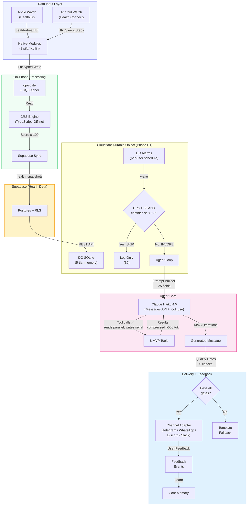

## 11 Locked Architecture Decisions

| # | Decision | Why |
|---|---------|-----|
| 1 | Messages API with `tool_use`, not Agent SDK | Edge Functions are stateless |
| 2 | Claude Haiku 4.5 only for MVP | ~$0.90/Pro user/month |
| 3 | Cross-platform from MVP (Android + iOS) | Apple Watch has best data; teammates have both |
| 4 | Channel adapter pattern from Day 1 | Telegram first; WhatsApp, Discord, Slack via adapter |
| 5 | NativeWind v4 | Tailwind for RN, not Gluestack-UI |
| 6 | 8 tools for MVP | Consolidation principle: fewer tools = higher success |
| 7 | 3-step onboarding | Permissions → Messaging channel link → Profile |
| 8 | On-phone CRS computation | Offline-capable, no server round-trip |
| 9 | Rules-based pre-filter before Claude | Saves 60-80% of API calls |
| 10 | op-sqlite + SQLCipher | AES-256 encrypted local health data |
| 11 | **Cloudflare Durable Objects for Phase D+** | Per-user persistent agent brain with SQLite, scheduling, WebSocket. Health data stays in Supabase. |

## The 8 MVP Tools

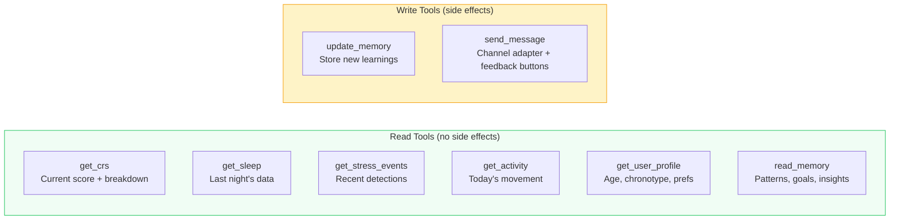

**Tool routing per trigger:**

| Trigger | Tools Used | Typical Cost |
|---------|-----------|-------------|
| Stress alert | get_crs, get_stress_events, send_message | ~$0.002 |
| Morning brief | get_crs, get_sleep, read_memory, send_message | ~$0.003 |
| User reply | All 8 tools available | ~$0.004 |
| AI onboarding interview | get_user_profile, update_memory, send_message | ~$0.01 (one-time) |

## 10-Hook Pipeline (Enhanced with Session 4 Additions)

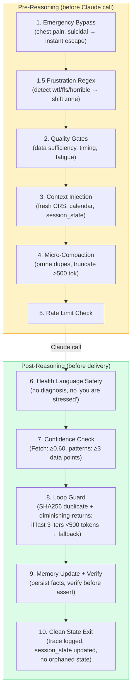

**New in Session 4:** Hook 1.5 (frustration regex), Hook 3 loads `session_state` from DO, Hook 9 verifies memory against fresh data, Hook 10 ensures clean state exit.

## AI Onboarding Interview

The agent's first act of intelligence — a dynamic conversation that builds the user profile and calibrates personality before the first morning brief. Same agent, different soul file (`SOUL_ONBOARDING`).


## CRS Algorithm

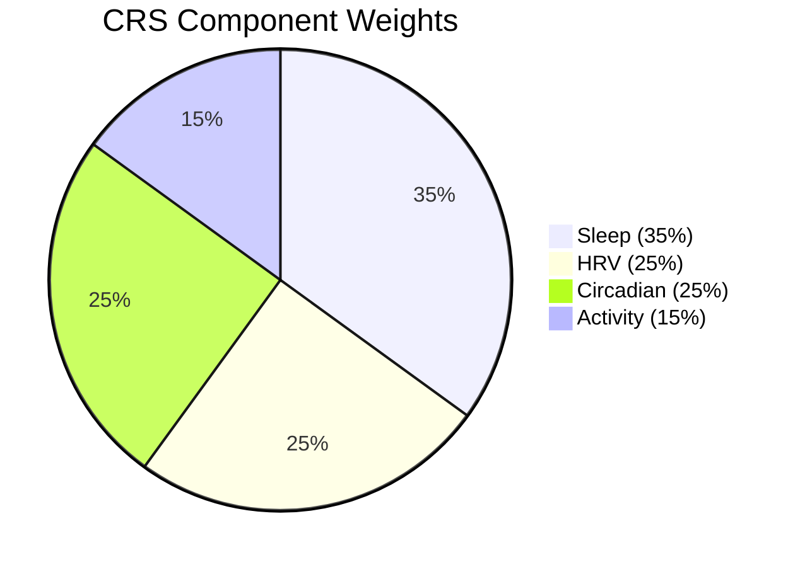

```
CRS = (Sleep * 0.35) + (HRV * 0.25) + (Circadian * 0.25) + (Activity * 0.15)
Range: 0-100 → Zone: Peak (80+) | Moderate (50-79) | Low (<50)
```

Each component outputs 0-100 using **personal baselines, not population norms.**

## Adapter Architecture (Plug & Play) — 10 Adapters

All external boundaries use adapter interfaces — swap any component without rewriting agent logic. **10 adapter interfaces across 6 dimensions of a person's life.**

| Adapter | Phase | Implementations |
|---------|-------|----------------|
| `HealthDataSource` | MVP | Apple Watch (HealthKit), Health Connect, Oura, Fitbit, WHOOP |
| `ChannelAdapter` | MVP | Telegram, WhatsApp, Discord, Slack, In-App |
| `LLMProvider` | MVP | Claude Haiku, multi-model routing |
| `StorageAdapter` | MVP | op-sqlite + SQLCipher |
| `WeatherProvider` | MVP | Open-Meteo (weather + AQI) |
| `CalendarProvider` | Phase 2 | Google Calendar, Outlook (Graph), Apple Calendar |
| `EmailProvider` | Phase 2 | Gmail, Outlook — metadata only, never body content |
| `TaskProvider` | Phase 2 | Todoist, Notion, Linear, Google Tasks, Microsoft To Do |
| `MusicProvider` | Phase 2 | Spotify, YouTube Music, Apple Music |
| `ScreenTimeProvider` | Phase 2 | RescueTime |

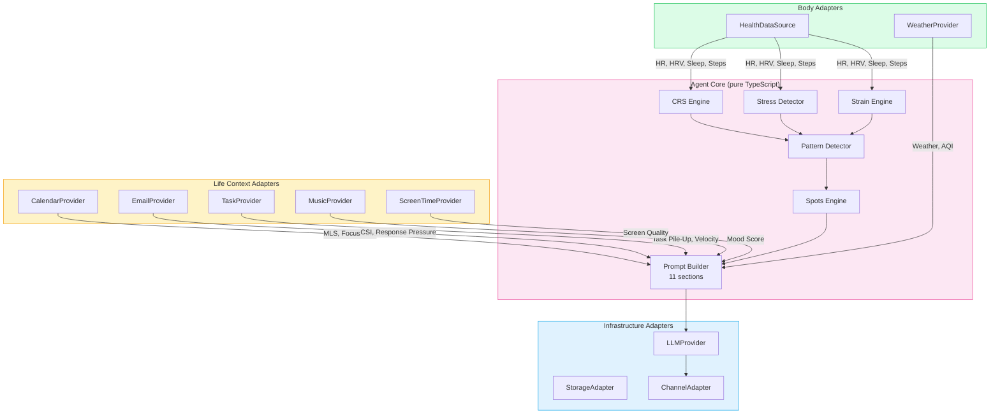

### 32 Metrics → 23 Capabilities → 375 Cross-Source Correlations

See **[Adapter Ecosystem](/adapter-ecosystem)** for complete formulas, all metrics, and capability details.

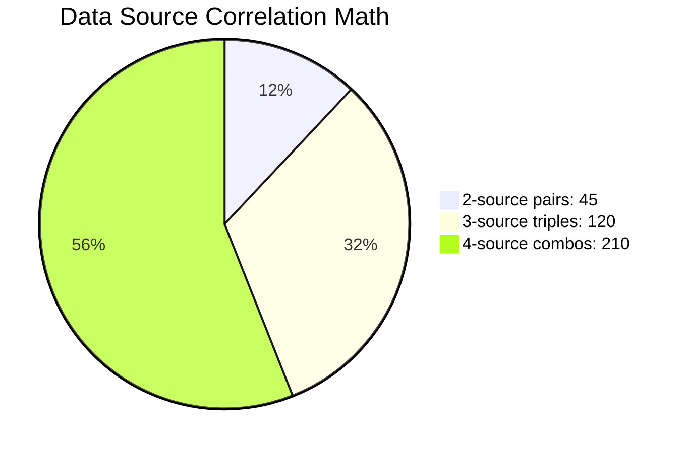

Every new data source multiplies intelligence exponentially, not linearly.

## Defense-in-Depth Security (5 Layers)

Inspired by AtlanClaw's enterprise agent infrastructure, adapted for serverless.

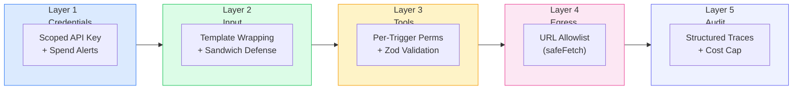

> See [Security & Reliability](security-reliability.md) for full details, Mermaid diagrams, and AtlanClaw comparison.

## Agent Self-Evolution (Phase G+)

Behavioral parameters evolve from user feedback. Soul files stay immutable.

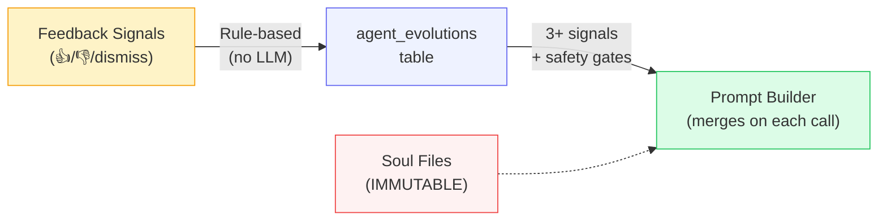

> See [Diagrams](diagrams.md) for full self-evolution flow + safety controls

## LLMProvider: 4-Level Fallback Chain

Reliability lives inside adapters. Core logic stays clean.

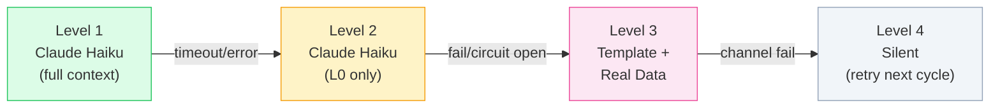

## Cost Model (Updated with Dynamic Token Budget)

| Tier | Price | AI Cost/User/Mo | Margin |
|------|-------|----------------|--------|
| Free | Rs 0 | ~$0.35 | Acquisition |
| Pro | Rs 399/mo ($4.34) | ~$1.15 | **73%** |
| Team | Rs 999/mo/seat | ~$1.15 | **89%** |

**Break-even:** ~55 Pro subscribers. Comfortable profit at 200.

Token budget is **dynamic per trigger** — the agent gets as much context as it needs:

| Trigger | Budget | Key Reason |
|---------|--------|------------|
| Morning Wag | 4,000 | Sleep detail + evolution params + personality |
| Fetch Alert | 4,500 | Stress context + memory + empathy |
| User Chat | 7,000 | 8-10 turn history + all 8 tools |
| Constellation | 10,000 | Weeks of cross-correlated patterns |

Cost control comes from **prompt caching** (cached tokens cost 0.1x) and the **rules pre-filter** (60-80% of checks skip Claude entirely) — not from limiting context.

**Updated cost with all Session 4 optimizations:**

| Cost Component | Per User/Month | Notes |
|---|---|---|
| Cloudflare DO infrastructure | ~$0.01 | Hibernation keeps this negligible |
| LLM (Claude Haiku) | $0.30-0.90 | 5-20 calls/day with pre-filter + caching |
| **Total** | **$0.31-0.91** | Revenue at Rs 399/mo ($4.34) = **73%+ margin** |

## 5-Tier Memory Architecture (Updated April 2026 — R2 Added)

Tiers 1-3 live in Cloudflare DO SQLite (per-user, <1ms). Tier 2 episodes older than 90 days archive to **Cloudflare R2** (cold, zero egress). Tier 4 is Supabase pgvector for semantic constellation search.

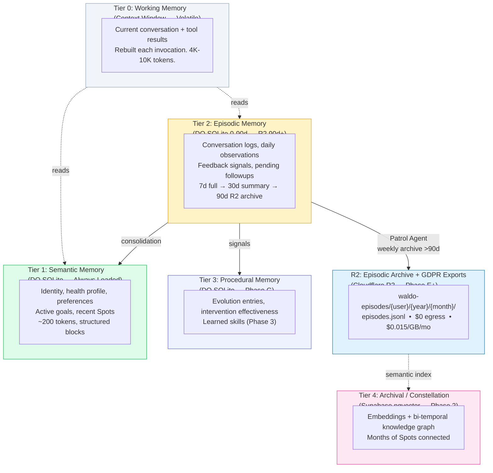

| Tier | Storage | What | When | Phase |
|------|---------|------|------|-------|
| 0 | Context window | Active conversation | Every call (volatile) | D |
| 1 | DO SQLite | Identity, profile, preferences | Always loaded | D |
| 2 | DO SQLite → R2 | Episodes, observations | On-demand; auto-archive >90d | D→E |
| 3 | DO SQLite | Evolutions, procedures | Selectively loaded | G |
| R2 | Cloudflare R2 | Old episodes + GDPR exports | Cold retrieval + downloads | E+ |
| 4 | Supabase pgvector | Embeddings, Constellation | Semantic search | Phase 2 |

> Raw health values NEVER enter DO SQLite or R2. Supabase only, always encrypted with RLS.

## Three-Stage Context Compaction (From Claude Code)

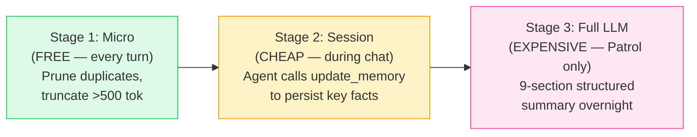

## Concurrent Tool Execution (From Claude Code)

Read-only tools run in **parallel**. Write tools run **serially**. Cuts tool execution from ~900ms to ~300ms.

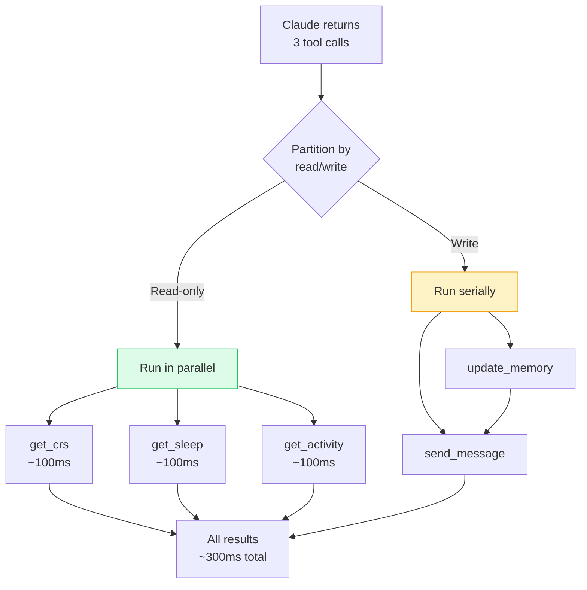

## Patrol Agent — Sleep-Time Compute (Phase G)

Nightly background consolidation via DO alarm. Pre-stages Morning Wag. Result: **<3 second delivery** when user wakes.

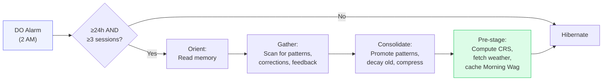

## Buddy System — Waldo Moods (Phase F-G)

Waldo is not an assistant. Waldo is a **buddy**. The dalmatian's visual state reflects your health.

| CRS Zone | Waldo's Mood | Visual |
|----------|-------------|--------|
| 80+ (Energized) | Excited | Tail wagging, running |
| 60-79 (Steady) | Happy | Calm, sitting |
| 40-59 (Flagging) | Concerned | Ears back, watching |
| <40 (Depleted) | Gentle | Curled up, sleeping |
| No data | Curious | Tilted head |

**Gamification:** 7-day streak → hat. 30-day → golden collar. 100 Spots → Constellation Waldo. 1% daily shiny chance.
**Buddy stats = YOUR stats:** SLEEP, RECOVERY, CONSISTENCY, STRESS_MGMT, SELF_AWARENESS.
**Deterministic quirks** from `hash(user_id)` — your Waldo feels uniquely yours.

## Waldo as MCP Server — Ecosystem Strategy (Phase 2)

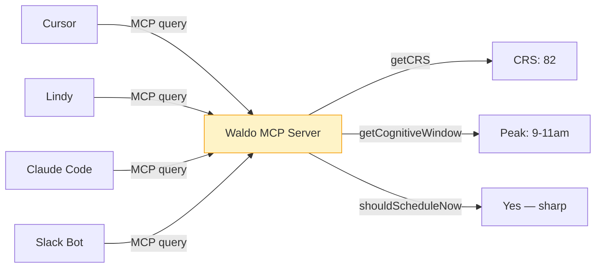

> **97M MCP installs.** Waldo becomes the biological intelligence layer under every other agent.
