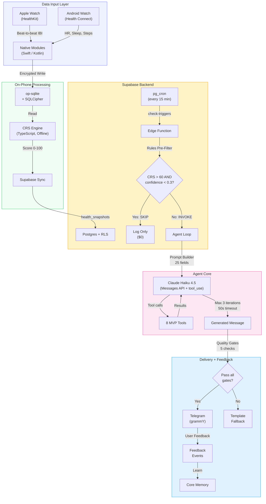
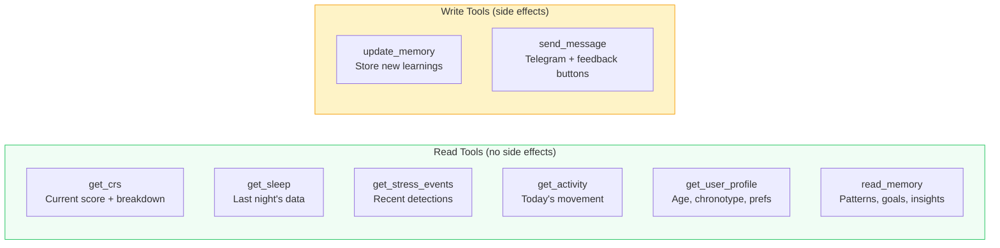
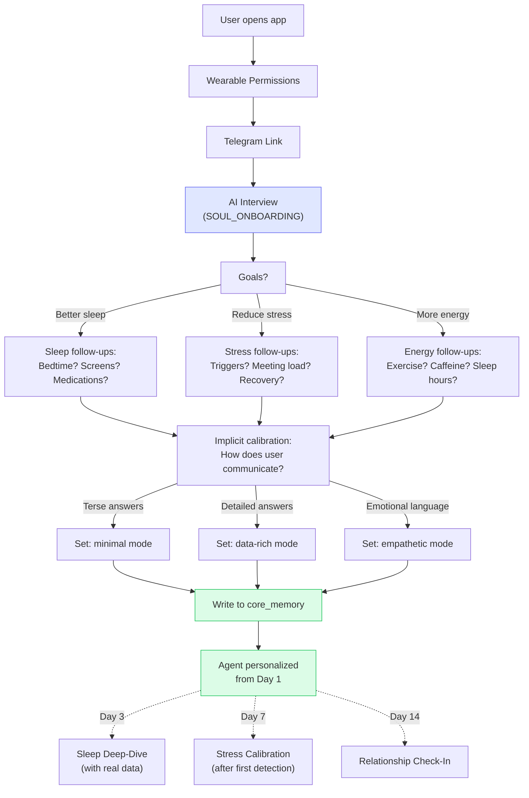
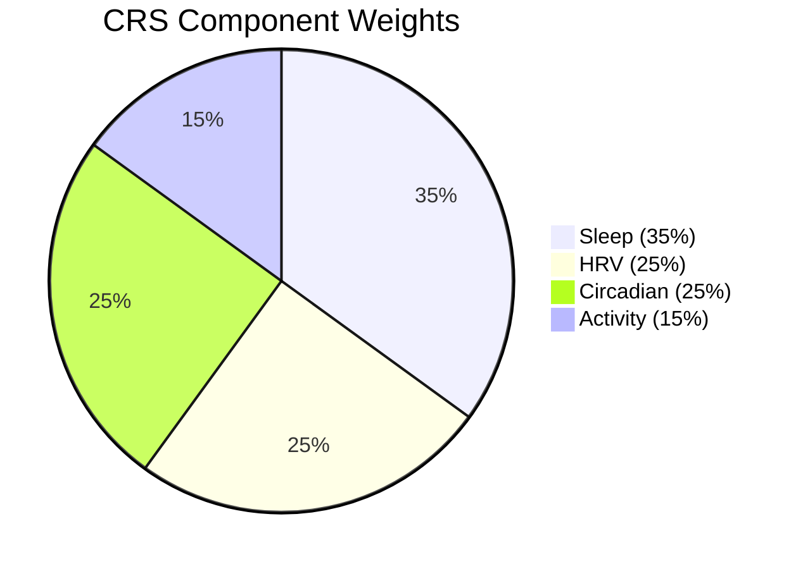

# Architecture at a Glance

OneSync is a **personal cognitive operating system** built in three layers: Body Intelligence (MVP) → Task Intelligence (Phase 2) → Autonomous Personal OS (Phase 3+). The architecture below shows the full system — MVP components are solid, future components expand on the same foundation.

## The Agent OS — Full System



## 10 Locked Architecture Decisions

| # | Decision | Why |
|---|---------|-----|
| 1 | Messages API with `tool_use`, not Agent SDK | Edge Functions are stateless |
| 2 | Claude Haiku 4.5 only for MVP | ~$0.90/Pro user/month |
| 3 | Cross-platform from MVP (Android + iOS) | Apple Watch has best data; teammates have both |
| 4 | Telegram only for MVP | 104M users in India, free API |
| 5 | NativeWind v4 | Tailwind for RN, not Gluestack-UI |
| 6 | 8 tools for MVP | Consolidation principle: fewer tools = higher success |
| 7 | 3-step onboarding | Permissions → Telegram link → Profile |
| 8 | On-phone CRS computation | Offline-capable, no server round-trip |
| 9 | Rules-based pre-filter before Claude | Saves 60-80% of API calls |
| 10 | op-sqlite + SQLCipher | AES-256 encrypted local health data |

## The 8 MVP Tools



**Tool routing per trigger:**

| Trigger | Tools Used | Typical Cost |
|---------|-----------|-------------|
| Stress alert | get_crs, get_stress_events, send_message | ~$0.002 |
| Morning brief | get_crs, get_sleep, read_memory, send_message | ~$0.003 |
| User reply | All 8 tools available | ~$0.004 |
| AI onboarding interview | get_user_profile, update_memory, send_message | ~$0.01 (one-time) |

## AI Onboarding Interview

The agent's first act of intelligence — a dynamic conversation that builds the user profile and calibrates personality before the first morning brief. Same agent, different soul file (`SOUL_ONBOARDING`).



## CRS Algorithm



```
CRS = (Sleep * 0.35) + (HRV * 0.25) + (Circadian * 0.25) + (Activity * 0.15)
Range: 0-100 → Zone: Peak (80+) | Moderate (50-79) | Low (<50)
```

Each component outputs 0-100 using **personal baselines, not population norms.**

## Cost Model

| Tier | Price | AI Cost/User/Mo | Margin |
|------|-------|----------------|--------|
| Free | Rs 0 | ~$0.27 | Acquisition |
| Pro | Rs 399/mo ($4.34) | ~$0.90 | **79%** |
| Team | Rs 999/mo/seat | ~$0.90 | **92%** |

**Break-even:** ~50 Pro subscribers. Comfortable profit at 200.
