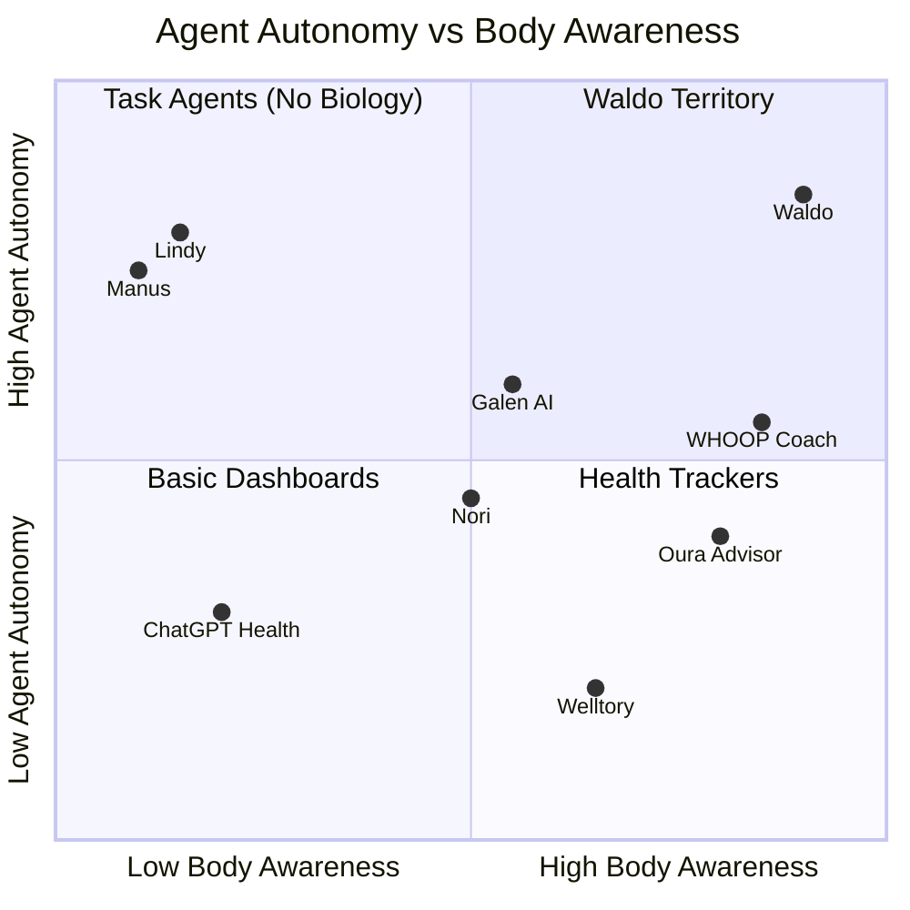
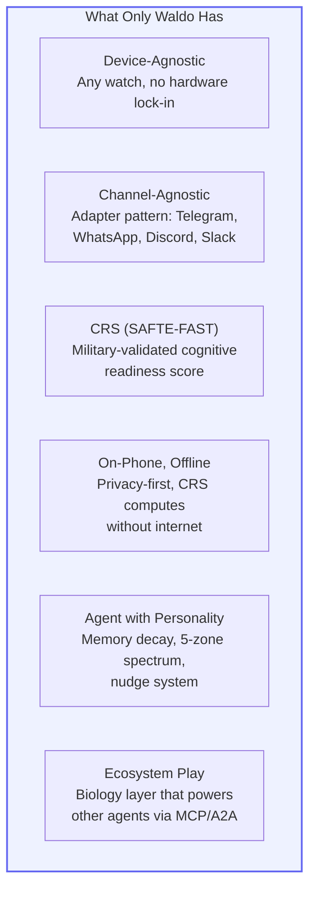
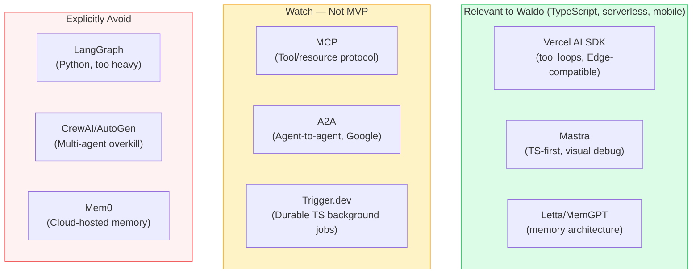

# Competitive Landscape & Ecosystem

> **Last updated:** March 22, 2026. Based on comprehensive web research across 15+ market players, YC batches, wearable platforms, and emerging frameworks.

## Strategic Positioning

Waldo is **not a health AI** — it's a personal cognitive agent. Body intelligence is the wedge and the moat. The product expands to full task delegation in the agent economy.

> **"Every AI agent knows your calendar. Only Waldo knows your body."**

The players below are not just competitors — they're potential **ecosystem partners**. Waldo's biology layer is something other agents and platforms can integrate with. We build the biological intelligence substrate; others can plug into it.

## The Empty Quadrant

**No one else combines deep body awareness with high agent autonomy.** WHOOP has the biology but stays in-app. Lindy has autonomy but zero biology. Waldo sits in the empty quadrant.

## Market Players — Detailed Analysis

### HIGH Overlap

| Player | What They Do | Relationship to Waldo |
|--------|-------------|------------------------|
| **WHOOP** ($3.6B) | Proactive nudges powered by OpenAI. Daily Outlook, Day in Review, rising stress alerts. $199-359/yr + proprietary band required. | **Potential data partner.** WHOOP has deep biometrics but is device-locked, in-app only, and expensive. Waldo is device-agnostic, channel-agnostic, and 50-100x cheaper. WHOOP users could benefit from Waldo's channel delivery; WHOOP data could enhance Waldo's CRS. |
| **Oura** ($5.2B) | Oura Advisor AI. Proprietary women's health AI model. Ring ~$349 + $5.99/mo. | **Potential partner.** Oura ring data flowing into Waldo's agent would give users cross-device intelligence (ring + watch). Oura stays hardware-focused; Waldo is the agent layer. |
| **Galen AI** (YC) | Healthcare agent with LLM memory. 20+ wearable integrations. Clinical/medical focus. | **Adjacent, not competing.** Galen handles chronic conditions and medications. Waldo handles daily cognitive performance. Users could have both — Galen for medical, Waldo for performance. |

### MEDIUM Overlap

| Player | What They Do | Relationship to Waldo |
|--------|-------------|------------------------|
| **Nori** (YC F25) | Concierge AI health coach. Built HealthMCP. iOS-only. Strong founders (2x YC exits). | **Potential integration.** HealthMCP (Model Context Protocol for health data) validates our "body API" vision. iOS-only = no Android. Data sync issues reported. |
| **Welltory** | HRV analysis + AI coach from 1000+ wearables. $8-15/mo. | **Potential data partner.** Notable: has native Galaxy Watch app measuring HRV directly (bypasses Samsung Health's sync gap). No proactive messaging, no agent. |
| **Prana Health** (YC W26) | AI primary care doctor. Continuous monitoring via wearables + EHRs. | **Different market.** Prana is medical-grade (prescriptions, clinical). Waldo is wellness/performance. Non-competing. |
| **Microsoft Copilot Health** | Wearable + medical records + AI Q&A hub. 50,000+ US hospitals. | **Complementary.** Reactive Q&A tool, not autonomous agent. No proactive messaging. |
| **Apple watchOS 26 AI** | Native health coaching + Workout Buddy on Apple Watch. | **Complementary.** Apple-only. Waldo adds cross-platform + external messaging + CRS + agent autonomy. |

### LOW Overlap (Ecosystem Partners)

| Player | Relationship |
|--------|-------------|
| **Lindy** ($50M+ raised) | **Integration partner.** AI Chief of Staff with 4000+ integrations but zero biology. Lindy + Waldo biology = a smarter task agent that knows when you're depleted. |
| **ChatGPT Health** | **Complementary.** Reactive Q&A (230M weekly health queries). Waldo is proactive. Different interaction model. |
| **Sahha.ai** | **Potential data partner.** Health AI SDK for developers. Their SDK could feed into our agent. |

## Wearable Data Platforms

| Platform | Devices | Pricing | Relevance to Waldo |
|----------|---------|---------|---------------------|
| **Terra API** (YC) | 150+ sources | $399-499/mo | Too expensive for MVP. Post-scale option. |
| **Vital (Tryvital)** | 500+ devices + labs | Enterprise | Post-scale option for lab integration. |
| **Sahha** | 300+ devices | $1.2M raised | Health scores SDK — could be complementary. |
| **Open Wearables** (OSS) | Apple, Samsung, Garmin, Polar | Free, self-hosted | **Watch this.** Has MCP Server for connecting wearable data to LLMs. Post-MVP integration candidate. |
| **Spike MCP** | 500+ wearables | Not listed | MCP-native wearable integration. Future possibility. |

**MVP decision:** Direct HealthKit + Health Connect integration ($0 cost, on-device, privacy-first). These platforms are relevant post-MVP when expanding to 50+ wearable brands.

## Ecosystem Changes (2025-2026)

| Change | Impact on Waldo |
|--------|------------------|
| **Google Fit deprecated** (July 2025) | Health Connect is the only path. Validates our architecture. |
| **Samsung HRV gap persists** | Samsung still doesn't write RMSSD to Health Connect. Our HR-proxy fallback is confirmed necessary. |
| **Samsung Health SDK deprecated** (July 2025) | Must use Samsung Health Data SDK. |
| **Apple adding health AI to watchOS 26** | Competitive for iOS users, but Apple-only. Waldo adds cross-platform + external messaging. |
| **MCP donated to Linux Foundation** (Dec 2025) | Open Wearables MCP Server could be future integration path. |
| **WHOOP + OpenAI partnership** | WHOOP building proactive nudges. Still in-app only, device-locked. |
| **61% of healthcare leaders building agentic AI** (Deloitte 2026) | Market timing is right. But most agentic health AI is enterprise/clinical, not consumer. |

## Waldo's Unique Position

### The Adapter Advantage

While competitors lock users into their app and their hardware, Waldo's adapter architecture means:
- **Users choose** where the agent lives (Telegram today, WhatsApp tomorrow, Slack at work)
- **Users choose** which watch they wear (Apple, Samsung, Pixel, Garmin)
- **Developers can** build on top of Waldo's biology layer via MCP/A2A (Phase 4)
- **Partners can** send their data into Waldo (Oura ring + Apple Watch = richer CRS)

### What Competitors Cannot Easily Replicate

1. **WHOOP** can't be device-agnostic (hardware is their business model)
2. **Apple** can't be cross-platform (Android is off-limits)
3. **Lindy/Manus** can't add biology without building what we're building
4. **Nori** can't serve Android users (iOS-only architecture)
5. **Generic health apps** can't add agent autonomy without rearchitecting

## Agent Framework Ecosystem (March 2026 Research)

Comprehensive research across 20+ agent frameworks validates Waldo's architecture. Key findings:

### Architecture Validations

| Waldo Decision | Industry Validation |
|---|---|
| Adapter pattern from Day 1 | Now industry standard — MCP, A2A protocol, Portkey all implement it |
| 5-tier memory with decay (Session 4) | Maps to cognitive science + Letta/MemGPT + Claude Code AutoDream |
| Rules pre-filter (skip LLM) | Validated cost optimization across production deployments |
| On-phone CRS (offline-first) | Almost no agent framework works offline. Genuine differentiator. |
| Messages API (not Agent SDK) | Correct for stateless 50s Edge Functions |

### Frameworks Landscape

### Protocol Landscape

| Protocol | Status (March 2026) | Waldo Relevance |
|----------|---------------------|-----------------|
| **MCP** (Model Context Protocol) | 10,000+ servers, 97M monthly SDK downloads. June 2025 spec adds structured outputs + OAuth. | Waldo as "body API" MCP server — Phase 4. Other agents query your CRS. |
| **A2A** (Agent-to-Agent) | Linux Foundation project. 150+ companies (Amazon, Microsoft, Salesforce). v0.3 adds gRPC. | Pack tier: multiple Waldos sharing Constellations. Phase 4. |
| **Microsoft Agent Framework** | Merged AutoGen + Semantic Kernel. RC status Q1 2026. Python/.NET only. | Validates our state machine approach. Not directly applicable. |

## Strategic Implications

1. **Speed matters.** The window for "proactive health agent via messaging, device-agnostic" is open but closing. WHOOP's proactive nudges are landing. Apple's watchOS 26 AI ships this fall.
2. **Body intelligence is the wedge, not the product.** We start with biology, expand to task delegation. No one else has this trajectory.
3. **Ecosystem > competition.** Frame WHOOP/Oura/Lindy as partners who could plug into our biology layer, not enemies to defeat.
4. **The adapter pattern is the moat.** Channel-agnostic + device-agnostic + model-agnostic = the most flexible health agent architecture in the market.
5. **Architecture validated by ecosystem research.** March 2026 research across 20+ frameworks confirms our core decisions are aligned with where the industry is heading. No pivots needed — invest in operational hardening.
