# Data Flow & Diagrams

## Complete Data Pipeline

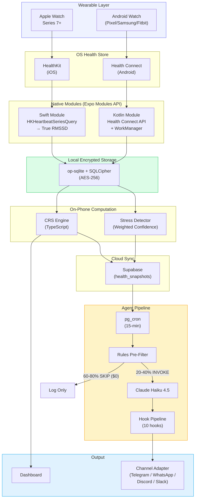
```mermaid
graph TB
    subgraph Wearable["Wearable Layer"]
        AW["Apple Watch<br/>Series 7+"]
        GW["Android Watch<br/>(Pixel/Samsung/Fitbit)"]
    end

    subgraph OS["OS Health Store"]
        HK["HealthKit<br/>(iOS)"]
        HC["Health Connect<br/>(Android)"]
    end

    subgraph NativeModule["Native Modules (Expo Modules API)"]
        SW["Swift Module<br/>HKHeartbeatSeriesQuery<br/>→ True RMSSD"]
        KT["Kotlin Module<br/>Health Connect API<br/>+ WorkManager"]
    end

    subgraph LocalDB["Local Encrypted Storage"]
        SQL["op-sqlite + SQLCipher<br/>(AES-256)"]
    end

    subgraph Compute["On-Phone Computation"]
        CRS["CRS Engine<br/>(TypeScript)"]
        STRESS["Stress Detector<br/>(Weighted Confidence)"]
    end

    subgraph Sync["Cloud Sync"]
        SUP["Supabase<br/>(health_snapshots)"]
    end

    subgraph Agent["Agent Pipeline"]
        CRON["pg_cron<br/>(15-min)"]
        PRE["Rules Pre-Filter"]
        HAIKU["Claude Haiku 4.5"]
        HOOKS["Hook Pipeline<br/>(10 hooks)"]
    end

    subgraph Output["Output"]
        TG["Channel Adapter<br/>(Telegram / WhatsApp /<br/>Discord / Slack)"]
        DASH["Dashboard"]
    end

    AW --> HK
    GW --> HC
    HK --> SW
    HC --> KT
    SW --> SQL
    KT --> SQL
    SQL --> CRS
    SQL --> STRESS
    CRS --> DASH
    CRS --> SUP
    STRESS --> SUP
    SUP --> CRON
    CRON --> PRE
    PRE -->|"60-80% SKIP ($0)"| LOG["Log Only"]
    PRE -->|"20-40% INVOKE"| HAIKU
    HAIKU --> HOOKS
    HOOKS --> TG

    style Wearable fill:#eef2ff,stroke:#6366f1
    style LocalDB fill:#dcfce7,stroke:#22c55e
    style Agent fill:#fef3c7,stroke:#f59e0b
    style Output fill:#e0f2fe,stroke:#0ea5e9
```

## Onboarding Flow — AI Interview

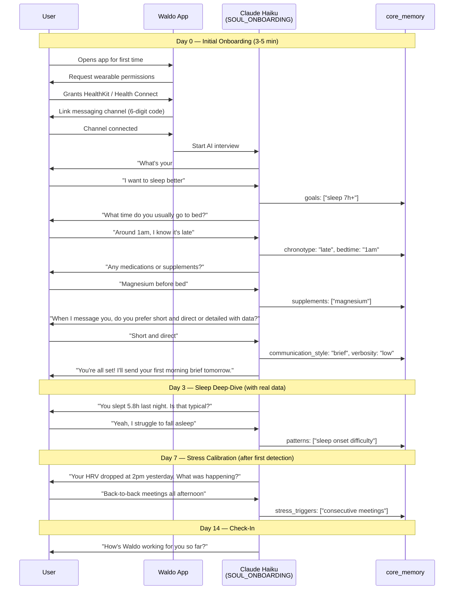
```mermaid
sequenceDiagram
    participant U as User
    participant APP as Waldo App
    participant AI as Claude Haiku<br/>(SOUL_ONBOARDING)
    participant MEM as core_memory

    Note over U,MEM: Day 0 — Initial Onboarding (3-5 min)
    U->>APP: Opens app for first time
    APP->>U: Request wearable permissions
    U->>APP: Grants HealthKit / Health Connect
    APP->>U: Link messaging channel (6-digit code)
    U->>APP: Channel connected

    APP->>AI: Start AI interview
    AI->>U: "What's your #1 health goal?"
    U->>AI: "I want to sleep better"
    AI->>MEM: goals: ["sleep 7h+"]
    AI->>U: "What time do you usually go to bed?"
    U->>AI: "Around 1am, I know it's late"
    AI->>MEM: chronotype: "late", bedtime: "1am"
    AI->>U: "Any medications or supplements?"
    U->>AI: "Magnesium before bed"
    AI->>MEM: supplements: ["magnesium"]
    AI->>U: "When I message you, do you prefer short and direct or detailed with data?"
    U->>AI: "Short and direct"
    AI->>MEM: communication_style: "brief", verbosity: "low"
    AI->>U: "You're all set! I'll send your first morning brief tomorrow."

    Note over U,MEM: Day 3 — Sleep Deep-Dive (with real data)
    AI->>U: "You slept 5.8h last night. Is that typical?"
    U->>AI: "Yeah, I struggle to fall asleep"
    AI->>MEM: patterns: ["sleep onset difficulty"]

    Note over U,MEM: Day 7 — Stress Calibration (after first detection)
    AI->>U: "Your HRV dropped at 2pm yesterday. What was happening?"
    U->>AI: "Back-to-back meetings all afternoon"
    AI->>MEM: stress_triggers: ["consecutive meetings"]

    Note over U,MEM: Day 14 — Check-In
    AI->>U: "How's Waldo working for you so far?"
```

## Memory Architecture (5-Tier, Cognitive Science Mapping)

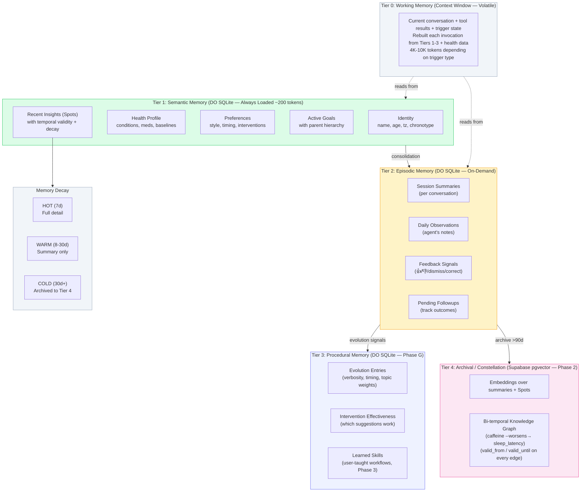
```mermaid
graph TB
    subgraph T0["Tier 0: Working Memory (Context Window — Volatile)"]
        CTX["Current conversation + tool results + trigger state<br/>Rebuilt each invocation from Tiers 1-3 + health data<br/>4K-10K tokens depending on trigger type"]
    end

    subgraph T1["Tier 1: Semantic Memory (DO SQLite — Always Loaded ~200 tokens)"]
        ID["Identity<br/>name, age, tz, chronotype"]
        HP["Health Profile<br/>conditions, meds, baselines"]
        PR["Preferences<br/>style, timing, interventions"]
        GO["Active Goals<br/>with parent hierarchy"]
        IN["Recent Insights (Spots)<br/>with temporal validity + decay"]
    end

    subgraph T2["Tier 2: Episodic Memory (DO SQLite — On-Demand)"]
        SS["Session Summaries<br/>(per conversation)"]
        DL["Daily Observations<br/>(agent's notes)"]
        FB["Feedback Signals<br/>(👍/👎/dismiss/correct)"]
        PF["Pending Followups<br/>(track outcomes)"]
    end

    subgraph T3["Tier 3: Procedural Memory (DO SQLite — Phase G)"]
        EV["Evolution Entries<br/>(verbosity, timing, topic weights)"]
        IE["Intervention Effectiveness<br/>(which suggestions work)"]
        LS["Learned Skills<br/>(user-taught workflows, Phase 3)"]
    end

    subgraph T4["Tier 4: Archival / Constellation (Supabase pgvector — Phase 2)"]
        VEC["Embeddings over summaries + Spots"]
        KG["Bi-temporal Knowledge Graph<br/>(caffeine --worsens→ sleep_latency)<br/>(valid_from / valid_until on every edge)"]
    end

    subgraph Decay["Memory Decay"]
        HOT["HOT (7d)<br/>Full detail"]
        WARM["WARM (8-30d)<br/>Summary only"]
        COLD["COLD (30d+)<br/>Archived to Tier 4"]
    end

    T0 -.->|"reads from"| T1
    T0 -.->|"reads from"| T2
    T1 -->|"consolidation"| T2
    T2 -->|"evolution signals"| T3
    T2 -->|"archive >90d"| T4
    IN --> Decay

    style T0 fill:#f1f5f9,stroke:#94a3b8
    style T1 fill:#dcfce7,stroke:#22c55e
    style T2 fill:#fef3c7,stroke:#f59e0b
    style T3 fill:#eef2ff,stroke:#6366f1
    style T4 fill:#fce7f3,stroke:#ec4899
    style Decay fill:#f1f5f9,stroke:#94a3b8
```

**Where each tier lives:**

| Tier | Storage | Why There |
|------|---------|-----------|
| 0 (Working) | LLM context window | Volatile, rebuilt each invocation |
| 1 (Semantic) | **DO SQLite** | Agent's persistent brain, <1ms access |
| 2 (Episodic) | **DO SQLite** | Per-user history, searchable locally |
| 3 (Procedural) | **DO SQLite** | Learned behaviors, per-user |
| 4 (Archival) | **Supabase pgvector** | Cross-device, graph queries, Constellation |
| Health data | **Supabase Postgres** | Phone syncs here. Never in DO SQLite (privacy). |

> **Key rule:** Raw health values (HRV, HR, sleep hours) NEVER enter DO SQLite. Only derived insights.

## Agent Loop Detail

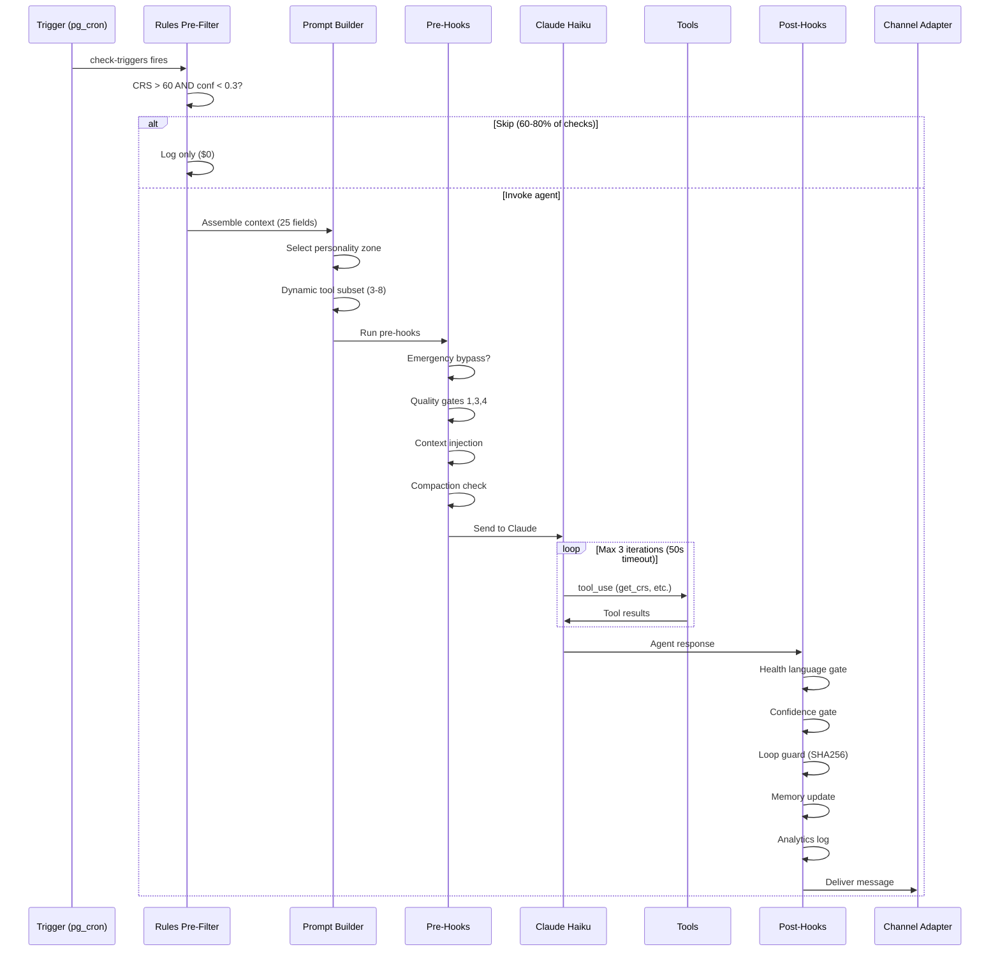
```mermaid
sequenceDiagram
    participant T as Trigger (pg_cron)
    participant PF as Rules Pre-Filter
    participant PB as Prompt Builder
    participant H1 as Pre-Hooks
    participant C as Claude Haiku
    participant TO as Tools
    participant H2 as Post-Hooks
    participant TG as Channel Adapter

    T->>PF: check-triggers fires
    PF->>PF: CRS > 60 AND conf < 0.3?

    alt Skip (60-80% of checks)
        PF->>PF: Log only ($0)
    else Invoke agent
        PF->>PB: Assemble context (25 fields)
        PB->>PB: Select personality zone
        PB->>PB: Dynamic tool subset (3-8)
        PB->>H1: Run pre-hooks
        H1->>H1: Emergency bypass?
        H1->>H1: Quality gates 1,3,4
        H1->>H1: Context injection
        H1->>H1: Compaction check
        H1->>C: Send to Claude

        loop Max 3 iterations (50s timeout)
            C->>TO: tool_use (get_crs, etc.)
            TO->>C: Tool results
        end

        C->>H2: Agent response
        H2->>H2: Health language gate
        H2->>H2: Confidence gate
        H2->>H2: Loop guard (SHA256)
        H2->>H2: Memory update
        H2->>H2: Analytics log
        H2->>TG: Deliver message
    end
```

## Stress Detection Algorithm

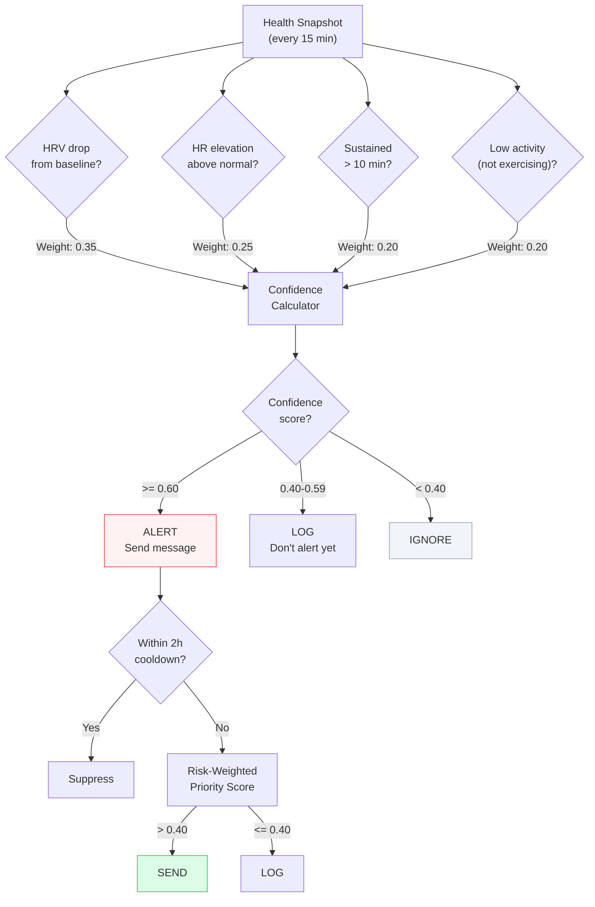
```mermaid
graph TD
    START["Health Snapshot<br/>(every 15 min)"] --> HRV{"HRV drop<br/>from baseline?"}
    HRV -->|"Weight: 0.35"| CONF["Confidence<br/>Calculator"]
    START --> HR{"HR elevation<br/>above normal?"}
    HR -->|"Weight: 0.25"| CONF
    START --> DUR{"Sustained<br/>> 10 min?"}
    DUR -->|"Weight: 0.20"| CONF
    START --> ACT{"Low activity<br/>(not exercising)?"}
    ACT -->|"Weight: 0.20"| CONF

    CONF --> CHECK{"Confidence<br/>score?"}
    CHECK -->|">= 0.60"| ALERT["ALERT<br/>Send message"]
    CHECK -->|"0.40-0.59"| LOGONLY["LOG<br/>Don't alert yet"]
    CHECK -->|"< 0.40"| IGNORE["IGNORE"]

    ALERT --> COOL{"Within 2h<br/>cooldown?"}
    COOL -->|Yes| SUPPRESS["Suppress"]
    COOL -->|No| PRIORITY["Risk-Weighted<br/>Priority Score"]
    PRIORITY -->|"> 0.40"| SEND["SEND"]
    PRIORITY -->|"<= 0.40"| LOGONLY2["LOG"]

    style ALERT fill:#fef2f2,stroke:#ef4444
    style SEND fill:#dcfce7,stroke:#22c55e
    style IGNORE fill:#f1f5f9,stroke:#94a3b8
```

## Context Assembly (Dynamic Token Budget)

Budget is **dynamic per trigger type** — the agent should have access to as much relevant context as possible. Cost control comes from prompt caching and the pre-filter, NOT from starving context.

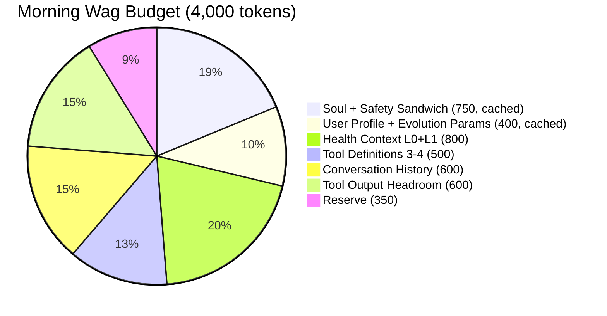
```mermaid
pie title Morning Wag Budget (4,000 tokens)
    "Soul + Safety Sandwich (750, cached)" : 750
    "User Profile + Evolution Params (400, cached)" : 400
    "Health Context L0+L1 (800)" : 800
    "Tool Definitions 3-4 (500)" : 500
    "Conversation History (600)" : 600
    "Tool Output Headroom (600)" : 600
    "Reserve (350)" : 350
```

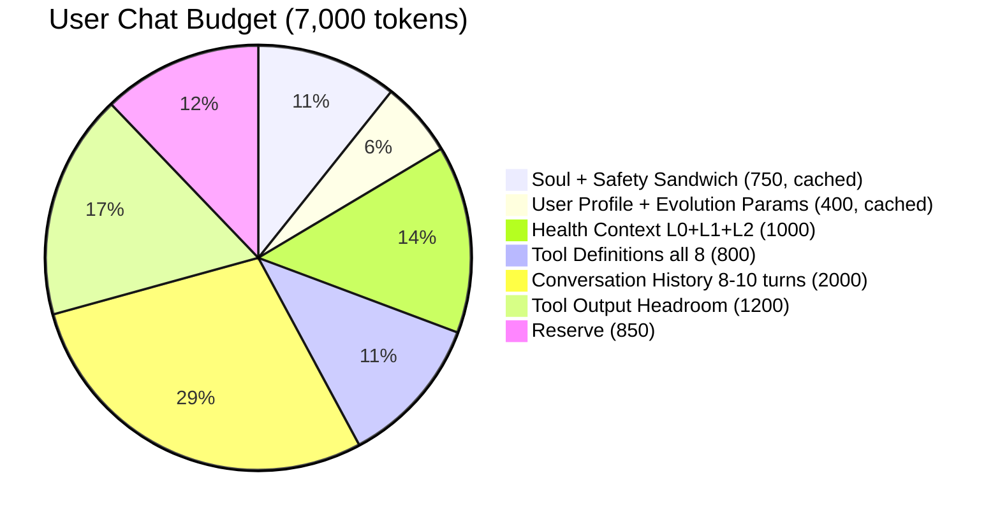
```mermaid
pie title User Chat Budget (7,000 tokens)
    "Soul + Safety Sandwich (750, cached)" : 750
    "User Profile + Evolution Params (400, cached)" : 400
    "Health Context L0+L1+L2 (1000)" : 1000
    "Tool Definitions all 8 (800)" : 800
    "Conversation History 8-10 turns (2000)" : 2000
    "Tool Output Headroom (1200)" : 1200
    "Reserve (850)" : 850
```

| Trigger Type | Budget | Why |
|-------------|--------|-----|
| Morning Wag | **4,000** | Sleep detail + evolution params + personality |
| Fetch Alert | **4,500** | Stress context + memory + empathetic framing |
| User Chat | **7,000** | Full conversation (8-10 turns) + all tools |
| Constellation (Phase 2) | **10,000** | Weeks of pattern summaries |

**Cost impact:** +$0.25/month per Pro user (from $0.90 → $1.15). Still 73%+ margin. Quality is worth it.

## Proactive Intelligence Roadmap

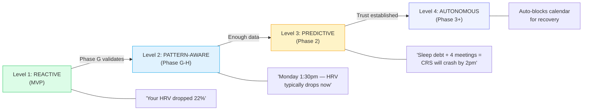
```mermaid
graph LR
    L1["Level 1: REACTIVE<br/>(MVP)"] -->|"Phase G validates"| L2["Level 2: PATTERN-AWARE<br/>(Phase G-H)"]
    L2 -->|"Enough data"| L3["Level 3: PREDICTIVE<br/>(Phase 2)"]
    L3 -->|"Trust established"| L4["Level 4: AUTONOMOUS<br/>(Phase 3+)"]

    L1 --- D1["'Your HRV dropped 22%'"]
    L2 --- D2["'Monday 1:30pm — HRV<br/>typically drops now'"]
    L3 --- D3["'Sleep debt + 4 meetings =<br/>CRS will crash by 2pm'"]
    L4 --- D4["Auto-blocks calendar<br/>for recovery"]

    style L1 fill:#dcfce7,stroke:#22c55e
    style L2 fill:#e0f2fe,stroke:#0ea5e9
    style L3 fill:#fef3c7,stroke:#f59e0b
    style L4 fill:#eef2ff,stroke:#6366f1
```

## Security Architecture (5-Layer Defense-in-Depth)

Inspired by AtlanClaw's enterprise agent infrastructure (Atlan's 18+ K8s-deployed AI agents), adapted for Waldo's serverless model.

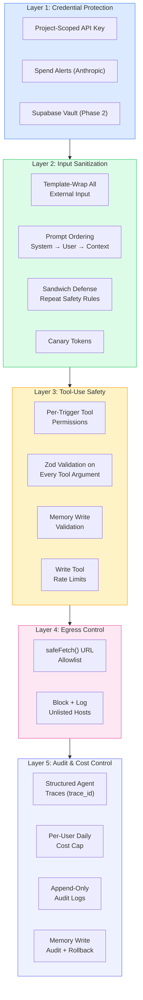
```mermaid
graph TB
    subgraph L1["Layer 1: Credential Protection"]
        S1["Project-Scoped API Key"]
        S2["Spend Alerts (Anthropic)"]
        S3["Supabase Vault (Phase 2)"]
    end

    subgraph L2["Layer 2: Input Sanitization"]
        S4["Template-Wrap All<br/>External Input"]
        S5["Prompt Ordering<br/>System → User → Context"]
        S6["Sandwich Defense<br/>Repeat Safety Rules"]
        S7["Canary Tokens"]
    end

    subgraph L3["Layer 3: Tool-Use Safety"]
        S8["Per-Trigger Tool<br/>Permissions"]
        S9["Zod Validation on<br/>Every Tool Argument"]
        S10["Memory Write<br/>Validation"]
        S11["Write Tool<br/>Rate Limits"]
    end

    subgraph L4["Layer 4: Egress Control"]
        S12["safeFetch() URL<br/>Allowlist"]
        S13["Block + Log<br/>Unlisted Hosts"]
    end

    subgraph L5["Layer 5: Audit & Cost Control"]
        S14["Structured Agent<br/>Traces (trace_id)"]
        S15["Per-User Daily<br/>Cost Cap"]
        S16["Append-Only<br/>Audit Logs"]
        S17["Memory Write<br/>Audit + Rollback"]
    end

    L1 --> L2 --> L3 --> L4 --> L5

    style L1 fill:#dbeafe,stroke:#3b82f6
    style L2 fill:#dcfce7,stroke:#22c55e
    style L3 fill:#fef3c7,stroke:#f59e0b
    style L4 fill:#fce7f3,stroke:#ec4899
    style L5 fill:#eef2ff,stroke:#6366f1
```

## Input Sanitization Flow

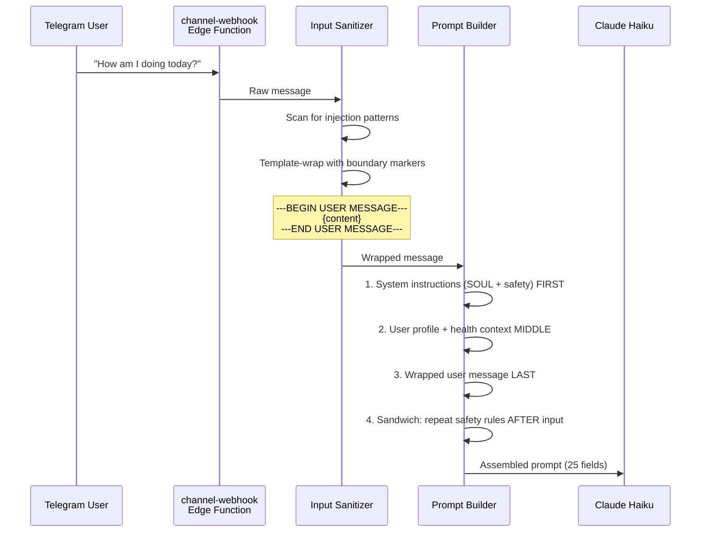
```mermaid
sequenceDiagram
    participant USER as Telegram User
    participant WEBHOOK as channel-webhook<br/>Edge Function
    participant SANITIZE as Input Sanitizer
    participant BUILDER as Prompt Builder
    participant CLAUDE as Claude Haiku

    USER->>WEBHOOK: "How am I doing today?"
    WEBHOOK->>SANITIZE: Raw message
    SANITIZE->>SANITIZE: Scan for injection patterns
    SANITIZE->>SANITIZE: Template-wrap with boundary markers
    Note over SANITIZE: ---BEGIN USER MESSAGE---<br/>{content}<br/>---END USER MESSAGE---
    SANITIZE->>BUILDER: Wrapped message

    BUILDER->>BUILDER: 1. System instructions (SOUL + safety) FIRST
    BUILDER->>BUILDER: 2. User profile + health context MIDDLE
    BUILDER->>BUILDER: 3. Wrapped user message LAST
    BUILDER->>BUILDER: 4. Sandwich: repeat safety rules AFTER input
    BUILDER->>CLAUDE: Assembled prompt (25 fields)
```

## Tool Validation Pipeline

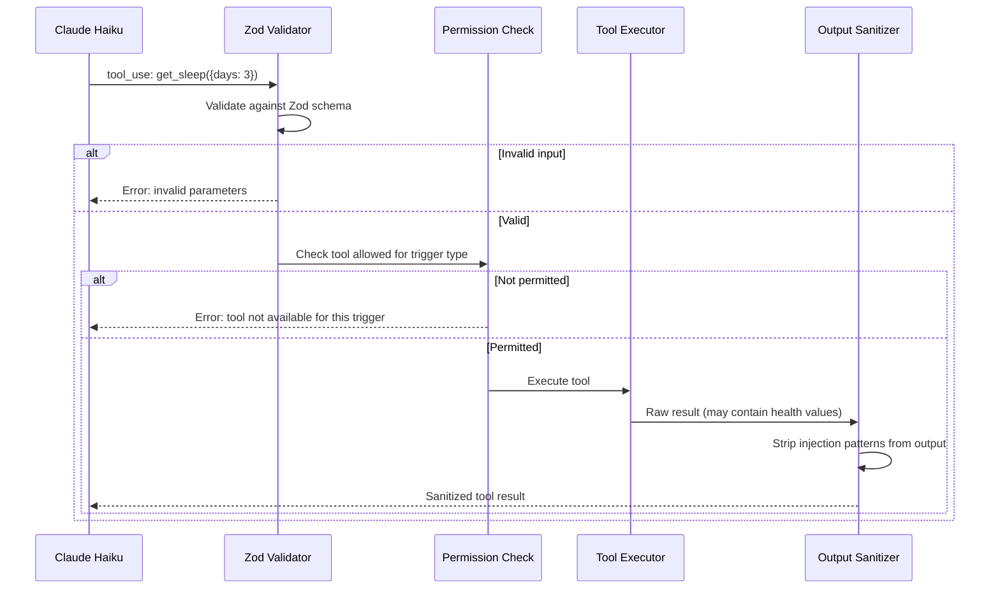
```mermaid
sequenceDiagram
    participant C as Claude Haiku
    participant V as Zod Validator
    participant P as Permission Check
    participant T as Tool Executor
    participant S as Output Sanitizer

    C->>V: tool_use: get_sleep({days: 3})
    V->>V: Validate against Zod schema
    alt Invalid input
        V-->>C: Error: invalid parameters
    else Valid
        V->>P: Check tool allowed for trigger type
        alt Not permitted
            P-->>C: Error: tool not available for this trigger
        else Permitted
            P->>T: Execute tool
            T->>S: Raw result (may contain health values)
            S->>S: Strip injection patterns from output
            S-->>C: Sanitized tool result
        end
    end
```

## LLM Fallback Chain (Built Into LLMProvider Adapter)

```mermaid
graph TD
    START["Agent Invocation"] --> CB{"Circuit<br/>Breaker<br/>Open?"}
    CB -->|No| L1{"Level 1:<br/>Claude Haiku<br/>(full L0+L1 context)"}
    CB -->|Yes (3+ failures)| L3

    L1 -->|Success| DELIVER["Deliver via<br/>Channel Adapter"]
    L1 -->|Timeout / Error| L2{"Level 2:<br/>Claude Haiku<br/>(L0 context only,<br/>cheaper + faster)"}
    L2 -->|Success| DELIVER
    L2 -->|Fail| L3["Level 3:<br/>Template + Real Data<br/>'Nap Score is 43.<br/>Rough night — take it easy.'"]
    L3 --> DELIVER
    L3 -->|Channel fail| L4["Level 4:<br/>Silent<br/>Log error, retry<br/>next pg_cron cycle"]

    style L1 fill:#dcfce7,stroke:#22c55e
    style L2 fill:#fef3c7,stroke:#f59e0b
    style L3 fill:#fce7f3,stroke:#ec4899
    style L4 fill:#f1f5f9,stroke:#94a3b8
    style CB fill:#fef2f2,stroke:#ef4444
```

## Per-Trigger Tool Permissions

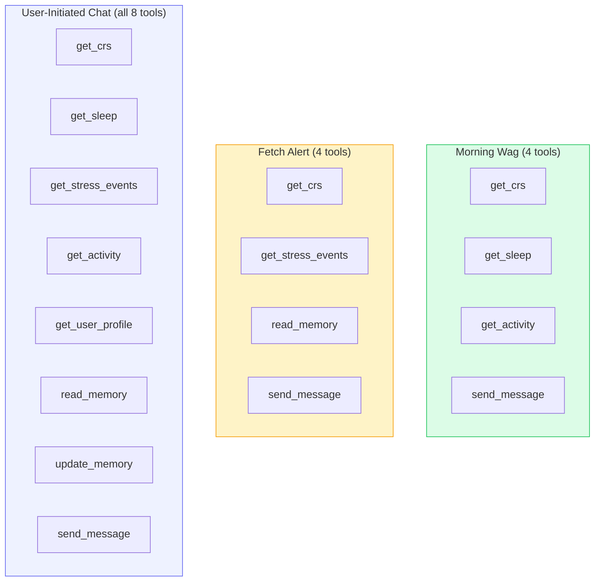
```mermaid
graph TB
    subgraph Morning["Morning Wag (4 tools)"]
        M1["get_crs"] ; M2["get_sleep"] ; M3["get_activity"] ; M4["send_message"]
    end

    subgraph Fetch["Fetch Alert (4 tools)"]
        F1["get_crs"] ; F2["get_stress_events"] ; F3["read_memory"] ; F4["send_message"]
    end

    subgraph Chat["User-Initiated Chat (all 8 tools)"]
        C1["get_crs"] ; C2["get_sleep"] ; C3["get_stress_events"] ; C4["get_activity"]
        C5["get_user_profile"] ; C6["read_memory"] ; C7["update_memory"] ; C8["send_message"]
    end

    style Morning fill:#dcfce7,stroke:#22c55e
    style Fetch fill:#fef3c7,stroke:#f59e0b
    style Chat fill:#eef2ff,stroke:#6366f1
```

## Idempotent Message Delivery

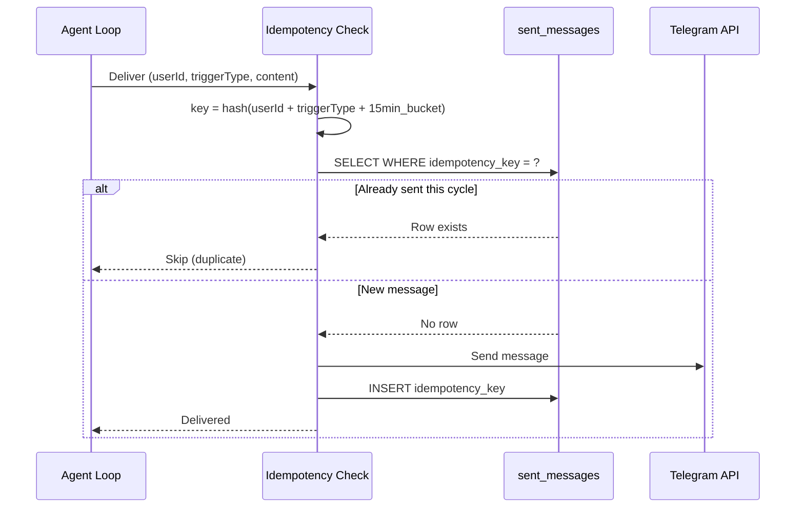
```mermaid
sequenceDiagram
    participant AGENT as Agent Loop
    participant IDEM as Idempotency Check
    participant DB as sent_messages
    participant TG as Telegram API

    AGENT->>IDEM: Deliver (userId, triggerType, content)
    IDEM->>IDEM: key = hash(userId + triggerType + 15min_bucket)
    IDEM->>DB: SELECT WHERE idempotency_key = ?
    alt Already sent this cycle
        DB-->>IDEM: Row exists
        IDEM-->>AGENT: Skip (duplicate)
    else New message
        DB-->>IDEM: No row
        IDEM->>TG: Send message
        IDEM->>DB: INSERT idempotency_key
        IDEM-->>AGENT: Delivered
    end
```

## Tools Under Evaluation (Flexible — Not Locked)

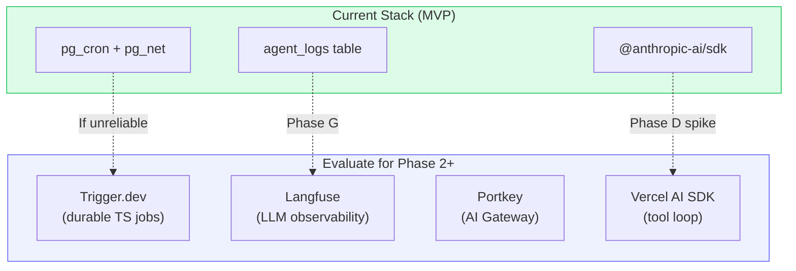
```mermaid
graph TB
    subgraph Current["Current Stack (MVP)"]
        PG["pg_cron + pg_net"]
        SDK["@anthropic-ai/sdk"]
        LOGS["agent_logs table"]
    end

    subgraph Eval["Evaluate for Phase 2+"]
        TRIG["Trigger.dev<br/>(durable TS jobs)"]
        LANG["Langfuse<br/>(LLM observability)"]
        PORT["Portkey<br/>(AI Gateway)"]
        VERCEL["Vercel AI SDK<br/>(tool loop)"]
    end

    PG -.->|"If unreliable"| TRIG
    LOGS -.->|"Phase G"| LANG
    SDK -.->|"Phase D spike"| VERCEL

    style Current fill:#dcfce7,stroke:#22c55e
    style Eval fill:#eef2ff,stroke:#6366f1
```

## Agent Self-Evolution (Feedback-Driven Learning)

Inspired by JiuwenClaw's "living skills" pattern. The agent evolves its behavior based on accumulated user signals — but identity (soul files) stays immutable.

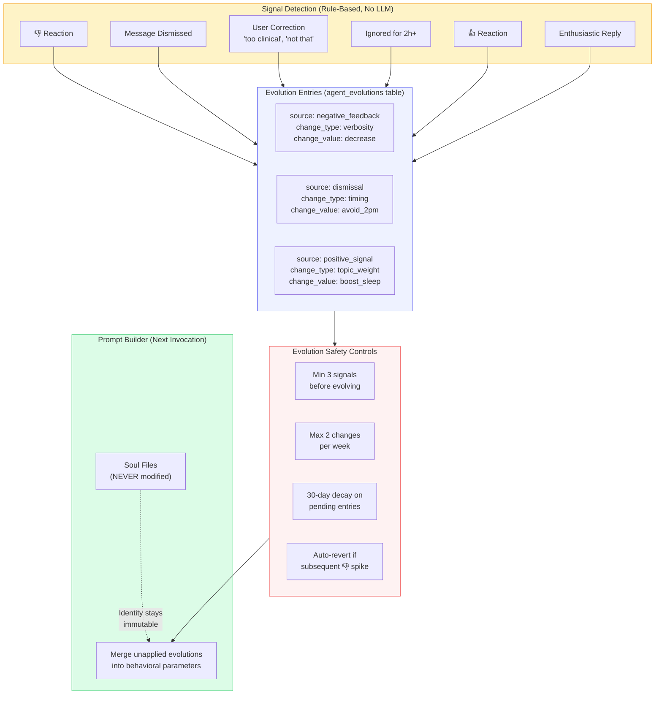
```mermaid
graph TD
    subgraph Signals["Signal Detection (Rule-Based, No LLM)"]
        S1["👎 Reaction"] ; S2["Message Dismissed"] ; S3["User Correction<br/>'too clinical', 'not that'"]
        S4["👍 Reaction"] ; S5["Enthusiastic Reply"] ; S6["Ignored for 2h+"]
    end

    subgraph Accumulate["Evolution Entries (agent_evolutions table)"]
        E1["source: negative_feedback<br/>change_type: verbosity<br/>change_value: decrease"]
        E2["source: dismissal<br/>change_type: timing<br/>change_value: avoid_2pm"]
        E3["source: positive_signal<br/>change_type: topic_weight<br/>change_value: boost_sleep"]
    end

    subgraph Safety["Evolution Safety Controls"]
        SC1["Min 3 signals<br/>before evolving"]
        SC2["Max 2 changes<br/>per week"]
        SC3["30-day decay on<br/>pending entries"]
        SC4["Auto-revert if<br/>subsequent 👎 spike"]
    end

    subgraph Apply["Prompt Builder (Next Invocation)"]
        PB["Merge unapplied evolutions<br/>into behavioral parameters"]
        SOUL["Soul Files<br/>(NEVER modified)"]
    end

    S1 & S2 & S3 & S6 --> Accumulate
    S4 & S5 --> Accumulate
    Accumulate --> Safety
    Safety --> PB
    SOUL -.->|"Identity stays<br/>immutable"| PB

    style Signals fill:#fef3c7,stroke:#f59e0b
    style Accumulate fill:#eef2ff,stroke:#6366f1
    style Safety fill:#fef2f2,stroke:#ef4444
    style Apply fill:#dcfce7,stroke:#22c55e
```

### What Evolves vs What Stays Immutable

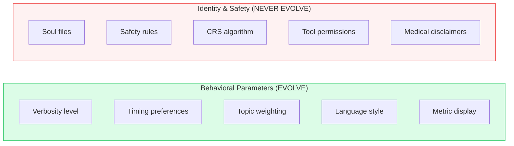
```mermaid
graph LR
    subgraph Evolves["Behavioral Parameters (EVOLVE)"]
        V1["Verbosity level"]
        V2["Timing preferences"]
        V3["Topic weighting"]
        V4["Language style"]
        V5["Metric display"]
    end

    subgraph Immutable["Identity & Safety (NEVER EVOLVE)"]
        I1["Soul files"]
        I2["Safety rules"]
        I3["CRS algorithm"]
        I4["Tool permissions"]
        I5["Medical disclaimers"]
    end

    style Evolves fill:#dcfce7,stroke:#22c55e
    style Immutable fill:#fef2f2,stroke:#ef4444
```

### The Closed Loop

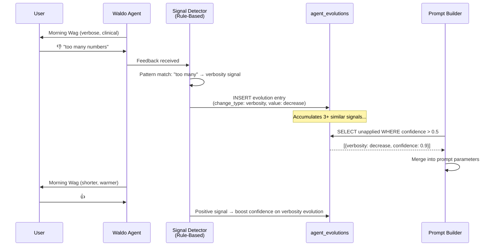
```mermaid
sequenceDiagram
    participant U as User
    participant W as Waldo Agent
    participant SD as Signal Detector<br/>(Rule-Based)
    participant EV as agent_evolutions
    participant PB as Prompt Builder

    W->>U: Morning Wag (verbose, clinical)
    U->>W: 👎 "too many numbers"
    W->>SD: Feedback received
    SD->>SD: Pattern match: "too many" → verbosity signal
    SD->>EV: INSERT evolution entry<br/>(change_type: verbosity, value: decrease)

    Note over EV: Accumulates 3+ similar signals...

    PB->>EV: SELECT unapplied WHERE confidence > 0.5
    EV-->>PB: [{verbosity: decrease, confidence: 0.9}]
    PB->>PB: Merge into prompt parameters
    W->>U: Morning Wag (shorter, warmer)
    U->>W: 👍
    SD->>EV: Positive signal → boost confidence on verbosity evolution
```

## Tool Output Compression

When tool results are large, compress before returning to Claude:

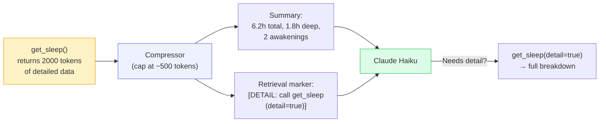
```mermaid
graph LR
    TOOL["get_sleep()<br/>returns 2000 tokens<br/>of detailed data"] --> COMPRESS["Compressor<br/>(cap at ~500 tokens)"]
    COMPRESS --> SUMMARY["Summary:<br/>6.2h total, 1.8h deep,<br/>2 awakenings"]
    COMPRESS --> MARKER["Retrieval marker:<br/>[DETAIL: call get_sleep<br/>(detail=true)]"]
    SUMMARY --> CLAUDE["Claude Haiku"]
    MARKER --> CLAUDE

    CLAUDE -->|"Needs detail?"| RETRIEVE["get_sleep(detail=true)<br/>→ full breakdown"]

    style TOOL fill:#fef3c7,stroke:#f59e0b
    style COMPRESS fill:#eef2ff,stroke:#6366f1
    style CLAUDE fill:#dcfce7,stroke:#22c55e
```

> See [Security & Reliability](security-reliability.md) for full details including AtlanClaw comparison, agent ecosystem research findings, and implementation patterns.

---

## Phase A0 — validated data pipeline (built and running)

This is the pipeline that was built and validated in Phase A0 using Ark's real Apple Health export (289MB, 683K records, 856 days).

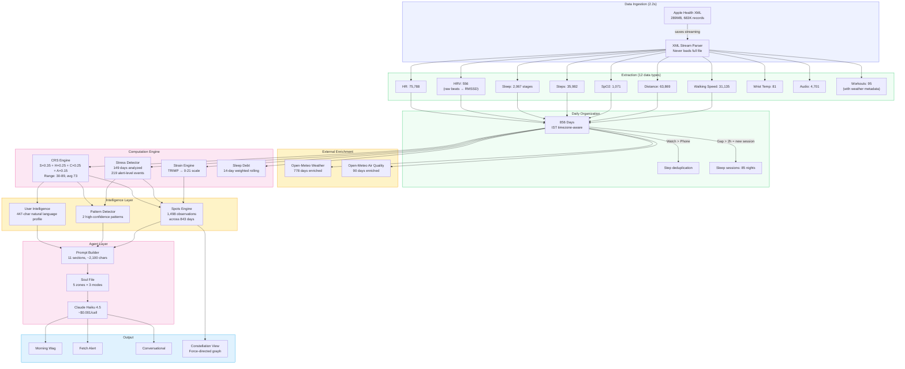
```mermaid
flowchart TB
    subgraph Input["Data Ingestion (2.2s)"]
        XML["Apple Health XML<br/>289MB, 683K records"]
        XML -->|"saxes streaming"| PARSER["XML Stream Parser<br/>Never loads full file"]
    end

    subgraph Extract["Extraction (12 data types)"]
        PARSER --> HR["HR: 75,788"]
        PARSER --> HRV["HRV: 556<br/>(raw beats → RMSSD)"]
        PARSER --> SLEEP["Sleep: 2,067 stages"]
        PARSER --> STEPS["Steps: 35,982"]
        PARSER --> SPO2["SpO2: 1,071"]
        PARSER --> DIST["Distance: 63,869"]
        PARSER --> WSPD["Walking Speed: 31,135"]
        PARSER --> WTEMP["Wrist Temp: 81"]
        PARSER --> AUDIO["Audio: 4,701"]
        PARSER --> WORKOUT["Workouts: 95<br/>(with weather metadata)"]
    end

    subgraph Organize["Daily Organization"]
        HR & HRV & SLEEP & STEPS & SPO2 & DIST & WSPD --> DAILY["856 Days<br/>IST timezone-aware"]
        DAILY -->|"Watch > Phone"| DEDUP["Step deduplication"]
        DAILY -->|"Gap > 2h = new session"| SESSIONS["Sleep sessions: 85 nights"]
    end

    subgraph Enrich["External Enrichment"]
        DAILY --> WEATHER["Open-Meteo Weather<br/>778 days enriched"]
        DAILY --> AQI["Open-Meteo Air Quality<br/>90 days enriched"]
    end

    subgraph Compute["Computation Engine"]
        DAILY --> CRS["CRS Engine<br/>S×0.35 + H×0.25 + C×0.25 + A×0.15<br/>Range: 30-89, avg 73"]
        DAILY --> STRESS["Stress Detector<br/>149 days analyzed<br/>219 alert-level events"]
        DAILY --> STRAIN["Strain Engine<br/>TRIMP → 0-21 scale"]
        DAILY --> DEBT["Sleep Debt<br/>14-day weighted rolling"]
    end

    subgraph Intel["Intelligence Layer"]
        CRS & STRESS --> PATTERNS["Pattern Detector<br/>2 high-confidence patterns"]
        CRS & STRESS & STRAIN --> SPOTS["Spots Engine<br/>1,498 observations<br/>across 843 days"]
        CRS --> PROFILE["User Intelligence<br/>447-char natural language profile"]
    end

    subgraph Agent["Agent Layer"]
        PROFILE & PATTERNS & SPOTS --> PROMPT["Prompt Builder<br/>11 sections, ~2,100 chars"]
        PROMPT --> SOUL["Soul File<br/>5 zones × 3 modes"]
        SOUL --> CLAUDE["Claude Haiku 4.5<br/>~$0.001/call"]
    end

    subgraph Output["Output"]
        CLAUDE --> WAG["Morning Wag"]
        CLAUDE --> FETCH["Fetch Alert"]
        CLAUDE --> CHAT["Conversational"]
        SPOTS --> CONSTELLATION["Constellation View<br/>Force-directed graph"]
    end

    style Input fill:#eef2ff,stroke:#6366f1
    style Extract fill:#f0fdf4,stroke:#22c55e
    style Organize fill:#f0fdf4,stroke:#22c55e
    style Enrich fill:#fef3c7,stroke:#f59e0b
    style Compute fill:#fce7f3,stroke:#ec4899
    style Intel fill:#fef3c7,stroke:#f59e0b
    style Agent fill:#fce7f3,stroke:#ec4899
    style Output fill:#e0f2fe,stroke:#0ea5e9
```

### Phase A0 validation results

| Metric | Result |
|--------|--------|
| Records parsed | 683,330 in 2.2s |
| Rich days (sleep + HRV + HR) | 85 of 856 |
| CRS range | 30-89, avg 73 |
| Stress events detected | 219 alert-level (≥60% confidence) |
| Spots generated | 1,498 across 843 days |
| Patterns discovered | 2 high-confidence (sleep→CRS swing, exercise recovery dip) |
| Weather enriched | 778 days |
| Prompt size | ~2,100 chars user + ~2,500 chars system |
| Cost per Claude call | ~$0.001 |
| Step dedup impact | -37% (removed iPhone/Watch overlap) |
| Timezone fix impact | +12 rich days recovered (IST offset) |

## Phase 2 — full life context pipeline (planned)

```mermaid
flowchart LR
    subgraph Health["Body"]
        AW["Apple Watch"] --> CRS["CRS 0-100"]
        AW --> STRAIN2["Strain 0-21"]
        AW --> DEBT2["Sleep Debt"]
        AW --> STRESS2["Stress 0-1"]
    end

    subgraph Work["Schedule + Communication"]
        GCAL["Google Calendar"] --> MLS["Meeting Load 0-15"]
        GCAL --> FOCUS["Focus Time"]
        GMAIL["Gmail"] --> CSI["Comm Stress 0-100"]
        GMAIL --> AFTERHRS["After-Hours Ratio"]
    end

    subgraph Tasks2["Tasks + Output"]
        TODO["Todoist / Notion"] --> PILE["Task Pile-Up"]
        TODO --> VELOCITY["Completion Velocity"]
        GH["GitHub"] --> COMMITS["Work Patterns"]
    end

    subgraph Mood2["Mood + Screen"]
        SPOT2["Spotify"] --> MOOD2["Mood Score"]
        RT2["RescueTime"] --> SCREENQ["Screen Quality"]
    end

    subgraph Master["Master Metrics"]
        CRS & MLS & CSI & PILE & DEBT2 --> DCL["Daily Cognitive Load<br/>0-100"]
        CRS & MLS & CSI & DEBT2 --> BTS["Burnout Trajectory<br/>30-day slope"]
    end

    subgraph WaldoAgent["Waldo"]
        DCL & BTS & MOOD2 & FOCUS & STRESS2 & STRAIN2 --> AGENT2["Agent<br/>23 capabilities"]
        AGENT2 --> MW2["Morning Wag"]
        AGENT2 --> FA2["Fetch Alert"]
        AGENT2 --> AUTO2["Automations"]
        AGENT2 --> LEARN2["Pattern Learning"]
    end

    style Health fill:#dcfce7,stroke:#22c55e
    style Work fill:#eef2ff,stroke:#6366f1
    style Tasks2 fill:#fef3c7,stroke:#f59e0b
    style Mood2 fill:#fce7f3,stroke:#ec4899
    style Master fill:#fef3c7,stroke:#f59e0b
    style WaldoAgent fill:#e0f2fe,stroke:#0ea5e9
```

## Phase D+ — Cloudflare Durable Object Architecture

Each user gets a persistent Durable Object with its own SQLite database, scheduling, and WebSocket. Health data stays in Supabase. The agent brain lives in the DO.

```mermaid
graph TB
    subgraph Phone["User's Phone"]
        APP["Waldo App<br/>(React Native)"] -->|Sync health data| SUP["Supabase<br/>(Postgres + RLS)"]
        APP <-->|WebSocket| DO
    end

    subgraph CF["Cloudflare Edge Network"]
        ROUTER["Waldo Worker<br/>(Router)"] -->|Route to user's DO| DO

        subgraph DO["Durable Object: Waldo-U1"]
            SQLITE["SQLite<br/>5-tier memory"]
            SCHED["Scheduler<br/>Morning Wag alarm<br/>Patrol every night<br/>Custom reminders"]
            SM["State Machine<br/>CRS zone, cooldowns<br/>nudge phase"]
        end
    end

    subgraph External["External Services"]
        DO -->|Fetch health data| SUP
        DO -->|Reasoning| CLAUDE["Claude Haiku 4.5"]
        DO -->|Delivery| TG["Channel Adapter<br/>(Telegram / WhatsApp)"]
    end

    TG -->|User feedback| DO

    style Phone fill:#f0fdf4,stroke:#22c55e
    style CF fill:#fef3c7,stroke:#f59e0b
    style DO fill:#eef2ff,stroke:#6366f1
    style External fill:#e0f2fe,stroke:#0ea5e9
```

**Cost at 10K users:** ~$85-250/month total (~$0.008-0.025/user/month infrastructure). LLM costs dominate at $50-200/month.

## Patrol Agent — Sleep-Time Compute (Phase G)

```mermaid
sequenceDiagram
    participant ALARM as DO Alarm (2 AM)
    participant DO as Durable Object
    participant SUP as Supabase
    participant MEM as DO SQLite

    Note over ALARM,MEM: Dual-gate: ≥24h since last AND ≥3 sessions

    ALARM->>DO: Wake
    DO->>MEM: Phase 1: Orient — read memory blocks, count episodes
    DO->>MEM: Phase 2: Gather — scan for corrections, patterns, feedback
    DO->>MEM: Phase 3: Consolidate
    Note over DO,MEM: Promote patterns → Tier 1<br/>Decay unaccessed blocks<br/>Compress old episodes<br/>Create evolution entries

    DO->>SUP: Phase 4: Pre-stage Morning Wag
    SUP-->>DO: Latest health data
    DO->>DO: Compute CRS, fetch weather
    DO->>MEM: Cache pre-computed Morning Wag bundle
    DO->>DO: Set alarm: user wake time - 5 min
    DO->>DO: Hibernate (~5-15s total active time)

    Note over ALARM,MEM: Result: Morning Wag delivered in <3 seconds when user wakes
```

## Buddy System — Waldo Moods (Phase F-G)

```mermaid
graph TB
    subgraph CRS["CRS Zone"]
        E["ENERGIZED (80+)"]
        S["STEADY (60-79)"]
        F["FLAGGING (40-59)"]
        D["DEPLETED (<40)"]
    end

    subgraph Moods["Waldo's Mood"]
        E --> ME["Excited, tail wagging 🐕"]
        S --> MS["Happy, sitting 🐾"]
        F --> MF["Concerned, ears back"]
        D --> MD["Curled up sleeping 💤"]
    end

    subgraph Gamification["Health Streaks"]
        STREAK7["7-day sleep streak<br/>→ Little hat"]
        STREAK30["30-day consistency<br/>→ Golden collar"]
        SPOTS100["100 Spots discovered<br/>→ Constellation Waldo ⭐"]
        SHINY["1% daily shiny chance<br/>→ Special message variant"]
    end

    subgraph Stats["Buddy Stats (YOUR stats)"]
        BS1["SLEEP"]
        BS2["RECOVERY"]
        BS3["CONSISTENCY"]
        BS4["STRESS_MGMT"]
        BS5["SELF_AWARENESS"]
    end

    style CRS fill:#dcfce7,stroke:#22c55e
    style Moods fill:#fef3c7,stroke:#f59e0b
    style Gamification fill:#eef2ff,stroke:#6366f1
    style Stats fill:#fce7f3,stroke:#ec4899
```

> Deterministic personality quirks seeded from `hash(user_id)`. Your Waldo feels uniquely yours.

## Waldo as Ecosystem Infrastructure (Phase 2+)

```mermaid
graph TB
    subgraph Agents["Other AI Agents"]
        CURSOR["Cursor<br/>'Am I sharp enough<br/>for this refactor?'"]
        LINDY["Lindy<br/>'Is 4pm good for<br/>the investor call?'"]
        CC["Claude Code<br/>'Schedule heavy work<br/>for peak window'"]
        SLACK["Slack Bot<br/>'Set DND when<br/>CRS drops'"]
    end

    subgraph MCP["Model Context Protocol (97M installs)"]
        API["Waldo MCP Server"]
        API -->|getCRS| RES1["CRS: 82, zone: ENERGIZED"]
        API -->|getCognitiveWindow| RES2["Peak: 9-11am, dip: 2pm"]
        API -->|shouldScheduleNow| RES3["Yes — sharp enough"]
    end

    subgraph Waldo["Waldo (Biological Intelligence Layer)"]
        WEAR["Any Wearable"] --> CRS2["CRS Engine"]
        CRS2 --> MEM2["5-Tier Memory"]
        MEM2 --> SOUL2["Soul Files + Personality"]
    end

    CURSOR & LINDY & CC & SLACK -->|MCP query| API
    API -->|reads from| Waldo

    style Agents fill:#eef2ff,stroke:#6366f1
    style MCP fill:#fef3c7,stroke:#f59e0b
    style Waldo fill:#dcfce7,stroke:#22c55e
```

> **Waldo isn't competing with agent frameworks. Waldo IS the biological intelligence layer that every other agent should be running on.**
