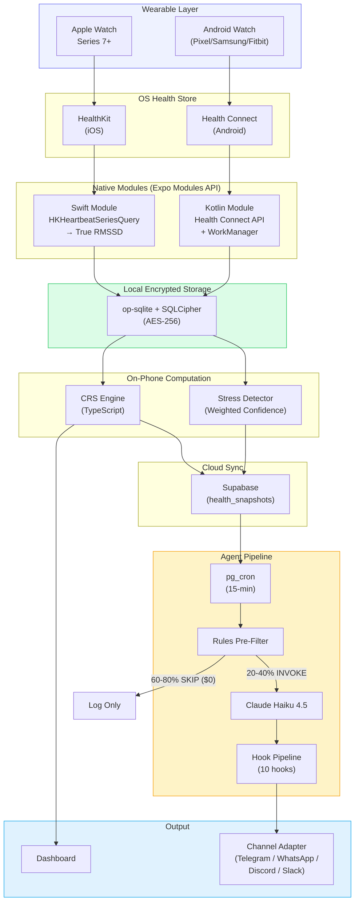
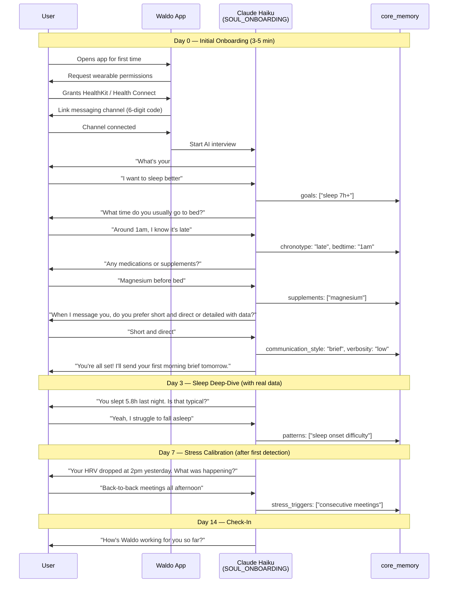
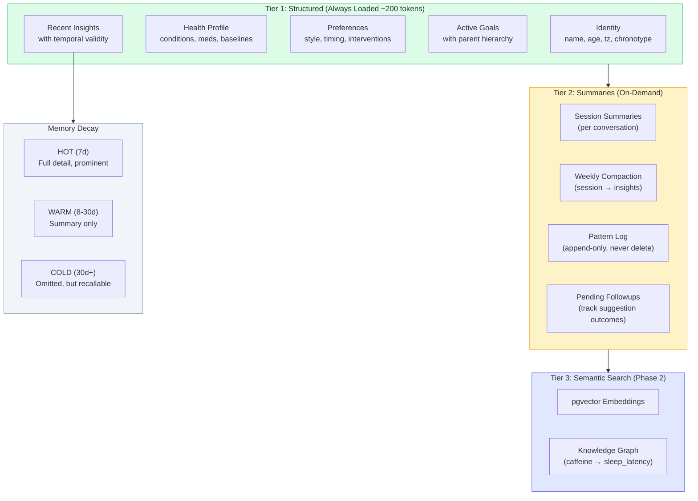
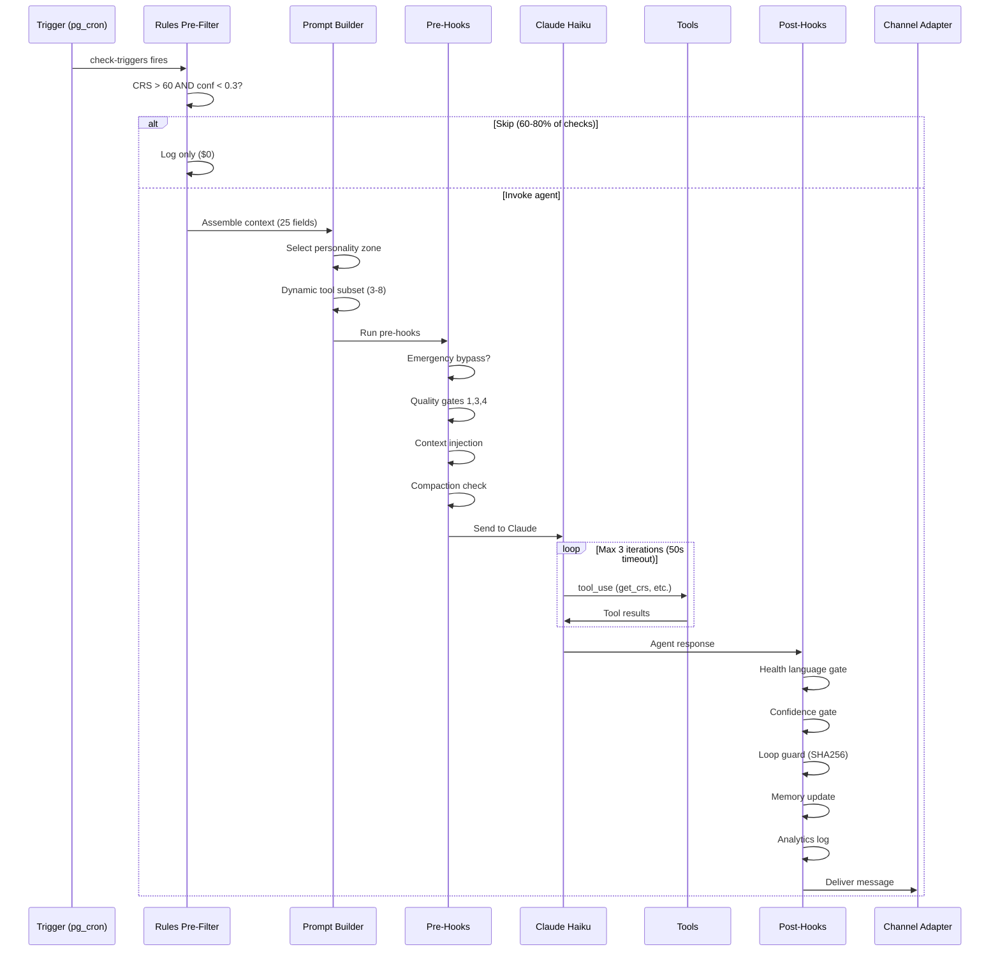
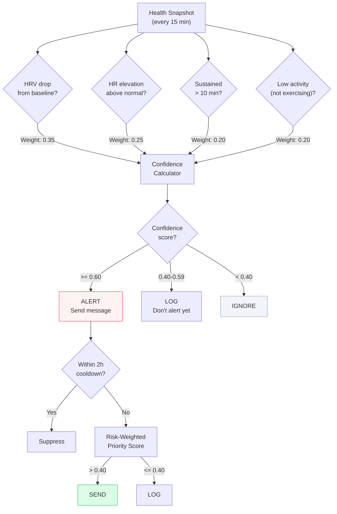
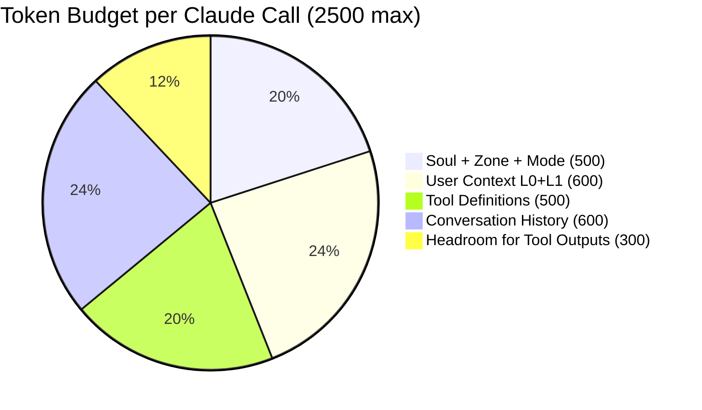
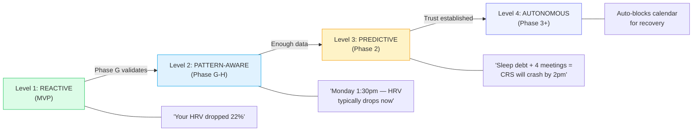
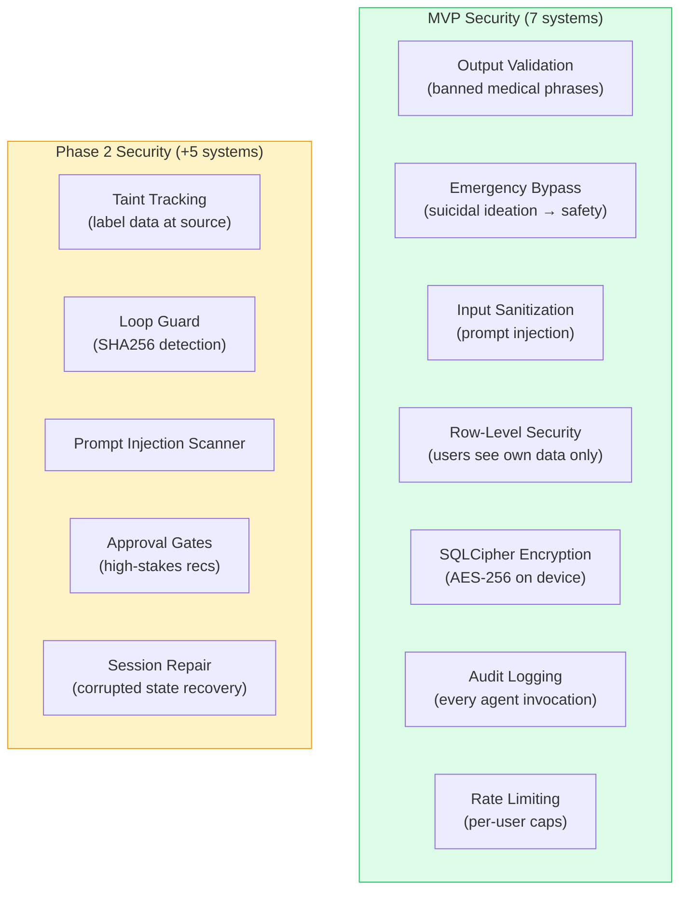

# Data Flow & Diagrams

## Complete Data Pipeline

## Onboarding Flow — AI Interview

## Memory Architecture

## Agent Loop Detail

## Stress Detection Algorithm

## Context Assembly (Token Budget)

## Proactive Intelligence Roadmap

## Security Layers

