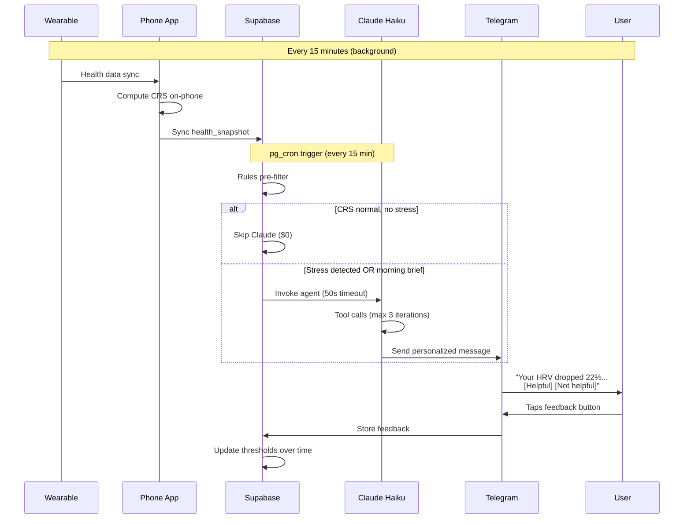
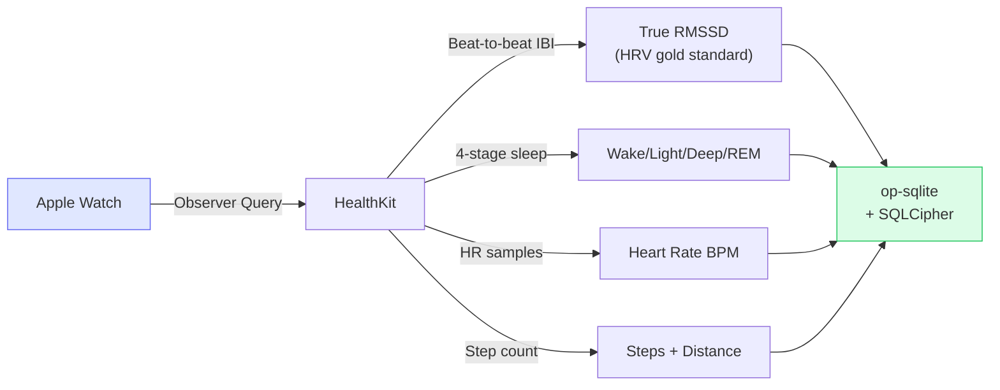
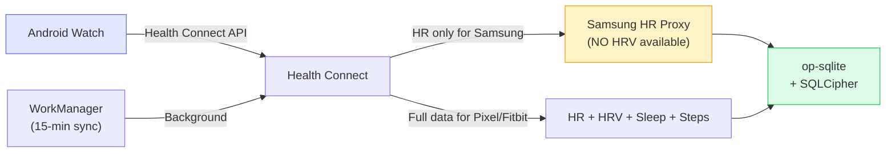
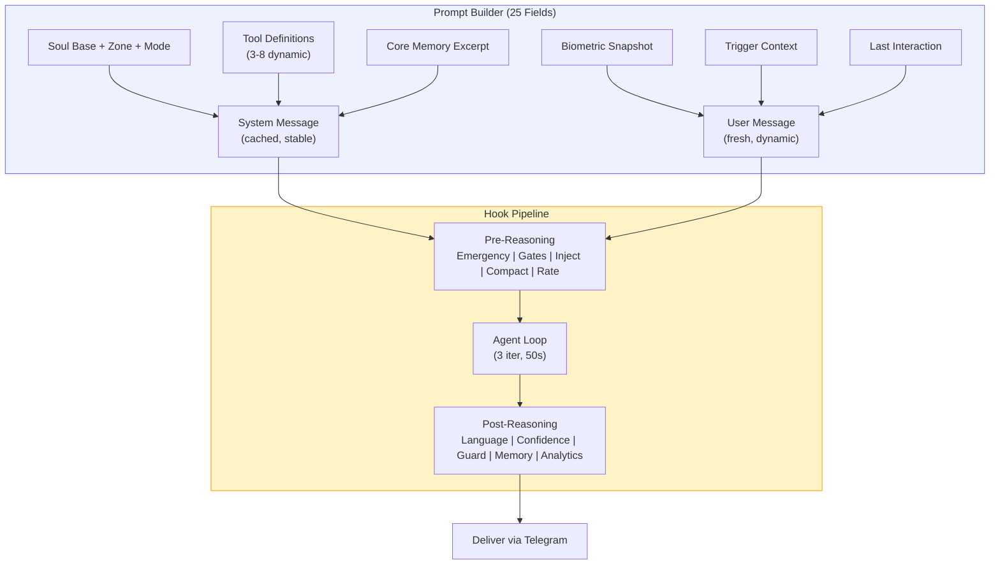
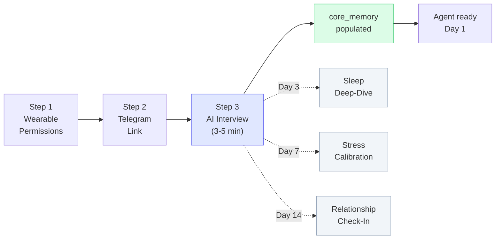
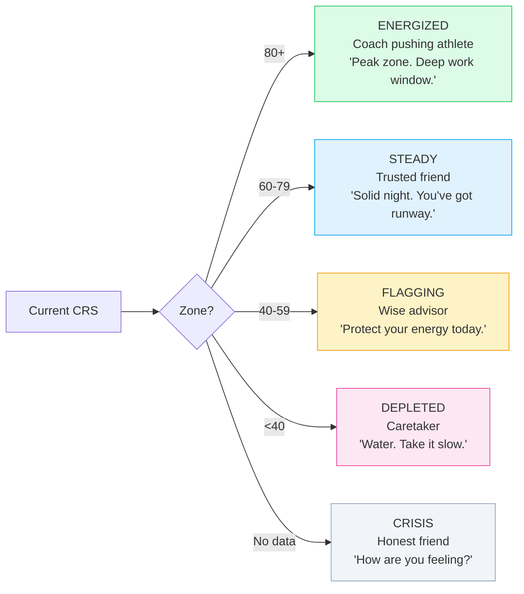
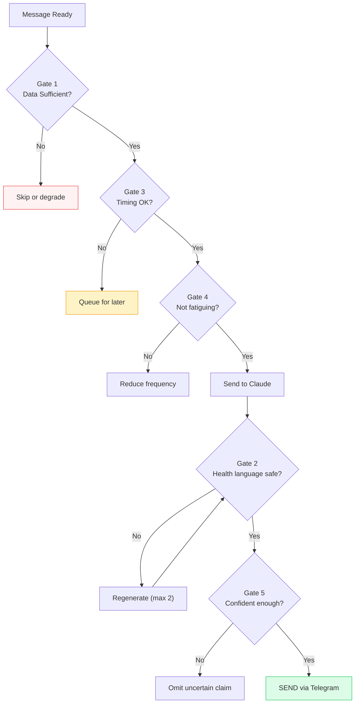

# MVP Scope — What We Ship

## The Core Loop (What Users Experience)



## What the MVP Delivers

### Hero Feature: Morning Cognitive Brief

Every morning at your wake time:

```
You slept 6.8h (good!) but your HRV is still recovering.
CRS at 58 — protect your 10-11am slot for deep focus.
→ Move anything optional to after lunch.

[Got it] [More details] [Mute today]
```

### Proactive Stress Alerts

When your body signals stress (gated on Phase G validation):

```
Your HRV dropped 22% in the last 30 minutes.
This usually happens during back-to-back meetings.
→ Take 3 slow breaths. 4 seconds in, 7 seconds out.

[Helpful] [Not helpful] [Too frequent]
```

### Conversational Health Chat

Message the Telegram bot anytime:

```
You: "Why am I so tired today?"

OneSync: "You got 5.2h of sleep last night — that's 1.8h
below your baseline. Plus your HRV hasn't recovered from
yesterday's stress spike at 3pm. The combination puts your
CRS at 41 (low zone). One thing that usually helps you:
an afternoon walk around 2-3pm. Want me to remind you?"
```

## Phase-by-Phase Deliverables

### Phase A: Pre-Code Setup
- Telegram bot via @BotFather
- Supabase project (pg_cron + pgmq enabled)
- Tech spike: op-sqlite + SQLCipher on both platforms
- Wizard of Oz: 5-7 users, 5-7 days of manual CRS via Telegram
- **Gate:** Morning briefs feel useful to 3+ users

### Phase B1: HealthKit Connector (iOS)



- **Gate:** CRS updates every 15 min with real Apple Watch data

### Phase B2: Health Connect Connector (Android)



- **Samsung HRV gap:** Samsung does NOT write HRV to Health Connect. Use HR BPM proxy.
- **Gate:** CRS updates from Health Connect; Samsung users get degraded CRS

### Phase C: Dashboard
- CRS gauge (270-degree SVG arc)
- Sleep card, metric cards, 7-day trend
- **Gate:** Real health data displays with auto-updating CRS

### Phase D: Agent Core + Messaging



- **Gate:** Message bot, get personalized health-aware response

### Phase E: Proactive Delivery
- Morning brief at wake time
- Stress alerts (rules pre-filter → Claude → Telegram)
- 2h cooldown, max 3 proactive/day
- **Gate:** Wake up to morning brief; agent alerts on stress

### Phase F: Onboarding + AI Interview



- Step 1: Wearable permissions (HealthKit / Health Connect)
- Step 2: Telegram bot link (6-digit code)
- Step 3: **AI-powered onboarding interview** — dynamic questions that adapt based on answers. Learns goals, chronotype, medications, communication style, stress triggers. Writes directly to `core_memory`. Also implicitly calibrates agent personality from HOW the user answers.
- Progressive profiling: follow-up interviews at Day 3 (sleep), Day 7 (stress), Day 14 (check-in) — each using real wearable data as context.
- **Gate:** Non-technical person completes onboarding in < 5 min. Agent has a useful profile from Day 1.

### Phase G: Self-Test (14 Days)
- Daily founder use with logging
- Tune false positive thresholds
- A/B test soul file variants
- **Gate:** 14 days daily use, false positive < 20%

### Phase H: Beta (5-7 Users, 7 Days)
- **Gate:** Product works for external users

## The Personality Spectrum

The agent adapts its voice to your CRS, not just the trigger type:



## Quality Gates — No Message Without Passing



## What's NOT in MVP (Deliberately)

| Feature | Why Not | When |
|---------|---------|------|
| WhatsApp | Telegram first, prove the model | Phase 2 |
| Calendar integration | Body signals first, workspace second | Phase 2 |
| Multi-model routing | Haiku-only keeps it simple and cheap | Phase 2 |
| Knowledge graph | Core memory is sufficient for MVP | Phase 2 |
| Predictive intelligence | Need reactive to work first | Phase 2 |
| Samsung Sensor SDK | HC proxy is good enough until CRS quality is the bottleneck | Post-MVP |
| Population learning | Need individual learning to work first | Phase 3+ |
| Autonomous actions | Need trust established first | Phase 3+ |
