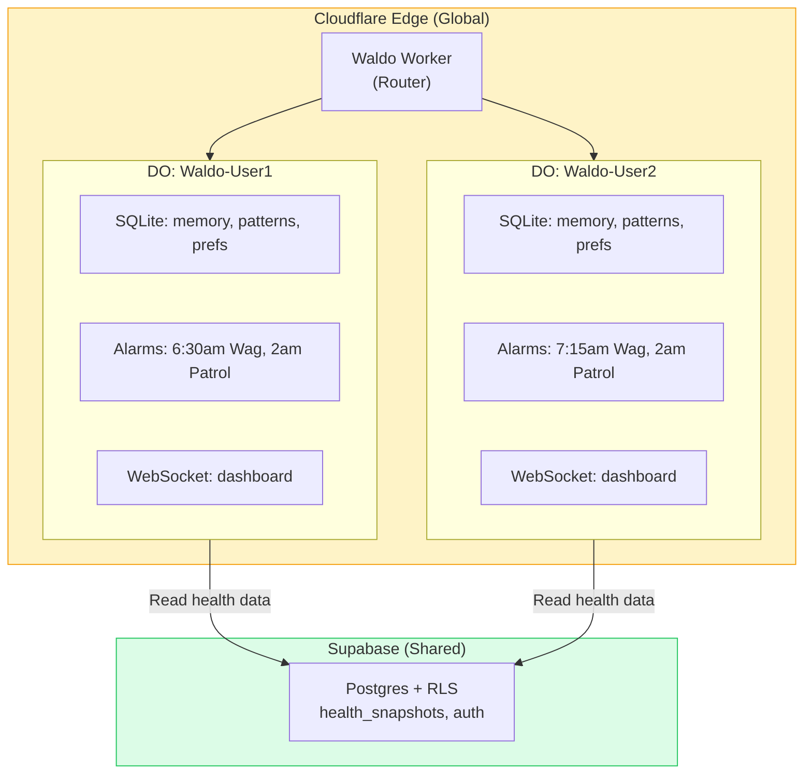
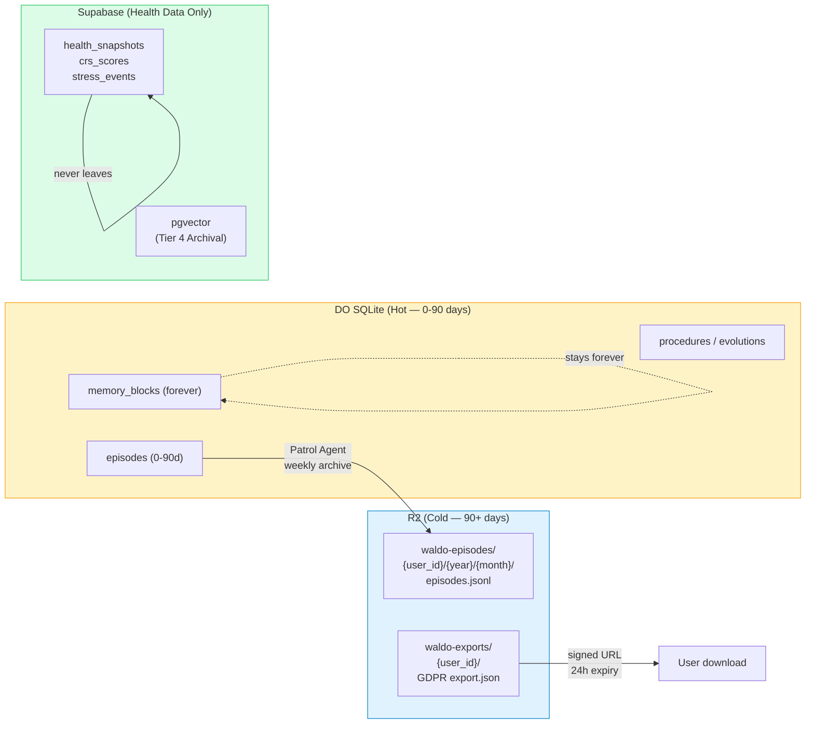

# Scaling Infrastructure — Cloudflare Durable Objects

> **Decision:** Cloudflare Workers + Durable Objects is the agent runtime for Phase D+. Supabase stays as the health data layer.

## The Problem

Waldo today runs on Supabase Edge Functions — stateless, 50s timeout, no per-user scheduling, no WebSocket. The agent is amnesiac between invocations. It re-loads everything from Postgres every time.

**What we need:** Per-user persistent agent brain with scheduling, memory, and real-time push — at consumer economics ($0.01/user/month, not $15-30).

## The Solution: Durable Objects

Each user gets a dedicated Durable Object with:
- **Own SQLite database** — 5-tier memory, patterns, preferences, conversation history
- **Built-in scheduling** — per-user Morning Wag times via DO alarms (not global pg_cron)
- **WebSocket** — real-time dashboard and chat
- **Hibernate when idle** — zero cost when user isn't active



## Cost Comparison

| Infrastructure | Cost at 10K Users/Month | Per User |
|---------------|------------------------|----------|
| Supabase Edge Functions (current) | ~$25-50 | $0.003-0.005 |
| **Cloudflare DOs (recommended)** | **~$5-25** | **$0.001-0.003** |
| Fly.io Sprites | ~$50K-150K | $5-15 |
| K8s/AtlanClaw | ~$150K-300K | $15-30 |

**LLM costs dominate** (~$50-200/month at 10K users). Infrastructure cost is noise. But DOs give us capabilities Supabase can't: per-user scheduling, persistent state, real-time WebSocket.

## AI Gateway — Route All LLM Calls (Ship NOW)

> **Status: GA. 2-line change. Zero behavior change. Ship this week.**

Cloudflare AI Gateway is a proxy layer between Waldo's DO and Anthropic/DeepSeek. Route through it to get:

| Feature | Value |
|---|---|
| **Cost dashboard** | Every LLM call, tokens, latency, model, cost per user |
| **Semantic caching** | 30-40% reduction on repeated patterns (Morning Wag same CRS zone each day) |
| **Auto-fallback** | Anthropic slow → DeepSeek automatically, or any backup model |
| **Rate limit monitoring** | Alerts before hitting API limits |
| **Zero added latency** | Runs at Cloudflare edge, co-located with the DO |

**Implementation in `cloudflare/waldo-worker/src/llm.ts`:**
```typescript
// BEFORE (line 71):
const res = await fetch('https://api.anthropic.com/v1/messages', ...);

// AFTER — set CLOUDFLARE_AI_GATEWAY_URL as a wrangler secret:
const gatewayBase = (env as any).CLOUDFLARE_AI_GATEWAY_URL ?? 'https://api.anthropic.com';
const res = await fetch(`${gatewayBase}/v1/messages`, ...);
```

Set once: `wrangler secret put CLOUDFLARE_AI_GATEWAY_URL`
Value: `https://gateway.ai.cloudflare.com/v1/{account_id}/waldo/anthropic`

Same change for DeepSeek (route through the `deepseek` provider path).

---

## Code Mode + Dynamic Workers (Phase E)

> **Status: Dynamic Workers are now Open Beta (April 2026). This is unblocked. Ship it.**

Claude generates a single TypeScript function instead of multiple tool calls. A Dynamic Worker executes it in isolation in milliseconds.

| Pattern | LLM Calls | Tokens | Cost |
|---------|----------|--------|------|
| Traditional ReAct (4 tool round-trips) | 4 | ~8,000 | ~$0.005 |
| **Code Mode (1 generated function)** | **1** | **~1,500** | **~$0.001** |

**81% token reduction.** At 10K users, that's $500/month → $95/month in LLM costs.

**What moves to Dynamic Workers:**
- Cognitive load formula (meetings + email + tasks + sleep debt weights)
- Trend direction calculation (CRS week-over-week delta)
- Sleep debt accumulation (14-day weighted rolling)
- Focus window prediction (calendar gap + circadian peak intersection)
- Spot generation thresholds (deterministic math, not inference)

**What stays with Claude:**
- Narrative generation ("Bit of a rough night — your sleep was short by 40 minutes")
- Cross-domain synthesis (connecting HRV drop to meeting load)
- Novel pattern recognition

**Code Mode example for Morning Wag:**
```typescript
// Dynamic Worker function (runs in ~2ms, zero tokens):
function computeMorningContext(data: MorningData): MorningContext {
  const cogLoad = (data.cal.mls / 15) * 30 + data.email.ahRatio * 25 +
                  Math.min(data.tasks.overdue * 5, 20) + data.sleepDebt * 6;
  const focusWindow = data.cal.focusGaps.sort((a, b) => b.minutes - a.minutes)[0];
  const trend = data.crs.delta7d > 3 ? 'building' : data.crs.delta7d < -3 ? 'declining' : 'stable';
  return { cogLoad: Math.min(100, cogLoad), focusWindow, trend, urgentTask: data.tasks.titles[0] };
}
// Then 1 Claude call: narrative from pre-computed facts only
```

## Migration Path

| Phase | Runtime | Scheduling | Memory |
|-------|---------|-----------|--------|
| B-C (now) | Supabase Edge Functions | pg_cron (global) | Supabase Postgres |
| **D (agent core)** | **Cloudflare DO** | **DO alarms (per-user)** | **DO SQLite** |
| E (proactive) | DO + Dynamic Workers | DO alarms + Code Mode | DO SQLite **+ R2 archival** |
| F (onboarding) | DO + WebSocket | DO alarms | DO SQLite + R2 |
| G (evolution) | DO (full) | DO alarms | DO SQLite (all 5 tiers) + R2 |

---

## Cloudflare R2 — Cold Storage Layer (Phase E+)

> **Researched April 2026.** R2 was not in the original architecture. Added as the episodic memory archival tier and GDPR export layer.

### The Problem R2 Solves

DO SQLite stores everything for Tiers 1-3. As conversation history grows past 90 days, old episodic memory accumulates — it's rarely accessed but still takes up space and costs query reads. R2 is Cloudflare's object storage with **zero egress cost** and $0.015/GB/month. It's the natural cold tier.

### What Goes Where



**Key invariant: Raw health values never touch R2.** Health data is Supabase-only (encrypted, RLS). R2 stores agent conversation archives and user exports — no biometrics.

### Cost Impact

| Layer | Data (10K users) | Monthly Cost |
|-------|-----------------|-------------|
| DO SQLite (active memory) | 5 GB | ~$5-10 |
| R2 archival (old episodes) | 20 GB after 1yr | **$0.30** |
| R2 exports (GDPR, 7d TTL) | ~50 MB rolling | **<$0.10** |
| R2 egress | Any amount | **$0.00** |

R2 adds ~$0.40/month for 10K users. The zero-egress is the win — user data exports don't cost anything to serve.

### Archival Pattern

Patrol Agent's Sunday compaction (already in HEARTBEAT_WEEKLY) archives old episodes during weekly consolidation:

```typescript
// Inside DO weekly compaction
const oldEpisodes = await sql`
  SELECT * FROM episodes
  WHERE created_at < datetime('now', '-90 days')
    AND archived_to_r2 = false
`;

const r2Key = `${userId}/${year}/${month}/episodes_${timestamp}.jsonl`;
await env.WALDO_R2.put(r2Key, oldEpisodes.map(e => JSON.stringify(e)).join('\n'));

await sql`DELETE FROM episodes WHERE archived_to_r2 = true`;
```

### GDPR Export Pattern

```typescript
// New tool: export_user_data() → signed R2 URL
const exportKey = `exports/${userId}/waldo_export_${Date.now()}.json`;
await env.WALDO_EXPORTS.put(exportKey, JSON.stringify(exportData));
const signedUrl = await env.WALDO_EXPORTS.createSignedUrl(exportKey, { expiresIn: 86400 });
// Deliver via Telegram or email
```

### Wrangler Config (Phase E)

```toml
[[r2_buckets]]
binding = "WALDO_R2"
bucket_name = "waldo-episodes"

[[r2_buckets]]
binding = "WALDO_EXPORTS"
bucket_name = "waldo-exports"
```

### DO SQLite Schema Addition (Tier 2)

```sql
ALTER TABLE episodes ADD COLUMN archived_to_r2 BOOLEAN DEFAULT false;
ALTER TABLE episodes ADD COLUMN r2_key TEXT;
```

> **Full R2 design:** Section 11 of [Docs/WALDO_SCALING_INFRASTRUCTURE.md](https://github.com/Pin4sf/Waldo/blob/main/Docs/WALDO_SCALING_INFRASTRUCTURE.md)

---

## Project Think Compatibility (Phase F/G)

> **Status: Think is in Preview (April 2026). DO NOT migrate yet. Design toward it.**
> **Full analysis:** [cloudflare-agents-week-analysis.md](./cloudflare-agents-week-analysis.md)

Project Think is Cloudflare's opinionated base class (`Think extends DurableObject`) that provides the same patterns we built manually — but productized. Our `WaldoAgent extends DurableObject<Env>` maps cleanly to Think's lifecycle.

### What Think Provides That We Don't Have

| Think Primitive | Our Gap | Impact |
|---|---|---|
| `runFiber()` + `ctx.stash()` | No checkpoint on Morning Wag — silent failures if DO evicted | HIGH |
| Sessions as trees (`parent_id`) | Flat `conversation_history` — Morning Wag pollutes chat context | MEDIUM |
| Sub-agent Facets | Monolithic DO — no specialist sub-agents (sleep, productivity) | HIGH (Phase 2) |
| `withCachedPrompt()` | Manual `cache_control: ephemeral` on soul prompt | LOW (equivalent) |

### Migration Map (When Think Hits GA)

| Waldo Pattern | Think Equivalent |
|---|---|
| `loadWorkspaceContext()` in workspace.ts | `configureSession().withContext("profile", ...).withContext("baselines", ...)` |
| `buildSystemPrompt()` soul + zone + mode | `getSystemPrompt()` override |
| `getToolsForTrigger(triggerType)` | `getTools()` override with trigger context |
| Soul prompt caching | `.withCachedPrompt()` |
| `runPatrol()` | `runFiber("patrol", async (ctx) => { ... ctx.stash(...) })` |
| `runDailyCompaction()` | `runFiber("compaction", async (ctx) => { ... ctx.stash(...) })` |
| Sub-agents (Phase 2) | `await this.subAgent(SleepAgent, "sleep-${userId}")` |

### What Stays Custom (Waldo's Moat — Never Delegate to Think)

- **Soul files** (SOUL_BASE, zone modifiers, mode templates) — warm, specific, "Already on it."
- **CRS 3-pillar engine** (Recovery/CASS/ILAS) — science-grounded, unique IP
- **Per-trigger tool permissions** — Morning Wag ≠ Fetch Alert ≠ Conversational
- **Cross-domain narrative builder** — 6-dimension parallel Supabase queries before ReAct
- **Health data privacy architecture** — health values stay in Supabase, DO stores only derived insights
- **12-adapter data flywheel** — no general agent framework replicates this

### Fiber Checkpointing Stopgap (Before Think GA)

Until Think is stable, implement durability manually using `agent_state`:

```typescript
async runPatrol() {
  const checkpoint = getState(this.sql, 'patrol_checkpoint');
  const stage = checkpoint ? JSON.parse(checkpoint).stage : 'start';

  if (stage === 'start') {
    const crs = await fetchCRS(this.userId, this.env);
    setState(this.sql, 'patrol_checkpoint', JSON.stringify({ stage: 'crs_loaded', crs }));
  }
  // If DO is evicted → alarm re-fires → resumes from stage='crs_loaded'
  // ...
}
```

This is the manual equivalent of `ctx.stash()`. Low-fi but effective.

---

## Cloudflare Sandbox — Execution Layer (Phase E+)

**Decision:** Adopt Cloudflare Sandbox (GA April 2026) as the third compute tier for Waldo when Code Mode, data visualization, or user-defined routines are required. Not needed for MVP.

> Source: [Cloudflare Sandbox GA announcement, April 2026](https://blog.cloudflare.com/sandbox-ga/)

### The Three-Tier Compute Model

| Tier | Product | When Used | Per-User Cost |
|---|---|---|---|
| **Tier 1 — Workers/DO** | V8 isolate + SQLite + R2 | Agent reasoning, tool calls, memory I/O | ~$0.001/month (hibernates) |
| **Tier 2 — Edge Functions** | Deno serverless | OAuth flows, webhooks, pg_cron targets | Pay-per-invocation |
| **Tier 3 — Sandbox (NEW)** | Container with shell + Python + filesystem | Code Mode, data viz, file parsing, user routines | Active CPU only (zero idle) |

### What Sandbox Unlocks for Waldo

**1. Code Mode — 60-75% cost reduction**
Today: Morning Wag costs ~$0.01 per call (Haiku + tool loop). Many computations are deterministic — cognitive load formulas, pattern correlations, trend math. Move these to Python in Sandbox; agent calls Sandbox for computation, uses Claude only for the narrative wrapper.

**2. Real chart generation in chat**
User: *"Show me my sleep trend this month"*
→ Agent runs `pandas + matplotlib` in Sandbox → PNG uploaded to R2 → image URL returned in chat. The agent draws actual charts.

**3. Advanced health file parsing**
Current Apple Health XML parsing happens in-browser (fragile, memory-bound). Moving to Sandbox unlocks:
- Garmin `.fit` files (requires `fitparse` — can't run in Workers)
- Whoop exports, Oura exports, any CSV format
- 500MB+ XML without browser crashes

**4. User-configurable routines (Phase G+)**
From spec: *"Every Sunday evening, tell me my recovery outlook for next week."*
Sandbox is purpose-built for this — user-defined logic runs in isolation, credentials injected via egress proxy, never touches the DO or Edge Functions.

**5. GEPA evolutionary optimization (Phase 3+)**
ICLR 2026 paper requires real Python + genetic algorithms ($2-10 per run). Sandbox is the only way to execute this on Cloudflare infrastructure.

### Cost Model with Sandbox (per user/month)

| Layer | Current | With Sandbox (Phase E) |
|---|---|---|
| DO (hibernates when idle) | ~$0.001 | ~$0.001 |
| Edge Functions | ~$0.02 | ~$0.02 |
| Claude Haiku (tokens) | $0.30–0.54 | **$0.08–0.15** (Code Mode replaces deterministic work) |
| R2 workspace | ~$0.001 | ~$0.001 |
| Sandbox compute | — | **~$0.02–0.05** (Active CPU only) |
| **Total** | **$0.32–0.56** | **$0.12–0.22** |

**Net: 60–65% per-user cost reduction at scale.** Sandbox compute cost < LLM tokens it replaces.

### Sandbox vs Dynamic Workers — When to Use Which

| Criterion | Dynamic Workers (V8 isolate) | Sandbox (container) |
|---|---|---|
| Startup time | 2ms | 2s (warm from snapshot) |
| Language | JS/TS only | Python, JS, TS, any shell-runnable |
| Persistent state | No | Yes (interpreter state across calls) |
| Filesystem | No | Yes (real Linux FS + inotify) |
| Background processes | No | Yes (dev servers, long-running jobs) |
| Network | RPC stubs only | Egress proxy with credential injection |
| Best for | Short, deterministic TS snippets (Code Mode core) | Python data analysis, visualization, file parsing, user scripts |

**Rule of thumb:** Dynamic Workers for sub-second computation in Code Mode. Sandbox for anything requiring Python libraries, filesystem, or stateful interpreters.

### Integration Architecture (Phase E+)

```
User message → DO (agent brain)
  ├── Tier 1 work: tool calls, memory, ReAct → DO itself
  ├── Tier 2 work: OAuth, webhooks → Edge Functions
  └── Tier 3 work:
      ├── Code Mode deterministic function → Dynamic Worker (2ms)
      ├── Python data analysis / chart → Sandbox (2s warm)
      └── User-defined routine → Sandbox (isolated, credential-injected)
```

### Implementation Roadmap

| Phase | Sandbox Capability | Trigger |
|---|---|---|
| **E** | Code Mode for Morning Wag pre-compute (cognitive load, trend math) | When per-user LLM cost exceeds $0.50/month at scale |
| **E** | `render_chart` agent tool (pandas + matplotlib) | When users request visualizations in chat |
| **F** | Upgraded health file parser (Apple/Garmin/Oura/Whoop) | When we support non-Apple wearables beyond Health Connect |
| **G** | User-configurable routines | When we ship personalization layer |
| **3+** | GEPA evolutionary self-improvement | When agent self-evolution is the priority |

### Security Posture

Sandbox adds a hard isolation boundary we currently don't have:
- **Credential injection via egress proxy** — agent never sees raw tokens
- **Per-execution filesystem** — ephemeral, wiped after snapshot
- **Active CPU pricing** — no idle cost exploits
- **R2 snapshots** — audit-safe, rewindable state

This matters for: HIPAA-adjacent workloads, Pack tier (enterprise), any feature that runs user-supplied code.

---

> **Full DO architecture:** [Docs/WALDO_SCALING_INFRASTRUCTURE.md](https://github.com/Pin4sf/Waldo/blob/main/Docs/WALDO_SCALING_INFRASTRUCTURE.md)
