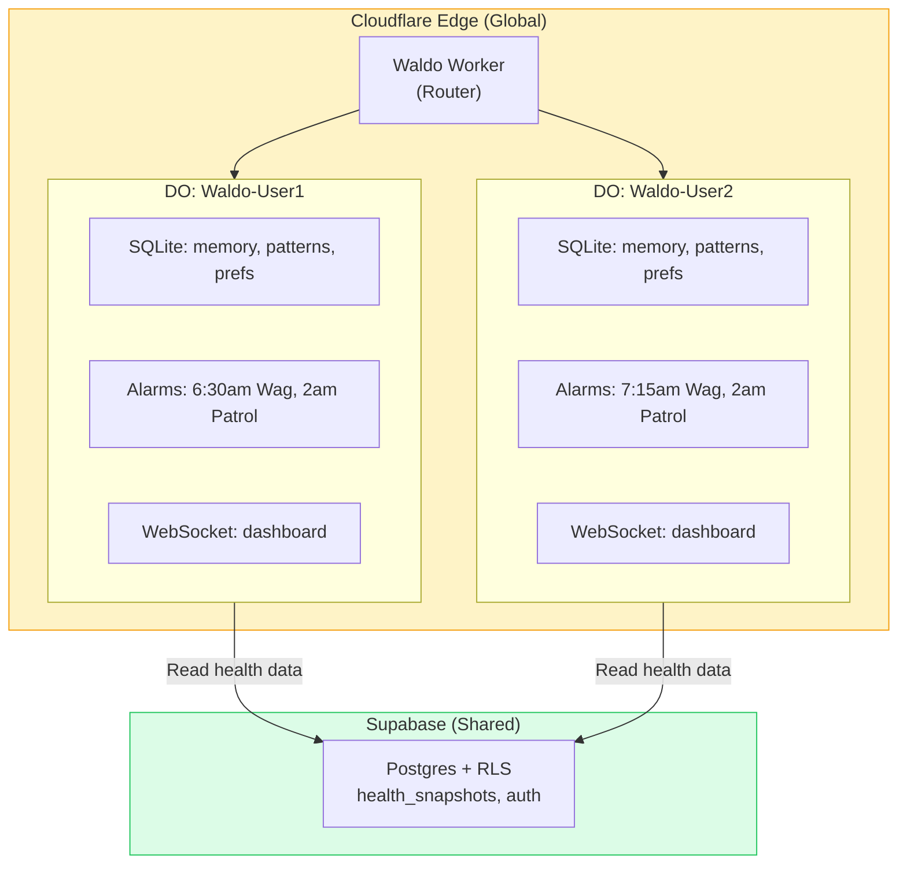
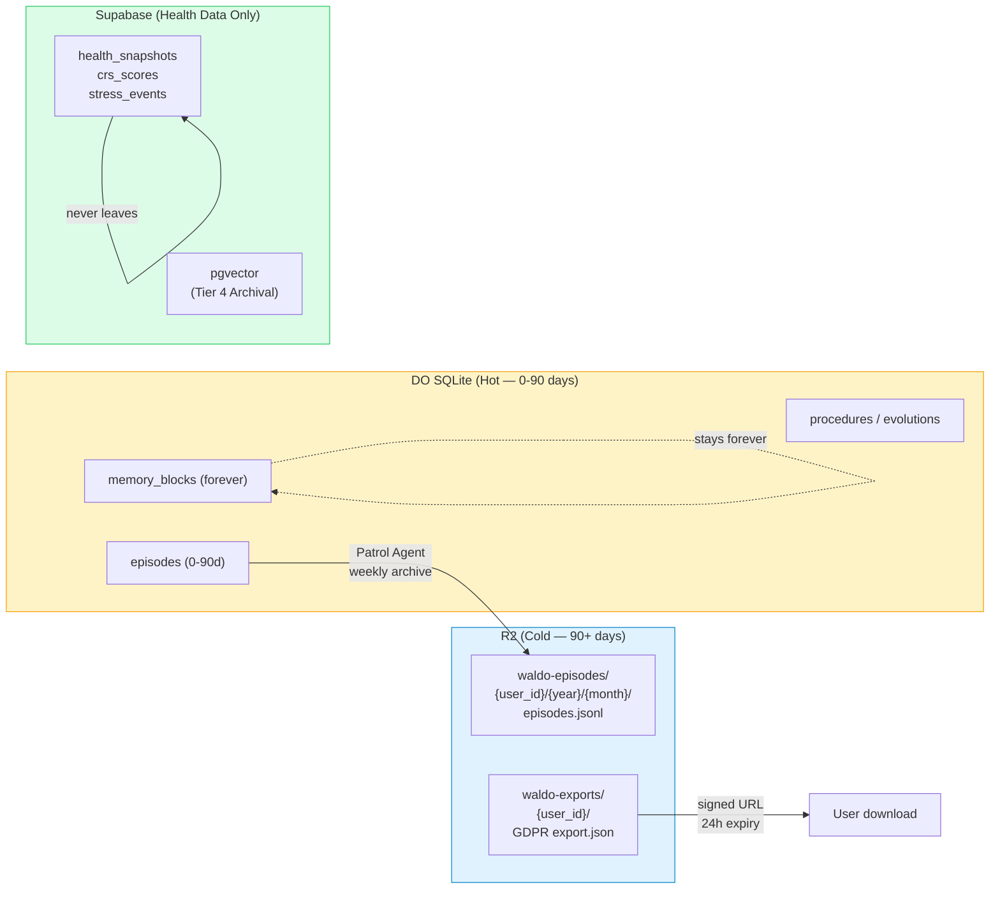

# Scaling Infrastructure — Cloudflare Durable Objects

> **Decision:** Cloudflare Workers + Durable Objects is the agent runtime for Phase D+. Supabase stays as the health data layer.

## The Problem

Waldo today runs on Supabase Edge Functions — stateless, 50s timeout, no per-user scheduling, no WebSocket. The agent is amnesiac between invocations. It re-loads everything from Postgres every time.

**What we need:** Per-user persistent agent brain with scheduling, memory, and real-time push — at consumer economics ($0.01/user/month, not $15-30).

## The Solution: Durable Objects

Each user gets a dedicated Durable Object with:
- **Own SQLite database** — 5-tier memory, patterns, preferences, conversation history
- **Built-in scheduling** — per-user Morning Wag times via DO alarms (not global pg_cron)
- **WebSocket** — real-time dashboard and chat
- **Hibernate when idle** — zero cost when user isn't active



## Cost Comparison

| Infrastructure | Cost at 10K Users/Month | Per User |
|---------------|------------------------|----------|
| Supabase Edge Functions (current) | ~$25-50 | $0.003-0.005 |
| **Cloudflare DOs (recommended)** | **~$5-25** | **$0.001-0.003** |
| Fly.io Sprites | ~$50K-150K | $5-15 |
| K8s/AtlanClaw | ~$150K-300K | $15-30 |

**LLM costs dominate** (~$50-200/month at 10K users). Infrastructure cost is noise. But DOs give us capabilities Supabase can't: per-user scheduling, persistent state, real-time WebSocket.

## Code Mode + Dynamic Workers (Phase E)

Claude generates a single TypeScript function instead of multiple tool calls. A Dynamic Worker executes it in isolation.

| Pattern | LLM Calls | Tokens | Cost |
|---------|----------|--------|------|
| Traditional ReAct (4 tool round-trips) | 4 | ~8,000 | ~$0.005 |
| **Code Mode (1 generated function)** | **1** | **~1,500** | **~$0.001** |

**81% token reduction.** At 10K users, that's $500/month → $95/month in LLM costs.

## Migration Path

| Phase | Runtime | Scheduling | Memory |
|-------|---------|-----------|--------|
| B-C (now) | Supabase Edge Functions | pg_cron (global) | Supabase Postgres |
| **D (agent core)** | **Cloudflare DO** | **DO alarms (per-user)** | **DO SQLite** |
| E (proactive) | DO + Dynamic Workers | DO alarms + Code Mode | DO SQLite **+ R2 archival** |
| F (onboarding) | DO + WebSocket | DO alarms | DO SQLite + R2 |
| G (evolution) | DO (full) | DO alarms | DO SQLite (all 5 tiers) + R2 |

---

## Cloudflare R2 — Cold Storage Layer (Phase E+)

> **Researched April 2026.** R2 was not in the original architecture. Added as the episodic memory archival tier and GDPR export layer.

### The Problem R2 Solves

DO SQLite stores everything for Tiers 1-3. As conversation history grows past 90 days, old episodic memory accumulates — it's rarely accessed but still takes up space and costs query reads. R2 is Cloudflare's object storage with **zero egress cost** and $0.015/GB/month. It's the natural cold tier.

### What Goes Where



**Key invariant: Raw health values never touch R2.** Health data is Supabase-only (encrypted, RLS). R2 stores agent conversation archives and user exports — no biometrics.

### Cost Impact

| Layer | Data (10K users) | Monthly Cost |
|-------|-----------------|-------------|
| DO SQLite (active memory) | 5 GB | ~$5-10 |
| R2 archival (old episodes) | 20 GB after 1yr | **$0.30** |
| R2 exports (GDPR, 7d TTL) | ~50 MB rolling | **<$0.10** |
| R2 egress | Any amount | **$0.00** |

R2 adds ~$0.40/month for 10K users. The zero-egress is the win — user data exports don't cost anything to serve.

### Archival Pattern

Patrol Agent's Sunday compaction (already in HEARTBEAT_WEEKLY) archives old episodes during weekly consolidation:

```typescript
// Inside DO weekly compaction
const oldEpisodes = await sql`
  SELECT * FROM episodes
  WHERE created_at < datetime('now', '-90 days')
    AND archived_to_r2 = false
`;

const r2Key = `${userId}/${year}/${month}/episodes_${timestamp}.jsonl`;
await env.WALDO_R2.put(r2Key, oldEpisodes.map(e => JSON.stringify(e)).join('\n'));

await sql`DELETE FROM episodes WHERE archived_to_r2 = true`;
```

### GDPR Export Pattern

```typescript
// New tool: export_user_data() → signed R2 URL
const exportKey = `exports/${userId}/waldo_export_${Date.now()}.json`;
await env.WALDO_EXPORTS.put(exportKey, JSON.stringify(exportData));
const signedUrl = await env.WALDO_EXPORTS.createSignedUrl(exportKey, { expiresIn: 86400 });
// Deliver via Telegram or email
```

### Wrangler Config (Phase E)

```toml
[[r2_buckets]]
binding = "WALDO_R2"
bucket_name = "waldo-episodes"

[[r2_buckets]]
binding = "WALDO_EXPORTS"
bucket_name = "waldo-exports"
```

### DO SQLite Schema Addition (Tier 2)

```sql
ALTER TABLE episodes ADD COLUMN archived_to_r2 BOOLEAN DEFAULT false;
ALTER TABLE episodes ADD COLUMN r2_key TEXT;
```

> **Full R2 design:** Section 11 of [Docs/WALDO_SCALING_INFRASTRUCTURE.md](https://github.com/Pin4sf/Waldo/blob/main/Docs/WALDO_SCALING_INFRASTRUCTURE.md)

---

> **Full DO architecture:** [Docs/WALDO_SCALING_INFRASTRUCTURE.md](https://github.com/Pin4sf/Waldo/blob/main/Docs/WALDO_SCALING_INFRASTRUCTURE.md)
