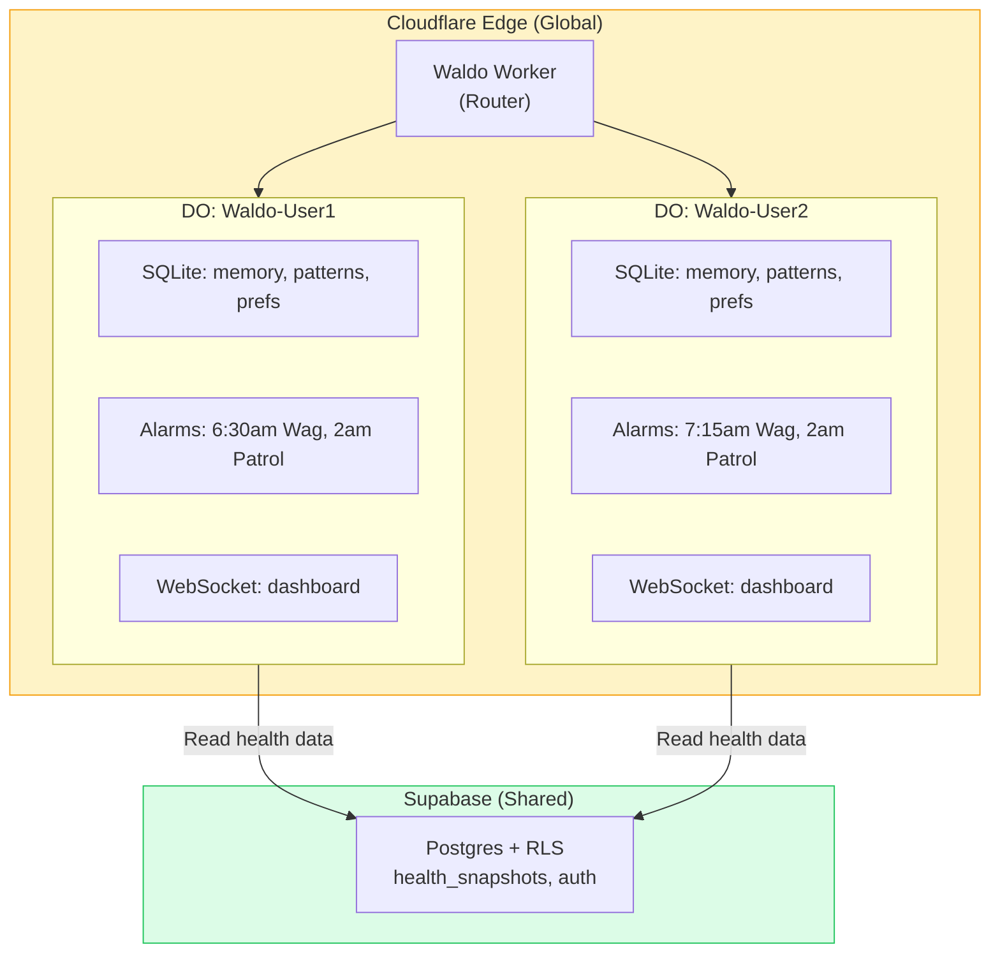

# Scaling Infrastructure — Cloudflare Durable Objects

> **Decision:** Cloudflare Workers + Durable Objects is the agent runtime for Phase D+. Supabase stays as the health data layer.

## The Problem

Waldo today runs on Supabase Edge Functions — stateless, 50s timeout, no per-user scheduling, no WebSocket. The agent is amnesiac between invocations. It re-loads everything from Postgres every time.

**What we need:** Per-user persistent agent brain with scheduling, memory, and real-time push — at consumer economics ($0.01/user/month, not $15-30).

## The Solution: Durable Objects

Each user gets a dedicated Durable Object with:
- **Own SQLite database** — 5-tier memory, patterns, preferences, conversation history
- **Built-in scheduling** — per-user Morning Wag times via DO alarms (not global pg_cron)
- **WebSocket** — real-time dashboard and chat
- **Hibernate when idle** — zero cost when user isn't active

## Cost Comparison

| Infrastructure | Cost at 10K Users/Month | Per User |
|---------------|------------------------|----------|
| Supabase Edge Functions (current) | ~$25-50 | $0.003-0.005 |
| **Cloudflare DOs (recommended)** | **~$5-25** | **$0.001-0.003** |
| Fly.io Sprites | ~$50K-150K | $5-15 |
| K8s/AtlanClaw | ~$150K-300K | $15-30 |

**LLM costs dominate** (~$50-200/month at 10K users). Infrastructure cost is noise. But DOs give us capabilities Supabase can't: per-user scheduling, persistent state, real-time WebSocket.

## Code Mode + Dynamic Workers (Phase E)

Claude generates a single TypeScript function instead of multiple tool calls. A Dynamic Worker executes it in isolation.

| Pattern | LLM Calls | Tokens | Cost |
|---------|----------|--------|------|
| Traditional ReAct (4 tool round-trips) | 4 | ~8,000 | ~$0.005 |
| **Code Mode (1 generated function)** | **1** | **~1,500** | **~$0.001** |

**81% token reduction.** At 10K users, that's $500/month → $95/month in LLM costs.

## Migration Path

| Phase | Runtime | Scheduling | Memory |
|-------|---------|-----------|--------|
| B-C (now) | Supabase Edge Functions | pg_cron (global) | Supabase Postgres |
| **D (agent core)** | **Cloudflare DO** | **DO alarms (per-user)** | **DO SQLite** |
| E (proactive) | DO + Dynamic Workers | DO alarms + Code Mode | DO SQLite |
| F (onboarding) | DO + WebSocket | DO alarms | DO SQLite |
| G (evolution) | DO (full) | DO alarms | DO SQLite (all 5 tiers) |

> **Full details:** [Docs/WALDO_SCALING_INFRASTRUCTURE.md](https://github.com/Pin4sf/Waldo/blob/main/Docs/WALDO_SCALING_INFRASTRUCTURE.md)
