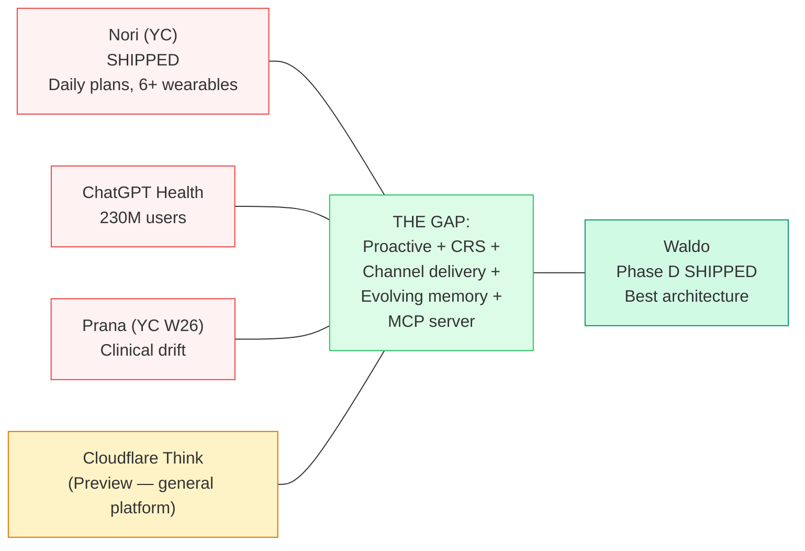

# 44 Upgrades from Agent Landscape Research (2026)

> **Sources:** Claude Code (1,905 TS files) · Hermes Agent (15th system) · MemPalace (16th system) · Cloudflare Agents Week / Project Think · OpenHarness/HKUDS (17th system, April 2026)
> Full harness design patterns: [harness-design.md](./harness-design.md) | Full Cloudflare analysis: [cloudflare-agents-week-analysis.md](./cloudflare-agents-week-analysis.md) | Full second brain vision: [second-brain-architecture.md](./second-brain-architecture.md)

## What We Learned

Claude Code is a production-grade agentic system running the same architectural backbone as Waldo: an LLM reasoning over tools in a loop with memory and context management. The patterns that make it reliable at 1M tokens of context are directly applicable to making Waldo reliable at 4K-10K tokens with a 50s timeout.

## The 18 Upgrades (Prioritized)

### Phase D (Agent Core) — +10.5 days

| # | Upgrade | Impact | What |
|---|---------|--------|------|
| 1 | **Three-stage compaction** | HIGH | Micro-compaction (free) → session memory → LLM compaction. Stage 1 saves 20-30% tokens every invocation. |
| 2 | **Tool metadata + concurrent execution** | HIGH | Read-only tools run in parallel. get_crs + get_sleep + get_activity = 300ms instead of 900ms. |
| 3 | **Semantic caching** | HIGH | Cache response structures for repetitive triggers. 30-40% output token reduction. |
| 4 | **Structured error taxonomy** | MEDIUM | Classify transient/capacity/permanent before choosing fallback level. |
| 5 | **Agent trace protocol** | MEDIUM | Structured logging (15+ fields) from day 1. Observability foundation. |
| 6 | **Guardrails pipeline** | MEDIUM | Typed guardrail system: medical_claims (BLOCK), health_language (REWRITE), confidence (WARN). |
| 7 | **Streaming delivery** | MEDIUM | Stream agent response to Telegram incrementally. |
| 8 | **Permission modes** | LOW | Named modes per trigger type instead of ad-hoc tool lists. |

### Phase E (Proactive) — +3 days

| # | Upgrade | Impact | What |
|---|---------|--------|------|
| 9 | **Speculative pre-computation** | HIGH | Pre-compute Morning Wag context overnight. Delivery in <3 seconds. |
| 10 | **Proactive context pre-loading** | HIGH | Cache user context bundle. Delta refresh only. |

### Phase G (Self-Test) — +7 days

| # | Upgrade | Impact | What |
|---|---------|--------|------|
| 11 | **Memory consolidation daemon** | HIGH | Patrol Agent: 4-phase nightly consolidation (AutoDream pattern). |
| 12 | **Feature flags** | MEDIUM | Supabase table for A/B testing soul variants. |
| 13 | **Agent evaluation harness** | HIGH | Promptfoo golden test suite. Run after every soul file change. |

### Phase 2+

| # | Upgrade | Impact | What |
|---|---------|--------|------|
| 14 | **Model routing** | HIGH | Haiku for simple, Sonnet for Constellation queries. Smart routing via 28 complexity keywords (Hermes pattern). |
| 15 | **Deferred tool discovery** | MEDIUM | ToolSearch pattern when 50+ tools exist. Saves 5K+ tokens. |
| 16 | **Waldo as MCP server** | STRATEGIC | Biological intelligence as a service. Any agent queries your CRS. |
| 17 | **Evolution dual audit** | MEDIUM | Simulate evolutions on golden tests before applying. |
| 18 | **4-tier memory completion** | LOW | Formalize Tier 3 (procedural) + Tier 4 (archival/pgvector). |

### From Hermes Agent Analysis (April 2026) — Upgrades 19-26

| # | Upgrade | Impact | Phase | What |
|---|---------|--------|-------|------|
| 19 | **Memory context fencing** | MEDIUM | D | Wrap recalled memory in `<memory-context>` tags with "NOT new user input" instruction. Prevents model from treating memory as user discourse. 1-hour implementation. |
| 20 | **FTS5 on episodes table** | HIGH | D | SQLite FTS5 virtual table for full-text search across all past conversations. Faster and cheaper than pgvector for keyword-based retrieval. Use BOTH for different query types. |
| 21 | **Structured context compression** | HIGH | D | 5-stage compression: (1) prune old tool results, (2) protect head, (3) protect tail (~20K tokens), (4) summarize middle with Goal/Progress/Decisions/Next Steps template, (5) iterative updates on subsequent compressions. From Hermes. |
| 22 | **Approval buttons on messaging** | MEDIUM | D-E | For L2 autonomy (suggest + one-tap): native inline buttons on Telegram/Slack/Discord. `[Move to Thursday 10am] [Keep it]`. Hermes proves this works cross-platform. |
| 23 | **Voice memo transcription** | MEDIUM | E-F | Accept voice input on Telegram/WhatsApp. faster-whisper for local STT, or Whisper API. "Hey Waldo, how'd I sleep?" → transcribe → respond. Low effort, high perceived capability. |
| 24 | **Skills as agentskills.io standard** | HIGH | G | Markdown skill files with trigger, steps, effectiveness tracking. Compatible with open standard. Enables skills marketplace in Phase 4. 25+ skill categories demonstrated by Hermes. |
| 25 | **Natural language cron scheduling** | MEDIUM | G+ | User-configurable routines via natural language: "Every Sunday evening, tell me my recovery outlook for next week." Parsed to DO alarm schedule. Hermes ships this as built-in. |
| 26 | **GEPA evolutionary self-improvement** | STRATEGIC | Phase 3+ | DSPy + Genetic-Pareto Prompt Evolution (ICLR 2026 Oral). Reads execution traces → understands failure reasons → proposes targeted mutations to skills/prompts → evaluates against golden tests → keeps winners. $2-10 per optimization run. Applied to Dreaming Mode Phase 6. Identity stays immutable. |

### From MemPalace Analysis (April 2026) — Upgrades 27-30

| # | Upgrade | Impact | Phase | What |
|---|---------|--------|-------|------|
| 27 | **Typed memory halls** | HIGH | D | Replace flat memory_blocks with 5 typed halls: facts, events, discoveries, preferences, advice. `hall_type` column enables selective loading per trigger type. Morning Wag loads facts+events+discoveries (~120 tokens). User chat loads all 5. From MemPalace's wing/room/hall taxonomy. |
| 28 | **170-token wake-up budget** | MEDIUM | D | Design target: always-loaded context under 200 tokens (L0 identity ~50 + L1 essential story ~120). Everything else on-demand via tools. MemPalace achieves 96.6% recall at this budget. |
| 29 | **Cross-domain tunnels** | HIGH | Phase 2 | When same entity (e.g., "board meeting") appears across health, calendar, tasks, and communication dimensions, auto-create cross-reference. Feed into Constellation analysis during weekly Dreaming Mode. MemPalace's spatial linking applied to multi-dimensional health intelligence. |
| 30 | **Temporal fact invalidation** | MEDIUM | D | `valid_from`/`valid_to`/`superseded_by` columns on memory_blocks. Never delete — mark as ended. Enables: evolution rollback, historical queries, temporal pattern discovery. From MemPalace's knowledge graph. |

### From Cloudflare Agents Week (April 2026) — Upgrades 31-38

> **Source:** [Project Think](https://blog.cloudflare.com/project-think/) + [Agents Week](https://blog.cloudflare.com/welcome-to-agents-week/). Full analysis: [cloudflare-agents-week-analysis.md](./cloudflare-agents-week-analysis.md)

| # | Upgrade | Impact | Phase | Status | What |
|---|---------|--------|-------|--------|------|
| 31 | **AI Gateway routing** | HIGH | **NOW** | 🔴 **2-line change** | Route `callAnthropic()` + `callDeepSeek()` through `gateway.ai.cloudflare.com`. Gains: cost dashboard, semantic caching (30-40% savings), auto-fallback, rate limit alerts. Zero behavior change. |
| 32 | **Dynamic Workers / Code Mode** | VERY HIGH | **Phase E — NOW UNBLOCKED** | 🔴 **Open Beta** | Morning Wag deterministic math (cognitive load, trend, sleep debt, focus window) runs as TypeScript function in Dynamic Worker. 81% token reduction. $0.01 → $0.002 per Morning Wag. |
| 33 | **Fiber checkpointing** | HIGH | Phase E | 🟡 Pattern available | Wrap `runPatrol()` + `runDailyCompaction()` in `runFiber()` with `ctx.stash()` checkpoints. Fixes silent Morning Wag failures when DO is evicted mid-call. |
| 34 | **Sessions tree** | MEDIUM | Phase F | 🟡 Schema change | Add `parent_id` to `conversation_history`. Morning Wag = separate branch from conversational. FTS5 search across all branches. Non-destructive compaction replaces deletion. |
| 35 | **MCP server on CF infrastructure** | STRATEGIC | Phase 2 | 🟡 Framework available | Rebuild `mcp-server` EF using Cloudflare's open-source MCP framework. Exposes `getCRS()`, `getStressLevel()`, `getCognitiveWindow()` to any external agent. Platform moat. |
| 36 | **Sub-agent Facets** | VERY HIGH | Phase 2 | 🟡 Needs Think GA | SleepAnalystAgent + ProductivityAgent as isolated child DOs with typed RPC. WaldoBrain coordinates. Each Facet: own SQLite, own conversation tree, own tools. |
| 37 | **Think base class migration** | MEDIUM | Phase F/G | 🟡 Wait for GA | Migrate `WaldoAgent extends DurableObject<Env>` → `extends Think<Env>`. Maps: soul→withContext, tools→getTools(), lifecycle→hooks. DON'T migrate yet — Think is Preview. |
| 38 | **x402 MCP monetization** | HIGH | Phase 3 | ⚪ After MCP server | HTTP 402 payment for agent-to-agent queries. External agents pay $0.0001-0.001 per biological intelligence query. New revenue stream on the platform moat. |

### From OpenHarness Analysis (April 2026) — Upgrades 39-44

> **Source:** HKUDS/OpenHarness — 337-file Python harness, MIT. Full analysis: [harness-design.md](./harness-design.md)
> Key finding: OpenHarness independently arrived at the same architectural decisions as Waldo (DO + SQLite + tool loop). Where they differ reveals our gaps.

| # | Upgrade | Impact | Phase | Status | What |
|---|---------|--------|-------|--------|------|
| 39 | **5-stage compaction cascade** | HIGH | **Phase E** | 🔴 **Direct gap** | Replace single nightly LLM compact with cascade: (1) Microcompact — strip old tool results, keep 5 recent (free), (2) Context collapse — truncate old TextBlocks to head+tail (free), (3) Session memory summary — 48-line textual replacement (free), (4) LLM compact — only if stages 1-3 insufficient. **40-60% of nightly LLM compact calls eliminated.** |
| 40 | **Capped LRU carryover buckets** | HIGH | Phase E | 🔴 **Direct gap** | Structured working memory buckets that survive compaction as `CompactAttachment` objects: `recent_work_log` (cap 10), `recent_verified_work` (cap 10). Updated after each tool call via `_append_capped_unique()`. Replaces our unbounded flat `tool_metadata`. Agent focus persists across context resets. |
| 41 | **Pending continuation recovery** | HIGH | Phase E | 🔴 **Direct gap** | Detect mid-loop interruptions: if `agent_state` contains `loop_interrupted`, resume from partial tool call state on next alarm re-fire. Fixes silent Morning Wag failures when DO is evicted during iteration 2 of 3. `has_pending_continuation()` pattern from OpenHarness. |
| 42 | **Per-turn synthetic context injection** | MEDIUM | Phase E | 🟡 Pattern available | Inject fresh narrative (calendar/health/tasks) as a synthetic user message at the start of each Morning Wag turn. Strip it after model responds — never enters conversation history. Matches OpenHarness's coordinator context injection pattern. Agent always sees fresh data without history pollution. |
| 43 | **Prompt hook type for safety** | MEDIUM | Phase F | 🟡 Design ready | Add a 5th hook type: `PromptHook` — sends tool call payload to an LLM, expects `{ok: true/false, reason: "..."}`. Gate `propose_action` and `execute-proposal` through this. Before executing a calendar move, ask: "Is this safe and reversible?" Cheap 50-token call as an additional safety layer. |
| 44 | **Structured compaction output template** | HIGH | Phase E | 🔴 **Root cause of thin workspace files** | Replace open-ended "summarize this data" prompts with a strict output template specifying exact format, example values, and minimum detail. Example: "Write a compiled truth entry. Format: 1-2 sentences with exact numbers. EXAMPLE: 'HRV drops 22-30% on Monday mornings (vs 59 weekly avg). Confirmed across 14 Mondays.'" This fixes `profile.md` at 26 bytes and `constellation.md` at 4 bytes. |

## 5-Tier Memory Architecture

See [Data Flow & Diagrams](diagrams.md#memory-architecture-5-tier-cognitive-science-mapping) for the full diagram.

## Cost Model (With All Optimizations)

**Current (no optimizations):** $0.30-0.56/user/month

**Optimized trajectory:**

| Milestone | Per User/Month | 10K Users | What Enables It |
|---|---|---|---|
| **Current** | $0.32–0.56 | $3,200–5,600 | — |
| **+ AI Gateway semantic cache** | $0.22–0.40 | $2,200–4,000 | 30-40% cache hit on repeated patterns |
| **+ Code Mode (Dynamic Workers)** | $0.08–0.15 | $800–1,500 | 81% token reduction on deterministic calls |
| **+ Sandbox Python analytics** | $0.06–0.12 | $600–1,200 | Charts/file parsing off the LLM |
| **+ Anthropic Batch API (overnight)** | $0.04–0.08 | $400–800 | 50% discount on Constellation analysis |
| **Phase 3 full autonomous** | $0.50–1.00 | $5,000–10,000 | Voice + specialist agents + GEPA |

**Individual optimizations:**
- Rules pre-filter (60-80% skip) + prompt caching (90% savings on cached tokens)
- Semantic caching via AI Gateway (47-73% reduction for repetitive queries)
- **Code Mode via Dynamic Workers** (81% token reduction, **Open Beta — ship now**)
- **AI Gateway routing** (caching + observability + fallback, **2-line change — ship now**)
- **Cloudflare Sandbox** (GA) for Python analytics, chart rendering, user routines
- Markdown over JSON (34% savings), CSV for tabular data (40-50% savings)
- Anthropic Batch API (50% discount) for overnight Constellation analysis

## Competitive Urgency

> **We have the best architecture AND a working product. Ship Phase E (Code Mode) + Phase F (onboarding).**
>
> **Cloudflare is building the general plumbing. Waldo owns the domain-specific intelligence. These compose — they don't compete.**

> **Full report:** [Docs/WALDO_AGENT_UPGRADE_REPORT.md](https://github.com/Pin4sf/Waldo/blob/main/Docs/WALDO_AGENT_UPGRADE_REPORT.md) (1,739 lines)
> **Agents Week analysis:** [cloudflare-agents-week-analysis.md](./cloudflare-agents-week-analysis.md)
