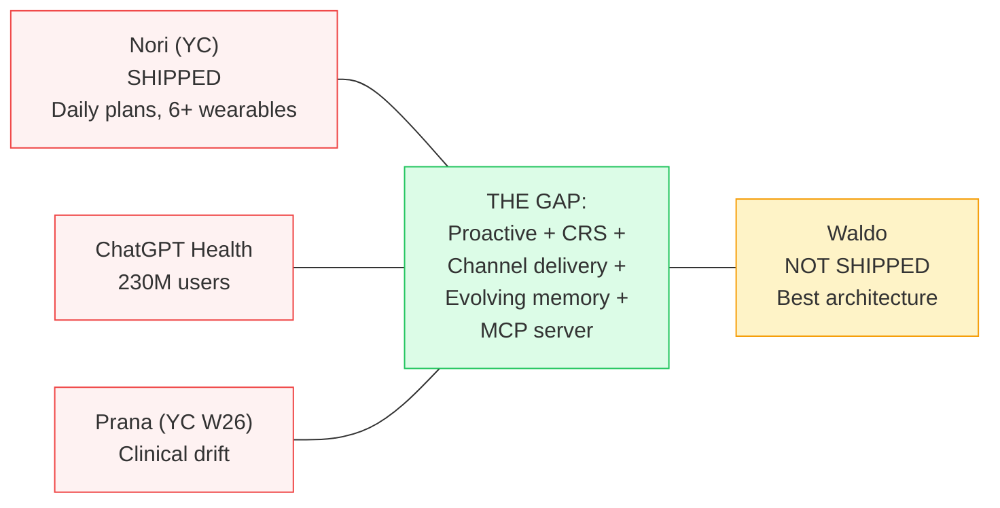

# 18 Upgrades from Claude Code + 2026 Landscape

> **Source:** Reverse-engineered Claude Code (1,905 TypeScript files, 213MB binary) + comprehensive 2026 agent landscape research + startup competitive analysis (March 31, 2026). + Hermes Agent (April 8, 2026) — 15th system. + MemPalace (April 9, 2026) — 16th system.

## What We Learned

Claude Code is a production-grade agentic system running the same architectural backbone as Waldo: an LLM reasoning over tools in a loop with memory and context management. The patterns that make it reliable at 1M tokens of context are directly applicable to making Waldo reliable at 4K-10K tokens with a 50s timeout.

## The 18 Upgrades (Prioritized)

### Phase D (Agent Core) — +10.5 days

| # | Upgrade | Impact | What |
|---|---------|--------|------|
| 1 | **Three-stage compaction** | HIGH | Micro-compaction (free) → session memory → LLM compaction. Stage 1 saves 20-30% tokens every invocation. |
| 2 | **Tool metadata + concurrent execution** | HIGH | Read-only tools run in parallel. get_crs + get_sleep + get_activity = 300ms instead of 900ms. |
| 3 | **Semantic caching** | HIGH | Cache response structures for repetitive triggers. 30-40% output token reduction. |
| 4 | **Structured error taxonomy** | MEDIUM | Classify transient/capacity/permanent before choosing fallback level. |
| 5 | **Agent trace protocol** | MEDIUM | Structured logging (15+ fields) from day 1. Observability foundation. |
| 6 | **Guardrails pipeline** | MEDIUM | Typed guardrail system: medical_claims (BLOCK), health_language (REWRITE), confidence (WARN). |
| 7 | **Streaming delivery** | MEDIUM | Stream agent response to Telegram incrementally. |
| 8 | **Permission modes** | LOW | Named modes per trigger type instead of ad-hoc tool lists. |

### Phase E (Proactive) — +3 days

| # | Upgrade | Impact | What |
|---|---------|--------|------|
| 9 | **Speculative pre-computation** | HIGH | Pre-compute Morning Wag context overnight. Delivery in <3 seconds. |
| 10 | **Proactive context pre-loading** | HIGH | Cache user context bundle. Delta refresh only. |

### Phase G (Self-Test) — +7 days

| # | Upgrade | Impact | What |
|---|---------|--------|------|
| 11 | **Memory consolidation daemon** | HIGH | Patrol Agent: 4-phase nightly consolidation (AutoDream pattern). |
| 12 | **Feature flags** | MEDIUM | Supabase table for A/B testing soul variants. |
| 13 | **Agent evaluation harness** | HIGH | Promptfoo golden test suite. Run after every soul file change. |

### Phase 2+

| # | Upgrade | Impact | What |
|---|---------|--------|------|
| 14 | **Model routing** | HIGH | Haiku for simple, Sonnet for Constellation queries. Smart routing via 28 complexity keywords (Hermes pattern). |
| 15 | **Deferred tool discovery** | MEDIUM | ToolSearch pattern when 50+ tools exist. Saves 5K+ tokens. |
| 16 | **Waldo as MCP server** | STRATEGIC | Biological intelligence as a service. Any agent queries your CRS. |
| 17 | **Evolution dual audit** | MEDIUM | Simulate evolutions on golden tests before applying. |
| 18 | **4-tier memory completion** | LOW | Formalize Tier 3 (procedural) + Tier 4 (archival/pgvector). |

### From Hermes Agent Analysis (April 2026) — Upgrades 19-26

| # | Upgrade | Impact | Phase | What |
|---|---------|--------|-------|------|
| 19 | **Memory context fencing** | MEDIUM | D | Wrap recalled memory in `<memory-context>` tags with "NOT new user input" instruction. Prevents model from treating memory as user discourse. 1-hour implementation. |
| 20 | **FTS5 on episodes table** | HIGH | D | SQLite FTS5 virtual table for full-text search across all past conversations. Faster and cheaper than pgvector for keyword-based retrieval. Use BOTH for different query types. |
| 21 | **Structured context compression** | HIGH | D | 5-stage compression: (1) prune old tool results, (2) protect head, (3) protect tail (~20K tokens), (4) summarize middle with Goal/Progress/Decisions/Next Steps template, (5) iterative updates on subsequent compressions. From Hermes. |
| 22 | **Approval buttons on messaging** | MEDIUM | D-E | For L2 autonomy (suggest + one-tap): native inline buttons on Telegram/Slack/Discord. `[Move to Thursday 10am] [Keep it]`. Hermes proves this works cross-platform. |
| 23 | **Voice memo transcription** | MEDIUM | E-F | Accept voice input on Telegram/WhatsApp. faster-whisper for local STT, or Whisper API. "Hey Waldo, how'd I sleep?" → transcribe → respond. Low effort, high perceived capability. |
| 24 | **Skills as agentskills.io standard** | HIGH | G | Markdown skill files with trigger, steps, effectiveness tracking. Compatible with open standard. Enables skills marketplace in Phase 4. 25+ skill categories demonstrated by Hermes. |
| 25 | **Natural language cron scheduling** | MEDIUM | G+ | User-configurable routines via natural language: "Every Sunday evening, tell me my recovery outlook for next week." Parsed to DO alarm schedule. Hermes ships this as built-in. |
| 26 | **GEPA evolutionary self-improvement** | STRATEGIC | Phase 3+ | DSPy + Genetic-Pareto Prompt Evolution (ICLR 2026 Oral). Reads execution traces → understands failure reasons → proposes targeted mutations to skills/prompts → evaluates against golden tests → keeps winners. $2-10 per optimization run. Applied to Dreaming Mode Phase 6. Identity stays immutable. |

### From MemPalace Analysis (April 2026) — Upgrades 27-30

| # | Upgrade | Impact | Phase | What |
|---|---------|--------|-------|------|
| 27 | **Typed memory halls** | HIGH | D | Replace flat memory_blocks with 5 typed halls: facts, events, discoveries, preferences, advice. `hall_type` column enables selective loading per trigger type. Morning Wag loads facts+events+discoveries (~120 tokens). User chat loads all 5. From MemPalace's wing/room/hall taxonomy. |
| 28 | **170-token wake-up budget** | MEDIUM | D | Design target: always-loaded context under 200 tokens (L0 identity ~50 + L1 essential story ~120). Everything else on-demand via tools. MemPalace achieves 96.6% recall at this budget. |
| 29 | **Cross-domain tunnels** | HIGH | Phase 2 | When same entity (e.g., "board meeting") appears across health, calendar, tasks, and communication dimensions, auto-create cross-reference. Feed into Constellation analysis during weekly Dreaming Mode. MemPalace's spatial linking applied to multi-dimensional health intelligence. |
| 30 | **Temporal fact invalidation** | MEDIUM | D | `valid_from`/`valid_to`/`superseded_by` columns on memory_blocks. Never delete — mark as ended. Enables: evolution rollback, historical queries, temporal pattern discovery. From MemPalace's knowledge graph. |

## 5-Tier Memory Architecture

See [Data Flow & Diagrams](diagrams.md#memory-architecture-5-tier-cognitive-science-mapping) for the full diagram.

## Cost Model (With All Optimizations)

**$0.01-0.03/user/day** ($0.30-0.90/month) with:
- Rules pre-filter (60-80% skip) + prompt caching (90% savings on cached tokens)
- Semantic caching (47-73% reduction for repetitive queries)
- Code Mode (81% token reduction via Dynamic Workers, Phase E)
- **Cloudflare Sandbox** (GA April 2026) for Python-based Code Mode, chart rendering, user routines — see [architecture-roadmap.md](./architecture-roadmap.md#the-execution-layer-gap--where-cloudflare-sandbox-fits)
- Markdown over JSON (34% savings), CSV for tabular data (40-50% savings)
- Anthropic Batch API (50% discount) for overnight Constellation analysis

## Competitive Urgency

> **We have the best architecture. We don't have a product. Ship Phase D.**

> **Full report:** [Docs/WALDO_AGENT_UPGRADE_REPORT.md](https://github.com/Pin4sf/Waldo/blob/main/Docs/WALDO_AGENT_UPGRADE_REPORT.md) (1,739 lines)
