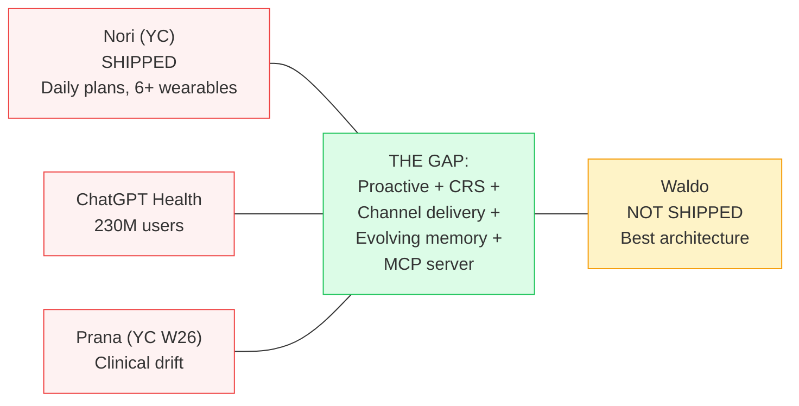

# 18 Upgrades from Claude Code + 2026 Landscape

> **Source:** Reverse-engineered Claude Code (1,905 TypeScript files, 213MB binary) + comprehensive 2026 agent landscape research + startup competitive analysis. March 31, 2026.

## What We Learned

Claude Code is a production-grade agentic system running the same architectural backbone as Waldo: an LLM reasoning over tools in a loop with memory and context management. The patterns that make it reliable at 1M tokens of context are directly applicable to making Waldo reliable at 4K-10K tokens with a 50s timeout.

## The 18 Upgrades (Prioritized)

### Phase D (Agent Core) — +10.5 days

| # | Upgrade | Impact | What |
|---|---------|--------|------|
| 1 | **Three-stage compaction** | HIGH | Micro-compaction (free) → session memory → LLM compaction. Stage 1 saves 20-30% tokens every invocation. |
| 2 | **Tool metadata + concurrent execution** | HIGH | Read-only tools run in parallel. get_crs + get_sleep + get_activity = 300ms instead of 900ms. |
| 3 | **Semantic caching** | HIGH | Cache response structures for repetitive triggers. 30-40% output token reduction. |
| 4 | **Structured error taxonomy** | MEDIUM | Classify transient/capacity/permanent before choosing fallback level. |
| 5 | **Agent trace protocol** | MEDIUM | Structured logging (15+ fields) from day 1. Observability foundation. |
| 6 | **Guardrails pipeline** | MEDIUM | Typed guardrail system: medical_claims (BLOCK), health_language (REWRITE), confidence (WARN). |
| 7 | **Streaming delivery** | MEDIUM | Stream agent response to Telegram incrementally. |
| 8 | **Permission modes** | LOW | Named modes per trigger type instead of ad-hoc tool lists. |

### Phase E (Proactive) — +3 days

| # | Upgrade | Impact | What |
|---|---------|--------|------|
| 9 | **Speculative pre-computation** | HIGH | Pre-compute Morning Wag context overnight. Delivery in <3 seconds. |
| 10 | **Proactive context pre-loading** | HIGH | Cache user context bundle. Delta refresh only. |

### Phase G (Self-Test) — +7 days

| # | Upgrade | Impact | What |
|---|---------|--------|------|
| 11 | **Memory consolidation daemon** | HIGH | Patrol Agent: 4-phase nightly consolidation (AutoDream pattern). |
| 12 | **Feature flags** | MEDIUM | Supabase table for A/B testing soul variants. |
| 13 | **Agent evaluation harness** | HIGH | Promptfoo golden test suite. Run after every soul file change. |

### Phase 2+

| # | Upgrade | Impact | What |
|---|---------|--------|------|
| 14 | **Model routing** | HIGH | Haiku for simple, Sonnet for Constellation queries. |
| 15 | **Deferred tool discovery** | MEDIUM | ToolSearch pattern when 50+ tools exist. Saves 5K+ tokens. |
| 16 | **Waldo as MCP server** | STRATEGIC | Biological intelligence as a service. Any agent queries your CRS. |
| 17 | **Evolution dual audit** | MEDIUM | Simulate evolutions on golden tests before applying. |
| 18 | **4-tier memory completion** | LOW | Formalize Tier 3 (procedural) + Tier 4 (archival/pgvector). |

## 5-Tier Memory Architecture

See [Data Flow & Diagrams](diagrams.md#memory-architecture-5-tier-cognitive-science-mapping) for the full diagram.

## Cost Model (With All Optimizations)

**$0.01-0.03/user/day** ($0.30-0.90/month) with:
- Rules pre-filter (60-80% skip) + prompt caching (90% savings on cached tokens)
- Semantic caching (47-73% reduction for repetitive queries)
- Code Mode (81% token reduction via Dynamic Workers, Phase E)
- Markdown over JSON (34% savings), CSV for tabular data (40-50% savings)
- Anthropic Batch API (50% discount) for overnight Constellation analysis

## Competitive Urgency

> **We have the best architecture. We don't have a product. Ship Phase D.**

> **Full report:** [Docs/WALDO_AGENT_UPGRADE_REPORT.md](https://github.com/Pin4sf/Waldo/blob/main/Docs/WALDO_AGENT_UPGRADE_REPORT.md) (1,739 lines)
